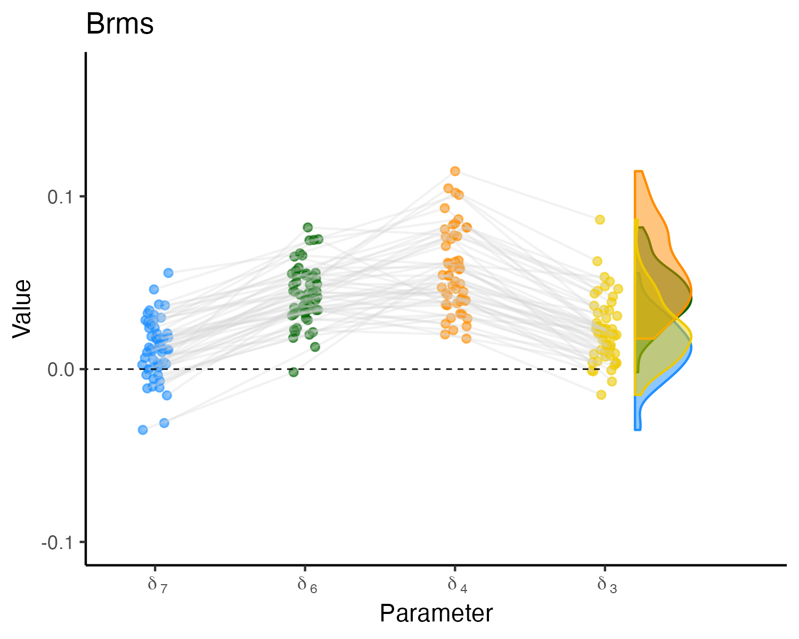

\spacing{1.5}
\fontsize{12}{12}

```{r setup, include=FALSE}
def.chunk.hook  <- knitr::knit_hooks$get("chunk")
knitr::knit_hooks$set(chunk = function(x, options) {
  x <- def.chunk.hook(x, options)
  ifelse(options$size != "normalsize", paste0("\n \\", options$size,"\n\n", x, "\n\n \\normalsize"), x)
})

knitr::opts_chunk$set(tidy.opts=list(width.cutoff=40), tidy=TRUE, echo = TRUE, message = FALSE, warning = FALSE, fig.pos = "H")
```

|    This online supplement provides a tutorial on Bayesian Hierarchical models (BHM) in `brms` [@R-brms_a; @R-brms_b]. In addition, it contains information about the digit classification task that could not be included in the paper. As `brms` runs on `Stan` [@carpenter2017stan], it is very similar to `rstan` [@R-rstan]. However, there are some differences that will be discussed in this tutorial. Only the fit of the full model will be shown as the fitting the others should follow logically from this tutorial. Technical details, such as explanations of statistical terms (e.g., $\hat{R}$), will not be discussed here but can be found in the paper. In concrete, the tutorial will cover the following:   

1. Required packages 
2. Input  
  2.1 Formula  
  2.2 Family  
  2.3 Data  
  2.4 Priors  
  2.5 Individual Effect Correlation 
3. Fit model 
4. Output   
  4.1 General Effects   
  4.2 Individual Effects 
5. Model comparison 
6. Additional resources 

## Required Packages 

In this practical, the following packages will be used: 

- For the document layout: *rmarkdown* [Version 2.9; @R-rmarkdown], *papaja* [Version 0.1.0.9997; @R-papaja], *knitr* [Version 1.33; @R-knitr], *kableExtra* [Version 1.3.4; @R-kableExtra]
- For data structuring: *LaplacesDemon* [Version 16.1.6; @R-LaplacesDemon], *plyr* [Version 1.8.6; @R-plyr], *dplyr* [Version 1.0.7; @R-dplyr], *readr* [Version 2.0.0; @R-readr], *truncnorm* [Version 1.0.8; @R-truncnorm]
- To fit the model and for model comparison: *brms* [Version 2.16.3; @R-brms_a; @R-brms_b]
- For the visualization of the results: *lattice* [Version 0.20.44; @R-lattice], *ggplot2* [Version 3.3.5; @R-ggplot2], *Rmisc* [Version 1.5; @R-Rmisc], *devtools* [Version 2.4.2; @R-devtools], *gghalves* [Version 0.1.1.9000; @R-gghalves], *bayesplot* [Version 1.8.1; @R-bayesplot], *gridExtra* [Version 2.3; @R-gridExtra], *ggridges* [Version 0.5.3; @R-ggridges], *ggbeeswarm* [Version 0.6.0; @R-ggbeeswarm], *tibble* [Version 3.1.6; @R-tibble]

&nbsp; 


\scriptsize 
```{R loadpackages, message = FALSE, warning = FALSE}
# Load the packages
library("papaja")
library("LaplacesDemon")
library("rstan")
library("brms")
library("plyr")
library("lattice")
library("ggplot2")
library("dplyr")
library("readr")
library("rmarkdown")
library("Rmisc")
library("devtools")
library("gghalves") 
library("bayesplot")
library("bridgesampling") 
library("gridExtra") 
library("tibble") 
library("kableExtra") 
library("bayestestR")
library("ggridges")
library("truncnorm")
library("ggbeeswarm")
```
\normalsize 

## Input 

|    To fit a BHM in *brms*, we use the *brm* function, as shown below. 
&nbsp; 

\scriptsize 
```{r modelfitpreview, eval=FALSE, echo=TRUE}
model_fit <- brm(formula = formula,                      # Model formula 
                 data = myData_dataframe,                # Dataset (parameters, observations) 
                 family = gaussian(),                    # Family, distribution dependent variable 
                 prior = priorsmodel,                    # Specification of the priors 
                 warmup = 1000,                          # Nr. iterations for warmup (per chain)
                 iter = 4000,                            # Nr. iterations (per chain)
                 chains = 4,                             # Nr. chains 
                 core = 4)                               # Nr. of cores for parallel estimation


```
\normalsize 

We can see from the code above that the function requires the following input: 

- Formula 
- Family 
- Data 
- Priors 

The other options do not require coding and are discussed in the paper. 

### Formula 

|    The formula is an object that specifies the dependent variable as a function of the independent variables. The `~` (tilde) separates the dependent variable (`rt`) on the left side from the independent variables on the right side. The formula distinguishes between general effects and individual deviations. The first part of the equation on the predictor side of the formula shown below (i.e., `1 + side + dif1 + dif2 + dif3 + dif4`) represents the general effects. The `1` represents the intercept, in the case of the symbolic distance effect $\mu_{\gamma}$, `side`, and `dif1` to `dif4` represent the general effects of side and distance ($\mu_{\beta}$ and $\mu_{\delta}$). Within the round brackets individual deviations and grouping variables are specified. In this case the grouping variable (`ind`) indicates that each participant has an individual effect. In other cases effects might vary per item, block, or even the combination of participant and item. The double bar (`||`) indicates that the correlation between the parameters should not be modeled. When using a single vertical bar (`|`), correlations across all individual effects (intercept, side and distance) are modeled. This approach, however, is a bit more difficult to interpret and would also not correspond to the implemented `Stan` model. We explain the estimation of the model with correlations across individual effects later on. 
&nbsp;

\scriptsize 
```{r formulafit}
formula <- rt2 ~ 1 + side + dif1 + dif2 + dif3 + dif4 +   # General effects 
          (1 + side + dif1 + dif2 + dif3 + dif4 || ind)   # Individual effects 

```
\normalsize 

However, for the digit classification task, we specified the formula in a slightly different way that allowed us to use a different prior on the intercept compared to the distance and side effects. In the first part, we specify that the dependent variable (in our case response times) are predicted by `a` and `b`. In the second part, we define `a`. It contains the general and individual distance and side effects. Also note that we replaced `1` by `0`, indicating that we do not want the default intercept. In the third and final part, we specify `b`, representing the general and individual intercepts by the variable `inter`. 

\scriptsize
```{r formulafit2, eval = FALSE}
formula <- brms::bf(rt2 ~ a + b, nl = TRUE,  # part 1 
                  lf(a ~ 0 + side + dif1 + dif2 + dif3 + dif4 + (0 + side + dif1 + dif2 + dif3 + dif4 || ind), center = TRUE),   # part 2 
                  lf(b ~ 0 + inter + (0 + inter || ind), cmc = FALSE)  # part 3 
)
```
\normalsize 

### Family 

|    The argument `family` in the `brm` function specifies the exponential family of distributions according to which the dependent variable is assumed to be distributed. For the normal model, this argument takes the value `gaussian`.  

### Data 

|    The `brm` function requires a data frame (here called `myData_dataframe`) that contains all variables mentioned in the formula. This means that every parameter in the formula should have an element in the data frame that we put in the function. In our case, this should result in seven elements in the data frame (i.e., `rt2`, `side`, `dif1`, `dif2`, `dif3`, `dif4`, and `ind`).  
|  First, we will load the data and clean it according to the requirements in the paper.  
&nbsp; 

\scriptsize 
```{r readdata}
indat=read.table(url('https://raw.githubusercontent.com/PerceptionCognitionLab/data0/master/lexDec-dist5/ld5.all'))
colnames(indat)=c('sub','block','trial','stim','resp','rt','error')

## Cleaning the data according to criteria discussed in paper 
# (code retrieved from Julia Haaf:
# https://github.com/PerceptionAndCognitionLab/bf-order/blob/public/papers/submission/R-scripts/ld5.R)
clean=function()
{
  indat=read.table(url('https://raw.githubusercontent.com/PerceptionCognitionLab/data0/master/lexDec-dist5/ld5.all'))
  colnames(indat)=c('sub','block','trial','stim','resp','rt','error')
  
  bad1=indat$sub%in%c(34,43)
  bad2=indat$rt<250 | indat$rt>2000
  bad3=indat$err==1
  bad4=indat$block==0 & indat$trial<20
  bad5=indat$trial==0
  
  bad=bad1 | bad2 | bad3 |bad4 |bad5
  dat=indat[!bad,]
  return(dat)
}

indat1 <- clean()  
myData_dataframe <- indat1  # Final dataset 
```
\normalsize 

|    Now, we will expand the data.frame we provide the *brm* function. We specify our dependent variable. In our case, these are the RTs. The RTs are given in milliseconds, but we would like them in seconds. Therefore, we transform the original RT (i.e., divide them by 1000) and save this in our new dependent variable `rt2`. 
&nbsp; 

\scriptsize 
```{r dependentvariable}
### Response time from milliseconds to seconds 
myData_dataframe$rt2 <- indat1$rt/1000
```
\normalsize 

|    The next step is to specify the intercept (`inter`) and indicators (`side`, `dif1`, `dif2`, `dif3`, and `dif4`). These are the variables that specify per observation of a variable applies or not. For the side parameter this means that the side indicator is $\frac{1}{2}$ for observations where the digit was smaller than 5, and  $-\frac{1}{2}$ for observations where the digit was greater than 5. For the digit parameters it means that the digit indicator is 1 when for the observation the digit was equal to 7, 6, 4 or 3, and 0 when it was not. 
&nbsp; 

\scriptsize 
```{r digitparameters}

# create variable inter for the intercept gamma 
myData_dataframe$inter <- rep(1, nrow(indat1))

### Add variable with information of the side of the digit to the dataframe, for parameter beta    
# j = condition, if j > 5 than x = -1/2, if j < 5 than x = 1/2 
# indat1$stim 0 = 2, 1=3, 2=4, 3=6, 4=7, 5=8 
# so if bigger than 2 than 1/2, else than -1/2 
for (j in 1:nrow(indat1)){
  if (indat1$stim[j] < 3) {
    myData_dataframe$side[j] <- 1/2}
  else myData_dataframe$side[j] <- -1/2
}

### Add variable with information about difference between digits to the dataframe, for parameters delta's 
#### Difference 8 and 7 
for (j in 1:nrow(indat1)){ 
  if (indat1$stim[j] == 5) {  # 5 = 8 , reference: https://github.com/PerceptionCognitionLab/data0/blob/master/lexDec-dist5/ld5.txt
    myData_dataframe$dif1[j] <- 0}
  else if (indat1$stim[j] == 4) {
    myData_dataframe$dif1[j] <- 1}
  else myData_dataframe$dif1[j] <- 0
}

#### Difference 7 and 6 
for (j in 1:nrow(indat1)){ 
  if (indat1$stim[j] == 4) {  # 4 = 7 , reference: https://github.com/PerceptionCognitionLab/data0/blob/master/lexDec-dist5/ld5.txt
    myData_dataframe$dif2[j] <- 0}
  else if (indat1$stim[j] == 3) {  # 3 = 6 
    myData_dataframe$dif2[j] <- 1}
  else myData_dataframe$dif2[j] <- 0
}

#### Difference 4 and 3 
for (j in 1:nrow(indat1)){ 
  if (indat1$stim[j] == 1) {  # 1 = 3, 2 = 4 , reference: https://github.com/PerceptionCognitionLab/data0/blob/master/lexDec-dist5/ld5.txt
    myData_dataframe$dif3[j] <- 0}
  else if (indat1$stim[j] == 2) {
    myData_dataframe$dif3[j] <- 1}
  else myData_dataframe$dif3[j] <- 0
}

#### Difference 3 and 2 
for (j in 1:nrow(indat1)){ 
  if (indat1$stim[j] == 0) {  # 0 = 2, 1 = 3 , reference: https://github.com/PerceptionCognitionLab/data0/blob/master/lexDec-dist5/ld5.txt
    myData_dataframe$dif4[j] <- 0}
  else if (indat1$stim[j] == 1) {
    myData_dataframe$dif4[j] <- 1}
  else myData_dataframe$dif4[j] <- 0
}
```
\normalsize 

|    Lastly, we add an indicator to the data frame (`ind`) that specifies which observation belongs to which individual (or group).  
&nbsp; 

\scriptsize 
```{r participantnumber, eval = FALSE, echo = FALSE}
## Data add necessary information 
### Add participant number 
for (j in 1:nrow(indat1)){
  if (j == 1) {
    myData_dataframe$ind[j] <- 1}
  else if (indat1$sub[j] == indat1$sub[j-1]) {
    myData_dataframe$ind[j] <- indat1$sub1[j-1]}
  else myData_dataframe$ind[j] <- indat1$sub1[j-1] + 1
}
```
\normalsize


\scriptsize 
```{r participantnumber2}
## Data add necessary information 
### Add participant number 
myData_dataframe$ind <- indat1$sub + 1

```
\normalsize

### Priors 

|    Finally, we specify the priors. In `brms`, priors can be set on the general effects represented by `class = b` and on the individual variation represented by `class = sd`. It is important to note that priors can only be set on the specific parameters that are part of the brms model specification. For example, `brms` only allows setting priors on standard deviations and not on variances.
Therefore, for the normal model of the symbolic distance effect, we will use the priors for standard deviations specified in Equation 7. To set the priors, we use the `set_prior` function, as shown below. In this function, first, the distribution is specified, using the `Stan` programming language. Then, the type of parameter to which the prior applies is defined by `class`. The parameter to which this prior applies is specified by `coef`. For the priors on the individual effects, an additional element has to be specified, namely, the grouping variable (i.e., `group`). For example, the prior distributions on the general side effect, $\mu_{\beta}$, and on its variability between individuals, $\sigma_{\beta}$, can be specified as follows: 
&nbsp; 

\scriptsize 
```{r priorsillusbrms2, eval = FALSE, echo = TRUE}
set_prior("normal(0,0.3)", class = "b", coef="side")  # general effect 
set_prior("inv_gamma(13.8, 5.3)", class = "sd",       # individual variation 
          coef="side", group = "ind") 
```
\normalsize 

For the digit classification task, we want to specify a truncated normal prior on the intercept, because response times cannot be negative. This means that we are setting a different prior on the intercept than on the side and digit effects. To accomplish this, we split up the formula in two different parts. For each variable, we specify to which part of the formula they belong with `nlpar`. In addition, for the intercept, we specify that the prior has a lower bound of zero with `lb`. All priors are saved in an R `data.frame` that is used in the `brm` function.  

\scriptsize 
```{r priors}
priorsmodel <- c(set_prior("normal(0.5,1)", class = "b", lb = 0, nlpar = "b"),  
                  set_prior("inv_gamma(13.8, 6.3)", class = "sd", coef="inter", group = "ind", nlpar = "b"), 
                  set_prior("normal(0,0.3)", class = "b", coef="side",  nlpar = "a"),  
                  set_prior("inv_gamma(13.8,5.3)", class = "sd", coef="side", group = "ind",  nlpar = "a"), 
                  set_prior("normal(0,0.3)", class = "b", coef="dif1",  nlpar = "a"), 
                  set_prior("inv_gamma(13.8,5.3)", class = "sd", coef="dif1", group = "ind",  nlpar = "a"),
                  set_prior("normal(0,0.3)", class = "b", coef="dif2",  nlpar = "a"),  
                  set_prior("inv_gamma(13.8,5.3)", class = "sd", coef="dif2", group = "ind",  nlpar = "a"),
                  set_prior("normal(0,0.3)", class = "b", coef="dif3",  nlpar = "a"), 
                  set_prior("inv_gamma(13.8,5.3)", class = "sd", coef="dif3", group = "ind",  nlpar = "a"),
                  set_prior("normal(0,0.3)", class = "b", coef="dif4",  nlpar = "a"),  
                  set_prior("inv_gamma(13.8,5.3)", class = "sd", coef="dif4", group = "ind",  nlpar = "a"),
                  set_prior("inv_gamma(13.8, 6.3)", class = "sigma"))


```
\normalsize 


|    As described in the paper, we could check whether these priors are reasonable considering our expectations by performing prior prediction.
&nbsp; 

\scriptsize 
```{r priorprediction, echo = FALSE, fig.cap="Predicted mean RT difference between conditions per trial. The blue line represents the aggregated trend. ", fig.align = "left", fig.height=4, fig.width=5}
set.seed(123) 

Ipp <- 10  # repeat 10 times 
Jpp <- 6   # digit 2, 3, 4, 6, 7, and 8 
Kpp <- 60  # 60 observations per condition per person 

exppp <- rep(1:Ipp, each = Jpp * Kpp)  # which row belongs to which participant 
condpp <- rep(0:5, Ipp, each = Kpp)  # to which condition row belongs  
subpp <- rep(1:Kpp, Ipp * Jpp)  # to which observation per condition per parcticipant belongs row 

# add parameters x, u, v, w, z 
xjpp <- NA 
ujpp <- NA 
vjpp <- NA 
wjpp <- NA 
zjpp <- NA 
# side effect, greater or smaller than 5  
for (j in 1:length(condpp)){  # 3 = 6
  if (condpp[j] < 3) {
    xjpp[j] <- 1/2}
  else xjpp[j] <- -1/2
}

### Add variable with information about difference between digits, for parameters delta's 
#### Difference 8 and 7 
for (j in 1:length(condpp)){ 
  if (condpp[j] == 5) {  # 5 = 8 , 
    ujpp[j] <- 0}
  else if (condpp[j] == 4) {
    ujpp[j] <- 1}
  else ujpp[j] <- 0
}

# Difference 7 and 6 
for (j in 1:length(condpp)){ 
  if (condpp[j] == 4) {  # 4 = 7, 3 = 6  
    vjpp[j] <- 0}
  else if (condpp[j] == 3) {
    vjpp[j] <- 1}
  else vjpp[j] <- 0
}

# Difference 4 and 3 
for (j in 1:length(condpp)){ 
  if (condpp[j] == 1) {  # 1 = 3, 2 = 4 
    wjpp[j] <- 0}
  else if (condpp[j] == 2) {
    wjpp[j] <- 1}
  else wjpp[j] <- 0
}

# Difference 3 and 2 
for (j in 1:length(condpp)){ 
  if (condpp[j] == 0) {  # 0 = 2, 1 = 3
    zjpp[j] <- 0}
  else if (condpp[j] == 1) {
    zjpp[j] <- 1}
  else zjpp[j] <- 0
}

datalistpp3 <- list()
for (i in 1:1000){
# Hyperpriors: These are not individual specific so only sample 1  
mugammapp <- rtruncnorm(1, a = 0, mean = 0.5, sd = sqrt(1))
vargammapp <- rinvgamma(1, 3, 0.7)
mubetapp <- rnorm(1, 0, 0.3)
varbetapp <- rinvgamma(1, 3, 0.5)
mudeltapp <- rnorm(1, 0, 0.3)
vardeltapp <- rinvgamma(1, 3, 0.5)
    
# Priors: for each person sample prior 1 time 
gammaipp <- rnorm(Ipp, mugammapp, sqrt(vargammapp))
betaipp <-  rnorm(Ipp, mubetapp, sqrt(varbetapp))
delta1pp <- rnorm(Ipp, mudeltapp, sqrt(vardeltapp))
delta2pp <- rnorm(Ipp, mudeltapp, sqrt(vardeltapp))
delta3pp <- rnorm(Ipp, mudeltapp, sqrt(vardeltapp))
delta4pp <- rnorm(Ipp, mudeltapp, sqrt(vardeltapp))

sigmapp <- rinvgamma(1, 3, 0.7)  # Only 1 because not individual specific

# data
Ypp <- rnorm(Ipp*Jpp*Kpp, gammaipp[exppp] + xjpp * betaipp[exppp] + 
              ujpp * delta1pp[exppp] + vjpp * delta2pp[exppp] +
              wjpp * delta3pp[exppp] + zjpp * delta4pp[exppp],
              sqrt(sigmapp))  # model formula 
datartpp <- data.frame(exppp,  # data frame of results and conditions 
                       condpp, 
                       subpp, 
                       repetition = rep(i, length(exppp)), 
                       gammaipp[exppp], betaipp[exppp], delta1pp[exppp],
                       delta2pp[exppp], delta3pp[exppp], delta4pp[exppp], Ypp)
datalistpp3[[i]] <- datartpp
} 

# Add datasets under each other 
bigdatapp3 <- do.call(rbind, datalistpp3)

newbigdatapp3 <- bigdatapp3[bigdatapp3$exppp == 1,]


theme_set(theme_apa(base_size = 9))

########### Create figure function 

## Or plot mean rt per condition per trial 
priorpredfigurecreate <- function(bigdatapp3brms){
  plotsimpp <- aggregate(bigdatapp3brms$Ypp, list(bigdatapp3brms$condpp, bigdatapp3brms$repetition), mean)
  meanrtsimpp <- aggregate(bigdatapp3brms$Ypp, list(bigdatapp3brms$condpp), mean)  # mean RT per condition 
  
  # Mean difference per digits per trial and side effect (mean(2, 3, 4) - mean (6, 7, 8))
  plotsimpp <- aggregate(bigdatapp3brms$Ypp, list(bigdatapp3brms$condpp, bigdatapp3brms$repetition), mean)
  # meanrtsimpp <- aggregate(bigdatapp3$Ypp, list(bigdatapp3$condpp), mean)
  
  sideapp3 <- NA 
  diff1app3 <- NA   # length 1000 
  diff2app3 <- NA 
  diff3app3 <- NA
  diff4app3 <- NA 
  repapp3 <- NA 
  
  # Group.2 is the trial number (1000 in total per condition)
  for (i in 1:length(unique(plotsimpp$Group.2))){
    repapp3[i] <- i 
    sideapp3[i] <- ((plotsimpp$x[plotsimpp$Group.1==0 & plotsimpp$Group.2 == i] + plotsimpp$x[plotsimpp$Group.1==1 & plotsimpp$Group.2 == i] + plotsimpp$x[plotsimpp$Group.1==2 & plotsimpp$Group.2 == i]) - 
                   (plotsimpp$x[plotsimpp$Group.1==3 & plotsimpp$Group.2 == i] + plotsimpp$x[plotsimpp$Group.1==4 & plotsimpp$Group.2 == i] + plotsimpp$x[plotsimpp$Group.1==5 & plotsimpp$Group.2 == i]))
    diff1app3[i] <- (plotsimpp$x[plotsimpp$Group.1==4 & plotsimpp$Group.2 == i]- plotsimpp$x[plotsimpp$Group.1==5 & plotsimpp$Group.2 == i])  # 4 = 7 and 5 = 8 
    diff2app3[i] <- (plotsimpp$x[plotsimpp$Group.1==3 & plotsimpp$Group.2 == i]- plotsimpp$x[plotsimpp$Group.1==4 & plotsimpp$Group.2 == i])  # 3 = 6, 4 = 7
    
    diff3app3[i] <- (plotsimpp$x[plotsimpp$Group.1==2 & plotsimpp$Group.2 == i]- plotsimpp$x[plotsimpp$Group.1==1 & plotsimpp$Group.2 == i])  # 2 = 4, 1 = 3 
    
    diff4app3[i] <- (plotsimpp$x[plotsimpp$Group.1==1 & plotsimpp$Group.2 == i]- plotsimpp$x[plotsimpp$Group.1==0 & plotsimpp$Group.2 == i])  # 1 = 3, 0 = 2 
    
  }
  #diffdatapp3 <- data.frame(repapp3, diff1app3, diff2app3, diff3app3, diff4app3)  # length 1000 
  diffdatapp33 <- data.frame(trial = rep(repapp3, 5), condition = rep(1:5, each = length(repapp3)), difference =  c(sideapp3, diff4app3, diff3app3, diff2app3, diff1app3))
  
  # difference aggregated 
  diffmeandatapp33 <- data.frame(condition = 1:5, 
                                 difference =  c(((meanrtsimpp$x[meanrtsimpp$Group.1==0] + meanrtsimpp$x[meanrtsimpp$Group.1==1] + meanrtsimpp$x[meanrtsimpp$Group.1==2])-(meanrtsimpp$x[meanrtsimpp$Group.1==3] + meanrtsimpp$x[meanrtsimpp$Group.1==4] + meanrtsimpp$x[meanrtsimpp$Group.1==5])), 
                                                 (meanrtsimpp$x[meanrtsimpp$Group.1==1] - meanrtsimpp$x[meanrtsimpp$Group.1==0]), 
                                                 (meanrtsimpp$x[meanrtsimpp$Group.1==2] - meanrtsimpp$x[meanrtsimpp$Group.1==1]), 
                                                 (meanrtsimpp$x[meanrtsimpp$Group.1==3] - meanrtsimpp$x[meanrtsimpp$Group.1==4]), 
                                                 (meanrtsimpp$x[meanrtsimpp$Group.1==4] - meanrtsimpp$x[meanrtsimpp$Group.1==5])))
  
  
  # Old figure 
  diffrtplotsimpp <- ggplot(diffdatapp33, aes(y = difference, x = as.factor(condition))) + 
    geom_line(aes(group = trial), alpha = .014) + 
    geom_point(data = diffdatapp33, aes(group = trial), alpha = 0.014) + 
    geom_line(data = diffmeandatapp33, aes(group = 1), color='blue') + 
    geom_point(data = diffmeandatapp33, aes(group = 1), color='blue') + 
    labs(x = "Digits", y = "Response Time Difference (Seconds)") + 
    theme_bw() + 
    theme(axis.line = element_line(colour = "black"), panel.border = element_blank(), panel.background = element_blank()) + 
    scale_x_discrete(breaks = 1:5, labels = c("side", "3-2", "4-3", "6-7", "7-8"))   # + ylim(-0.1,0.1) then you see the difference better but missing a lot of trials 
    theme_set(theme_apa(base_size = 9))
  
  priorpredictionplot1 <- diffrtplotsimpp + ylim(-15,15)
  
  # Try new figure 
  
  # Create violin plot 
  priorpredictionplotnew_1 <- ggplot(diffdatapp33, aes(y = difference, x = as.factor(condition))) + 
    geom_violin(width = 1, alpha = 0.1) + 
    geom_quasirandom(alpha = 0.014, width = 0.2, dodge.width=1) + 
    geom_point(data = diffmeandatapp33, aes(group = 1), color='blue') + 
    labs(x = "Digits", y = "Response Time Difference (Seconds)") + 
    theme_bw() + 
    theme(axis.line = element_line(colour = "black"), panel.border = element_blank(), panel.background = element_blank()) + 
    scale_x_discrete(breaks = 1:5, labels = c("Side", "3-2", "4-3", "6-7", "7-8"))   # + ylim(-0.1,0.1) then you see the difference better but missing a lot of trials 
  
  return(priorpredictionplotnew_1)
} 

########### End figure function 

priorpredfigurecreate(bigdatapp3)

```
\normalsize 

### \textcolor{blue}{Individual Effect Correlation} 

\textcolor{blue}{Up until now, we discussed the normal model from the manuscript. This model assumes that there is no correlation between the individual effects. As stated in the manuscript, it is also possible to allow for the estimation of the correlation between individual effects. This means, for instance, that we would expect that the estimations for the individual effects} $\delta_{7,i}$ \textcolor{blue}{and} $\delta_{3,i}$ \textcolor{blue}{are related. To allow for correlation between individual effects, we would have to adjust the model formula. For the estimation of the digit classification task, we could use the following formula:}   

\scriptsize 
```{r formulafitindcor, eval = FALSE}
bform_cor <- brms::bf(rt2 ~ a + b, nl = TRUE, 
                  lf(a ~ 0 + side + dif1 + dif2 + dif3 + dif4 + (0 + side + dif1 + dif2 + dif3 + dif4 | ind), center = TRUE),  
                  lf(b ~ 0 + inter + (0 + inter | ind), cmc = FALSE)
)
```
\normalsize 

\textcolor{blue}{The difference is that instead of using the double bar} `||`\textcolor{blue}{, we are now using a single bar} `|` \textcolor{blue}{before} `ind`\textcolor{blue}{, indicating that we allow individual effects to correlate.} 

\textcolor{blue}{This means that we are estimating more parameters and therefore we have to specify priors on these parameters as well. In specific, we can set a prior on the correlation matrix called} `class = "cor"`\textcolor{blue}{. These priors will be transformed for efficiency and set on so called Cholesky factors of the matrices [for more information see} @stan2018a; \textcolor{blue}{section 1.13]. In our example, we set a prior on the Cholesky factors directly, by defining} `class = "L"`\textcolor{blue}{, shown in the last line of the code block:}  

\scriptsize 
```{r priorscor, eval = FALSE}
priorsmodel_cor <- c(set_prior("normal(0.5,1)", class = "b", lb = 0, nlpar = "b"),  
                  set_prior("inv_gamma(13.8, 6.3)", class = "sd", coef="inter", group = "sub1", nlpar = "b"), 
                  set_prior("normal(0,0.3)", class = "b", coef="side",  nlpar = "a"),  
                  set_prior("inv_gamma(13.8,5.3)", class = "sd", coef="side", group = "sub1",  nlpar = "a"), 
                  set_prior("normal(0,0.3)", class = "b", coef="dif1",  nlpar = "a"), 
                  set_prior("inv_gamma(13.8,5.3)", class = "sd", coef="dif1", group = "sub1",  nlpar = "a"),
                  set_prior("normal(0,0.3)", class = "b", coef="dif2",  nlpar = "a"),  
                  set_prior("inv_gamma(13.8,5.3)", class = "sd", coef="dif2", group = "sub1",  nlpar = "a"),
                  set_prior("normal(0,0.3)", class = "b", coef="dif3",  nlpar = "a"), 
                  set_prior("inv_gamma(13.8,5.3)", class = "sd", coef="dif3", group = "sub1",  nlpar = "a"),
                  set_prior("normal(0,0.3)", class = "b", coef="dif4",  nlpar = "a"),  
                  set_prior("inv_gamma(13.8,5.3)", class = "sd", coef="dif4", group = "sub1",  nlpar = "a"),
                  set_prior("inv_gamma(13.8, 6.3)", class = "sigma"), 
                  set_prior("lkj_corr_cholesky(1)", class = "L"))

```
\normalsize 


## Fit the Model 

|    Now that we have the required input, we can estimate the model.  
&nbsp; 

\scriptsize 
``` {r modelfit, eval = FALSE}
model_fit <- brm(formula = formula,                      # Model formula 
                 data = myData_dataframe,                # Dataset (parameters, observations) 
                 family = gaussian(),                    # Family, distribution dependent variable 
                 prior = priorsmodel,                    # Specification of the priors 
                 # sample_prior = "yes",                 # To calculate Bayes factors for point hypotheses  
                 warmup = 1000,                          # Nr. iterations for warmup (per chain)
                 iter = 4000,                            # Nr. iterations (per chain)
                 chains = 4,                             # Nr. chains 
                 core = 4)                               # Nr. of cores for parallel estimation

```
\normalsize 

\textcolor{blue}{To estimate the model with the correlation between individual effects, note that one would need to adjust} `formula` \textcolor{blue}{and} `priorsmodel` \textcolor{blue}{to the objects where these are saved in (i.e.,} `bform_cor` \textcolor{blue}{and} `priorsmodel_cor`\textcolor{blue}{).} 

\textcolor{blue}{Back to our model without the correlation term form the manuscript.} We have already estimated this model and saved it in the R object `brmmodel8_new03012022.rds`. In case you do not want to wait until the model has been fitted but continue immediately with the rest of this tutorial, you can load this R object that contains the model estimations.  
&nbsp; 

\scriptsize 
```{r loadmodelfit, eval = FALSE}
model_fit <- readRDS(file = "myPath/brmmodel8_new03012022.rds")  

# For model comparison - sample_prior was set to "yes" 
model_fit_bf <- readRDS("myPath/brmmodel8_new_bf_03012022l.rds")  

```
\normalsize 

\scriptsize 
```{r loadmodelfits, show = FALSE, echo = FALSE}
setwd('..')
model_fit <- readRDS(file = "K - R objects/brms/Truncated/BRMSmodelfit18_03012022.rds")  

# For model comparison - sample_prior was set to "yes" 
model_fit_bf <- readRDS("K - R objects/brms/Truncated/BRMSmodelfit18_BF_03012022.rds")  

```
\normalsize 

## Output 
|    The `summary` function provides an overview of the model fit. From this function, we can get a lot of information. 

\scriptsize 
```{r modelsummary}
summary(model_fit)
```
\normalsize 

|    `brms` offers the `launch_shinystan` function which will load a shiny app with the results of the model fit. It is very extensive. It, for instance, includes model diagnostics as trace plots, posterior plots, prediction plots and way more. 
&nbsp; 

\scriptsize 
```{r shinyrstan, eval = FALSE}
launch_shinystan(model_fit)
```
\normalsize 

It also has the possibility to save plots. However, if you want the full control over the layout, it might be better to code them yourself. Therefore, we will show how to create the figures presented in the paper.  


### Trace plot 

|    The trace plot shows whether the posterior distribution of the parameter has converged. With the package `mcmc_plot` function (used to be `stanplot`) it is possible to obtain the trace plots per parameter by setting the option `type` to `trace`. With the `variable` argument, you can specify for which parameters you want to inspect the trace plots. With `variables`, you can check the names of the parameters in the `brms` output. 

\scriptsize 
```{r checkvarnames, eval = FALSE}
variables(model_fit)
```
\normalsize 

The trace plot will automatically remove the warm-up (burn-in) period from the chain (which is desirable), however, the x axis will indicate that it is showing iteration 0 to 4000 (in our case) while it is actually showing the 1000th to 5000th iteration. As the `plot` option returns a `ggplot` object, it is possible to manually adjust the plot using `ggplot` functions. We created the function `traceplotfunc` to obtain the trace plot for the parameter you are interested in. In the figure below, we show the trace plots for all the general effects and variances. 
&nbsp; 

\scriptsize 
```{r traceplotB, fig.cap="Trace plots of the general effect parameters.", fig.align = "left", fig.height = 6, fig.width = 8}

# Default trace plot for parameter mu4
# I think warmup already deleted, but then have to adjust labels x axis 
trdif2brms <- mcmc_plot(model_fit,       # Model fit 
                       variable = "b_a_dif2",  # Select parameter, 
                       # it is also possible to select more than one at the same time, 
                       # such as c("mu2", "mu3","mu4")
                       type = "trace")   # Specify that you want trace plots 


# Function 
traceplotfunc <- function(parameter, title){
trdif2brms <- mcmc_plot(model_fit,       # Model fit 
                       variable = parameter,  # Select parameter, 
                       type = "trace")   # Specify that you want trace plots 


trdif2brms2 <- trdif2brms + 
               scale_x_continuous(breaks=c(1000, 3000, 5000), 
                                  labels=c(2000, 4000, 6000)) + 
                theme_classic() +              
                theme(axis.title.y=element_text(angle = 0, 
                                                vjust = 0.5, 
                                                hjust = -0.5, 
                                                margin = margin(0, 0.7, 0, 0, "cm"), size = 14), 
                      axis.line.x = element_line(color="black"), 
                     axis.line.y = element_line(color="black"), 
                     #legend.position = "none",  
                     plot.margin = unit(c(0.3,0.1,0.4,0),"cm")) + 
               scale_color_manual(values=c("#E66101", "#998EC3", "#542788", "#F1A340")) + 
               ylab(title) + 
               xlab("Iteration") + 
               labs(subtitle = "") #+ 
               #ylim(c(0.01, 0.07)) + 
               #scale_y_continuous(limits = c(0.01, 0.07), 
                                  #breaks = c(0.02, 0.04, 0.06), 
                                  #labels = c(0.02, 0.04, 0.06)) 

return(trdif2brms2)
}

# Show trace plot for one digit parameter 
tr2 <- traceplotfunc(parameter = "b_a_side", title = expression(~mu[~beta]))
tr2 <- tr2 + theme(legend.position = "none")
tr3 <- traceplotfunc(parameter = "b_a_dif1", title = expression(~mu[~delta[~7]]))
tr3 <- tr3 + theme(legend.position = "none")
tr4 <- traceplotfunc(parameter = "b_a_dif2", title = expression(~mu[~delta[~6]]))
tr4 <- tr4 + theme(legend.position = "none")
tr5 <- traceplotfunc(parameter = "b_a_dif3", title = expression(~mu[~delta[~4]]))
tr5 <- tr5 + theme(legend.position = "none")
tr6 <- traceplotfunc(parameter = "b_a_dif4", title = expression(~mu[~delta[~3]]))
legendtr <- cowplot::get_legend(tr6)
tr6 <- tr6 + theme(legend.position = "none")

# Plot general effects together 
grid.arrange(tr2, tr3, tr4, tr5, tr6, legendtr, nrow = 2, ncol = 3)
```
\normalsize 

\scriptsize 
```{r traceplotsd, }
# Show trace plot for one sd parameter 
tr2 <- traceplotfunc(parameter = "sd_sub1__a_side", title = expression(~sigma[~beta]))
tr2 <- tr2 + theme(legend.position = "none")
tr3 <- traceplotfunc(parameter = "sd_sub1__a_dif1", title = expression(~sigma[~delta[~7]]))
tr3 <- tr3 + theme(legend.position = "none")
tr4 <- traceplotfunc(parameter = "sd_sub1__a_dif2", title = expression(~sigma[~delta[~6]]))
tr4 <- tr4 + theme(legend.position = "none")
tr5 <- traceplotfunc(parameter = "sd_sub1__a_dif3", title = expression(~sigma[~delta[~4]]))
tr5 <- tr5 + theme(legend.position = "none")
tr6 <- traceplotfunc(parameter = "sd_sub1__a_dif4", title = expression(~sigma[~delta[~3]]))
legendtr <- cowplot::get_legend(tr6)
tr6 <- tr6 + theme(legend.position = "none")

# Plot general effects together 
grid.arrange(tr2, tr3, tr4, tr5, tr6, legendtr, nrow = 2, ncol = 3)
```
\normalsize 
Because there are many parameters (each for every individual), it is hard to inspect them all individually. A more efficient way to check if the parameters have converged is by checking the $\hat{R}$ and the number of effective samples. 

### Rhat & Number of Effective Samples 

|    As for the trace plots, the `mcmc_plot` function offers the possibility to plot the $\hat{R}$ (Rhat) and the ratio of effective sample size to the total posterior sample size (this is different from what is plotted in the paper). 
&nbsp; 

\scriptsize 
```{r rhatneffstandard, eval = FALSE}
# Plot frequency of rhat 
mcmc_plot(model_fit, type = "rhat_hist")   # Specify that you want trace plots 

# Plot frequency of the ratio 
mcmc_plot(model_fit, type = "neff_hist") 
```
\normalsize 

However, these figures can be manually adjusted. To obtain the figures from the paper, the following steps can be followed. First, we save the values for $\hat{R}$ and parameter names. 

\scriptsize 
```{r rhatexamp}
# Obtain rhat and neff brms 
## Rhat 
rhatbrms <- mcmc_plot(model_fit, type = "rhat_hist")$data$value  # save rhat values 
rhatbrms_para <- mcmc_plot(model_fit, type = "rhat_hist")$data$parameter  # save parameter names 
rhatbrmsratio_comb <- data.frame(parameter = rhatbrms_para, value = rhatbrms)  # combine values and parameters names into one data.frame 
```
\normalsize 

Then, we obtain the $\hat{R}$ of the general effects. 

\scriptsize 
```{r rhatexamp2}
# Obtain rhats of general effects 
rhatbrms_v2 <- mcmc_plot(model_fit, type = "rhat_hist")$data
fixedrhatbrms_v2 <- c(rhatbrms_v2$value[rhatbrms_v2$parameter == "b_b_inter"], 
                      rhatbrms_v2$value[rhatbrms_v2$parameter == "b_a_side"], 
                      rhatbrms_v2$value[rhatbrms_v2$parameter == "b_a_dif1"], 
                      rhatbrms_v2$value[rhatbrms_v2$parameter == "b_a_dif2"], 
                      rhatbrms_v2$value[rhatbrms_v2$parameter == "b_a_dif3"], 
                      rhatbrms_v2$value[rhatbrms_v2$parameter == "b_a_dif4"])

deltameanrrbrms <- mean(fixedrhatbrms_v2[3:6])  # compute mean of delta parameters (digit effects)

```
\normalsize

We also save the $\hat{R}$ of the individual effects. 

\scriptsize 
```{r rhatexamp3}
# Obtain rhats of all individual effects 
rhatbrmsratio3 <- c(rhatbrmsratio_comb[grep(",inter]", rhatbrmsratio_comb$parameter),]$value,
                      rhatbrmsratio_comb[grep(",side]", rhatbrmsratio_comb$parameter),]$value,
                      rhatbrmsratio_comb[grep(",dif1]", rhatbrmsratio_comb$parameter),]$value,
                      rhatbrmsratio_comb[grep(",dif2]", rhatbrmsratio_comb$parameter),]$value,
                      rhatbrmsratio_comb[grep(",dif3]", rhatbrmsratio_comb$parameter),]$value,
                      rhatbrmsratio_comb[grep(",dif4]", rhatbrmsratio_comb$parameter),]$value)

```
\normalsize

Next, the data of the individual effects is restructured to the format used in *ggplot*. 

\scriptsize 
```{r rhatexamp4}
# Restructure in a data frame we can use to create a figure with ggplot 
rstanrhatneff_v2 <- data.frame(package = rep("Brms", 312), 
                                 parameter = rep(c("Gamma", "Beta", "Delta",                                                          "Delta", "Delta", "Delta"), 
                                                 each = 52), 
                                 rhat = rhatbrmsratio3)

```
\normalsize

We follow the same steps for the number of effective samples (Neff). 

\scriptsize 
```{r neffexamp5}
neffbrmsratio_value <- mcmc_plot(model_fit, type = "neff_hist")$data$value   # save neff values, these are the values of the ration Neff/N, N representing the total number of iterations
neffbrmsratio_para <- mcmc_plot(model_fit, type = "neff_hist")$data$parameter  # save parameter names 
neffbrmsratio_comb <- data.frame(parameter = neffbrmsratio_para, value = neffbrmsratio_value)  # combine values and parameter names into data frame 

# Neff of general effects 
fixedneffbrms2 <- c(neffbrmsratio_comb[grep("b_inter", neffbrmsratio_comb$parameter),]$value[1],
                      neffbrmsratio_comb[grep("b_a_side", neffbrmsratio_comb$parameter),]$value[1],
                      neffbrmsratio_comb[grep("b_a_dif1", neffbrmsratio_comb$parameter),]$value[1],
                      neffbrmsratio_comb[grep("b_a_dif2", neffbrmsratio_comb$parameter),]$value[1],
                      neffbrmsratio_comb[grep("b_a_dif3", neffbrmsratio_comb$parameter),]$value[1],
                      neffbrmsratio_comb[grep("b_a_dif4", neffbrmsratio_comb$parameter),]$value[1])

fixedneffbrms3 <- fixedneffbrms2 * 12000  # we multiply values with total number of iterations (12000) to get Neff (used to be ration Neff/N, N representing the total number of iterations)
fixedneffbrmsmean <- mean(fixedneffbrms3[3:6])  # calculate mean Neff of delta parameters 

# Neff of individual effects  
neffbrmsratio3 <- c(neffbrmsratio_comb[grep(",inter]", neffbrmsratio_comb$parameter),]$value,
                      neffbrmsratio_comb[grep(",side]", neffbrmsratio_comb$parameter),]$value,
                      neffbrmsratio_comb[grep(",dif1]", neffbrmsratio_comb$parameter),]$value,
                      neffbrmsratio_comb[grep(",dif2]", neffbrmsratio_comb$parameter),]$value,
                      neffbrmsratio_comb[grep(",dif3]", neffbrmsratio_comb$parameter),]$value,
                      neffbrmsratio_comb[grep(",dif4]", neffbrmsratio_comb$parameter),]$value)
neffbrms2 <- neffbrmsratio3  * 12000  # we multiply values with total number of iterations (12000) to get Neff (used to be ration Neff/N, N representing the total number of iterations)

# Restructure in a data frame we can use to create a figure with ggplot 
neffrstanbrms2 <- data.frame(package = rep("Brms", 312), 
                               parameter = rep(c("Gamma", "Beta", "Delta", "Delta",                                                  "Delta", "Delta"), each = 52),
                               neff = c(neffbrms2)) 

```
\normalsize

Finally, we visualize the $\hat{R}$ and Neff using violin plots. 
&nbsp; 

\scriptsize 
```{r rhatneff, fig.cap="The frequency of the $\\hat{R}$ statistic and the number of effective samples. A: The frequency of the $\\hat{R}$. B: The frequency of the number of effective samples where the dashed lines represent the total number of iterations.", fig.align = "left", fig.height = 4, fig.width = 8}
# Create violin plots 
## Rhat 
  figrhatnew <- ggplot(rstanrhatneff_v2, aes(x = factor(parameter, level = c("Gamma", "Beta", "Delta")), y = rhat, colour = package)) + 
    geom_violin(width = 1) + 
    geom_quasirandom(alpha = 0.1, width = 0.2, dodge.width=1) + 
    geom_point(aes(x = 1, y = fixedrhatbrms_v2[1]), shape = 8, colour="darkorange", size = 2) + 
    geom_point(aes(x = 2, y = fixedrhatbrms_v2[2]), shape = 8, colour="darkorange", size = 2) + 
    geom_point(aes(x = 3, y = deltameanrrbrms ), shape = 8, colour="darkorange", size = 2) + 
    xlab("Parameter") + ylab(expression(hat(R))) +
    scale_colour_manual(values = "darkorange") + 
    theme_classic() + 
    theme(legend.position = "none") + 
    scale_x_discrete(labels= c( 
      expression(~gamma), 
      expression(~beta), 
      expression(~delta))) + 
    labs(subtitle = "C") + 
    theme(axis.title.y = element_text(angle = 0, 
                                      vjust = 0.5, 
                                      hjust = -0.5, 
                                      margin = margin(0, 1.1, 0, 0, "cm")))
  

## Neff 
figneffnew <- ggplot(neffrstanbrms2, aes(x = factor(parameter, level = c("Gamma", "Beta", "Delta")), y = neff, colour = package)) + 
    geom_violin(width = 1) + 
    geom_quasirandom(alpha = 0.1, width = 0.2, dodge.width=1) + 
    geom_point(aes(x=1, y= fixedneffbrms3[1]), shape = 8, colour="darkorange", size = 2) + 
    geom_point(aes(x=2, y= fixedneffbrms3[2]), shape = 8, colour="darkorange", size = 2) + 
    geom_point(aes(x=3, y= fixedneffbrmsmean), shape = 8, colour="darkorange", size = 2) + 
    xlab("Parameter") + ylab("Number of effective samples") +
    scale_colour_manual(values = "darkorange") + 
    theme_classic() + 
    theme(legend.position = "none") + 
    scale_x_discrete(labels= c( 
      expression(~gamma), 
      expression(~beta), 
      expression(~delta))) + 
    labs(subtitle = "D") + 
    geom_hline(yintercept = 20000, linetype = "dashed", color = "darkorange", size = .3)

# Plot together 
grid.arrange(figrhatnew, figneffnew, nrow = 1, ncol = 2)

```
\normalsize 

### General effects 

|    The general effects are represented by $\mu_{\delta_{7}}$, $\mu_{\delta_{6}}$, $\mu_{\delta_{4}}$, $\mu_{\delta_{3}}$, and $\mu_{\beta}$. To investigate whether there is a digit and side effect, we will inspect the estimates for these parameters.  

#### Posterior Distribution 

|    With the `mcmc_plot` function, the posterior distribution per parameter can be displayed. 
&nbsp; 

\scriptsize 
```{r posteriorstandard, eval = FALSE}
# Seperate plot per parameter of posterior density 
mcmc_plot(model_fit, 
     type = "dens")  
```
\normalsize 

|    Another possibility is to use the `bayesplot` package to display all the posterior densities together in one plot. This makes it easier to compare the posterior distributions of each parameter. 
&nbsp; 

\scriptsize 
```{r posteriormanual, fig.cap="The posterior distributions for the general effects. The middle line within the distributions represents the mean posterior. The shaded area within the distributions represents 95\\% of the probability mass.", fig.align = "left", fig.height = 4, fig.width = 5}
post8 <- as.array(model_fit)  # change structure of model fit 

color_scheme_set("orange")  # plot the distributions in orange 

pairs8 <- mcmc_areas(
  post8,    # Structured model fit 
  pars = c("b_a_side", "b_a_dif1", "b_a_dif2", "b_a_dif3", "b_a_dif4"),  # Select parameters 
  prob = 0.95, # 80% intervals  # Plot 95% credible intervals
  prob_outer = 0.99, # 99%     # 99% outer interval
  point_est = "mean"           # Plot line in the middle 
)
# Returns ggplot object 

# Adjust ggplot object further   
pairs82 <- pairs8 + 
           theme_apa() + 
           ggtitle("Brms") + 
           xlim(-0.05, 0.095) + 
           #scale_x_continuous(breaks = c(-0.025, 0, 0.025, 0.05, 0.075)) + 
           scale_y_discrete(labels= c( 
                                              expression(~mu[~beta]), 
                                              expression(~mu[~delta[~7]]), 
                                              expression(~mu[~delta[~6]]), 
                                              expression(~mu[~delta[~4]]), 
                                              expression(~mu[~delta[~3]]))) 

pairs82
```
\normalsize 

|    We can present more information about the distribution by providing a table with the estimated mean of the posterior distribution, the standard error of this mean, the lower and upper bound of the 95% credible interval, the $\hat{R}$ and the number of effective samples. 
&nbsp; 

\scriptsize 
```{r geneftable, results = "asis", cache = TRUE}
# Obtain the mean, standard error, 95% credible interval, rhat and number of effective samples for the intercept, and the digit and side parameters 
fitbrmshiertable <- summary(model_fit)[[14]][,c("Estimate", "Est.Error", "l-95% CI", "u-95% CI", "Bulk_ESS", "Rhat")]  # variance 

# The results are transformed to a dataframe that allows us to plot the results nicely in a table 
fitbrmshiertable2 <- as.data.frame(fitbrmshiertable)
fitbrmshiertable2 <- rbind(fitbrmshiertable2[6,], fitbrmshiertable2[1:5,])

# We manually set the row names of the table using latex for mathematical symbols 
rownamesfitbrmshiertable <-  c("$\\mu_{\\gamma}$","$\\mu_{\\beta}$", "$\\mu_{\\delta_{7}}$", 
                               "$\\mu_{\\delta_{6}}$", "$\\mu_{\\delta_{4}}$", "$\\mu_{\\delta_{3}}$")

# We manually set the column names of the table 
colnames(fitbrmshiertable2) <- c("Mean", "SE", "Lower Bound", "Upper Bound", "$n_{eff}$","$\\hat{R}$")

# The column with row names is added to the table 
fitbrmshiertable3 <- add_column(fitbrmshiertable2, 
                                 Parameters = rownamesfitbrmshiertable, 
                                 .before = "Mean")

# Using the apa_table function from the papaja package the results are presented in an apa table 
apa_table(fitbrmshiertable3,   # Data frame with results 
          row.names = FALSE,    # Default row names are deleted (we set them ourself)
          caption = "Posterior Mean, Standard Error (SE) of the Mean, Lower and 
          Upper Bound of the 95\\% Credible Interval, the Number of Effective 
          Samples, and the $\\hat{R}$ of the General Effect Parameters. ", 
          align = c("l", "c", "c", "c", "c", "c", "c"),   # How should results be presented, in the midle of the table or outlined left 
          digits = 3,       # The number of digits behind the ".". 
          placement = "h",  # Place after code 
          escape = FALSE)   # This indicates that the results contain latex code that should be read as latex code. It is important to do this in combination with putting the results to "asis" in the {R} section above. 

```
\normalsize 

### Individual Effects 

\    Next, we look at the individual deviations from the general effects. Therefore, we inspect the standard deviation and the individual estimates of the digit and side effects. 

#### Standard Deviation Estimates 

|    First, we can show a table with the posterior distribution estimates of the standard deviation parameters. Note that this is different from *rstan* where we estimated the variances instead of the standard deviations. 
&nbsp; 

\scriptsize 
```{r inddevtable, results = "asis", cache = TRUE}
# Obtain standard deviation estimates 
fitbrmshiertable2 <- summary(model_fit)[[17]]$sub1[,c("Estimate", "Est.Error", "l-95% CI", "u-95% CI", "Bulk_ESS", "Rhat")] 

# The results are transformed to a dataframe that allows us to plot the results nicely in a table 
fitbrmshiertable22 <- as.data.frame(fitbrmshiertable2)
fitbrmshiertable22 <- rbind(fitbrmshiertable22[6,], fitbrmshiertable22[1:5,])

# We manually set the row names of the table using latex for mathematical symbols 
rownamesfitbrmshiertable2 <-  c("$\\sigma_{\\gamma}$","$\\sigma_{\\beta}$", "$\\sigma_{\\delta_{7}}$", 
                                "$\\sigma_{\\delta_{6}}$", "$\\sigma_{\\delta_{4}}$", "$\\sigma_{\\delta_{3}}$")

# The column with row names is added to the table 
colnames(fitbrmshiertable22) <- c("Mean", "SE", "Lower Bound", "Upper Bound", "$n_{eff}$","$\\hat{R}$")

# The column with row names is added to the table 
fitbrmshiertable32 <- add_column(fitbrmshiertable22, 
                                  Parameters = rownamesfitbrmshiertable2, 
                                  .before = "Mean")

# Using the apa_table function from the papaja package the results are presented in an apa table 
apa_table(fitbrmshiertable32,  # Data frame with results
          row.names = FALSE,    # Default row names are deleted (we set them ourself)
          caption = "Posterior Standard Deviation, Standard Error (SE) of the Standard Deviation, 
          Lower and Upper Bound of the 95\\% Credible Interval, the Number of 
          Effective Samples, and the $\\hat{R}$ of the Standard Deviation Parameters           as estimated by Brms", 
          align = c("l", "c", "c", "c", "c", "c", "c"),  # How should results be presented, in the midle of the table or outlined left 
          digits = 3,        # The number of digits behind the ".". 
          place = "h",       # Place after code 
          escape = FALSE)    # This indicates that the results contain latex code that should be read as latex code. It is important to do this in combination with putting the results to "asis" in the {R} section above. 

```
\normalsize 

#### Individual Estimates 

|    Next, we can look at the individual estimates for the digit and side effect parameters in two different ways. First, we plot the individual estimates and display their 95% credible interval. The credible interval is displayed in pink when it contains zero, and displayed in blue when it does not contain zero. In addition, the dashed line represent the general effect estimate. 
|    The code below shows you how to obtain this code for one parameter. The other parameters follow logically from this example and would result in the figure below. 
&nbsp; 

\scriptsize 
```{r randefplotexample}
# Gamma 
# Extract the parameter estimates 
brmsgammar <- coef(model_fit)$sub1[,,"b_inter"][,c("Estimate", "Q2.5", "Q97.5")]
brmsgammar <- as.data.frame(brmsgammar)

# Extract the general effect estimate of the parameter 
fixbremsgammar <- fixef(model_fit)["b_inter","Estimate"]

# Order the estimates ascending 
brmsgammar2 <- brmsgammar[order(brmsgammar$Estimate),]
brmsgammar2$order <- c(1:52)

# Add parameter to dataframe. When the credible interval contains zero, the parameter is set pink, otherwise to blue 
for (i in 1:nrow(brmsgammar2)){  # 1 if CI contains zero, 0 otherwise 
  if (brmsgammar2$Q2.5[i]*brmsgammar2$Q97.5[i] < 0) {
    brmsgammar2$zero2[i] <- "#F8766D"
  } else (brmsgammar2$zero2[i] <- "#00BFC4") 
}

# Plot the individual estimates for gamma (intercept)
gammarandomplotbrms <- ggplot(brmsgammar2, aes(x = order, y = Estimate, ymin = Q2.5, ymax = Q97.5)) + 
  geom_linerange(color = brmsgammar2$zero2) + 
  geom_point() + 
  geom_hline(yintercept = 0, linetype = "dashed", alpha = .3) + 
  labs(title = expression(~gamma[~i]), y = "") + 
  geom_hline(yintercept = fixbremsgammar, color = "red", alpha = .3) +  
  theme(legend.position = "none", 
        axis.title.x=element_blank(),
        axis.text.x=element_blank(),
        axis.ticks.x=element_blank(),)

```
\normalsize 

```{r indvestirstan, echo = FALSE, fig.cap="The posterior means with 95\\% credible interval in pink and red as estimated by \\textit{brms} for every individual shown in increasing order. The dashed line represents the general posterior mean. A pink interval means that the interval contains zero, a blue interval represents an interval that does not contain zero.", fig.align = "left", fig.height = 6, fig.width = 8}
# Gamma 
brmsgammar <- coef(model_fit)$sub1[,,"b_inter"][,c("Estimate", "Q2.5", "Q97.5")]
brmsgammar <- as.data.frame(brmsgammar)
fixbremsgammar <- fixef(model_fit)["b_inter","Estimate"]

brmsgammar2 <- brmsgammar[order(brmsgammar$Estimate),]
brmsgammar2$order <- c(1:52)

for (i in 1:nrow(brmsgammar2)){  # 1 if CI contains zero, 0 otherwise 
  if (brmsgammar2$Q2.5[i]*brmsgammar2$Q97.5[i] < 0) {
    brmsgammar2$zero2[i] <- "#F8766D"
  } else (brmsgammar2$zero2[i] <- "#00BFC4") 
}

gammarandomplotbrms <- ggplot(brmsgammar2, aes(x = order, y = Estimate, ymin = Q2.5, ymax = Q97.5)) + 
  geom_linerange(color = brmsgammar2$zero2) + 
  geom_point() + 
  geom_hline(yintercept = 0, linetype = "dashed", alpha = .3) + 
  labs(title = expression(~gamma[~i]), y = "Estimation") + 
  geom_hline(yintercept = fixbremsgammar, color = "red", alpha = .3) +  
  theme(legend.position = "none", 
        axis.title.x=element_blank(),
        axis.text.x=element_blank(),
        axis.ticks.x=element_blank(),)

# Beta 
brmsbetar <- coef(model_fit)$sub1[,,"a_side"][,c("Estimate", "Q2.5", "Q97.5")]
brmsbetar <- as.data.frame(brmsbetar)
fixbremsbetar <- fixef(model_fit)["a_side","Estimate"]

brmsbetar2 <- brmsbetar[order(brmsbetar$Estimate),]
brmsbetar2$order <- c(1:52)

for (i in 1:nrow(brmsbetar2)){  # 1 if CI contains zero, 0 otherwise 
  if (brmsbetar2$Q2.5[i]*brmsbetar2$Q97.5[i] < 0) {
    brmsbetar2$zero2[i] <- "#F8766D"
  } else (brmsbetar2$zero2[i] <- "#00BFC4") 
}

betarandomplotbrms <- ggplot(brmsbetar2, aes(x = order, y = Estimate, ymin = Q2.5, ymax = Q97.5)) + 
  geom_linerange(color = brmsbetar2$zero2) + 
  geom_point() + 
  geom_hline(yintercept = 0, linetype = "dashed", alpha = .3) + 
  labs(title = expression(~beta[~"side,i"]), y = "") + 
  geom_hline(yintercept = fixbremsbetar, color = "red", alpha = .3) +  
  theme(legend.position = "none", 
        axis.title.x=element_blank(),
        axis.text.x=element_blank(),
        axis.ticks.x=element_blank(),) 

# Delta 1 
brmsdel1r <- coef(model_fit)$sub1[,,"a_dif1"][,c("Estimate", "Q2.5", "Q97.5")]
brmsdel1r <- as.data.frame(brmsdel1r)
fixbremsdif2r <- fixef(model_fit)["a_dif1","Estimate"]

brmsdel1r2 <- brmsdel1r[order(brmsdel1r$Estimate),]
brmsdel1r2$order <- c(1:52)

for (i in 1:nrow(brmsdel1r2)){  # 1 if CI contains zero, 0 otherwise 
  if (brmsdel1r2$Q2.5[i]*brmsdel1r2$Q97.5[i] < 0) {
    brmsdel1r2$zero2[i] <- "#F8766D"
  } else (brmsdel1r2$zero2[i] <- "#00BFC4") 
}

dif1randomplotbrms <- ggplot(brmsdel1r2, aes(x = order, y = Estimate, ymin = Q2.5, ymax = Q97.5)) + 
  geom_linerange(color = brmsdel1r2$zero2) + 
  geom_point() + 
  geom_hline(yintercept = 0, linetype = "dashed", alpha = .3) + 
  labs(title = expression(~delta[~"7,i"]), y = "") + 
  geom_hline(yintercept = fixbremsdif2r, color = "red", alpha = .3) +  
  theme(legend.position = "none", 
        axis.title.x=element_blank(),
        axis.text.x=element_blank(),
        axis.ticks.x=element_blank(),) 

# Delta 2 
brmsdel2r <- coef(model_fit)$sub1[,,"a_dif2"][,c("Estimate", "Q2.5", "Q97.5")]
brmsdel2r <- as.data.frame(brmsdel2r)
fixbremsdif22r <- fixef(model_fit)["a_dif2","Estimate"]

brmsdel2r2 <- brmsdel2r[order(brmsdel2r$Estimate),]
brmsdel2r2$order <- c(1:52)

for (i in 1:nrow(brmsdel2r2)){  # 1 if CI contains zero, 0 otherwise 
  if (brmsdel2r2$Q2.5[i]*brmsdel2r2$Q97.5[i] < 0) {
    brmsdel2r2$zero2[i] <- "#F8766D"
  } else (brmsdel2r2$zero2[i] <- "#00BFC4") 
}

dif2randomplotbrms <- ggplot(brmsdel2r2, aes(x = order, y = Estimate, ymin = Q2.5, ymax = Q97.5)) + 
  geom_linerange(color = brmsdel2r2$zero2) + 
  geom_point() + 
  geom_hline(yintercept = 0, linetype = "dashed", alpha = .3) + 
  labs(title = expression(~delta[~"6,i"]), y = "Estimation") + 
  geom_hline(yintercept = fixbremsdif22r, color = "red", alpha = .3) +  
  theme(legend.position = "none", 
        axis.title.x=element_blank(),
        axis.text.x=element_blank(),
        axis.ticks.x=element_blank(),) 

# Delta 3 
brmsdel3r <- coef(model_fit)$sub1[,,"a_dif3"][,c("Estimate", "Q2.5", "Q97.5")]
brmsdel3r <- as.data.frame(brmsdel3r)
fixbremsdif3r <- fixef(model_fit)["a_dif3","Estimate"]

brmsdel3r2 <- brmsdel3r[order(brmsdel3r$Estimate),]
brmsdel3r2$order <- c(1:52)

for (i in 1:nrow(brmsdel3r2)){  # 1 if CI contains zero, 0 otherwise 
  if (brmsdel3r2$Q2.5[i]*brmsdel3r2$Q97.5[i] < 0) {
    brmsdel3r2$zero2[i] <- "#F8766D"
  } else (brmsdel3r2$zero2[i] <- "#00BFC4") 
}

dif3randomplotbrms <- ggplot(brmsdel3r2, aes(x = order, y = Estimate, ymin = Q2.5, ymax = Q97.5)) + 
  geom_linerange(color = brmsdel3r2$zero2) + 
  geom_point() + 
  geom_hline(yintercept = 0, linetype = "dashed", alpha = .3) + 
  labs(title = expression(~delta[~"4,i"]), y = "") + 
  geom_hline(yintercept = fixbremsdif3r, color = "red", alpha = .3) +  
  theme(legend.position = "none", 
        axis.title.x=element_blank(),
        axis.text.x=element_blank(),
        axis.ticks.x=element_blank(),) 

# Delta 4 
brmsdel4r <- coef(model_fit)$sub1[,,"a_dif4"][,c("Estimate", "Q2.5", "Q97.5")]
brmsdel4r <- as.data.frame(brmsdel4r)
fixbremsdif4r <- fixef(model_fit)["a_dif4","Estimate"]

brmsdel4r2 <- brmsdel4r[order(brmsdel4r$Estimate),]
brmsdel4r2$order <- c(1:52)

for (i in 1:nrow(brmsdel4r2)){  # 1 if CI contains zero, 0 otherwise 
  if (brmsdel4r2$Q2.5[i]*brmsdel4r2$Q97.5[i] < 0) {
    brmsdel4r2$zero2[i] <- "#F8766D"
  } else (brmsdel4r2$zero2[i] <- "#00BFC4") 
}

dif4randomplotbrms <- ggplot(brmsdel4r2, aes(x = order, y = Estimate, ymin = Q2.5, ymax = Q97.5)) + 
  geom_linerange(color = brmsdel4r2$zero2) + 
  geom_point() + 
  geom_hline(yintercept = 0, linetype = "dashed", alpha = .3) + 
  labs(title = expression(~delta[~"3,i"]), y = "") + 
  geom_hline(yintercept = fixbremsdif4r, color = "red", alpha = .3) +  
  theme(legend.position = "none", 
        axis.title.x=element_blank(),
        axis.text.x=element_blank(),
        axis.ticks.x=element_blank(),) 

# Plot together 
theme_set(theme_apa(base_size = 9))
grid.arrange(gammarandomplotbrms, betarandomplotbrms, dif1randomplotbrms, dif2randomplotbrms, dif3randomplotbrms, dif4randomplotbrms, nrow = 2, ncol = 3)

```

|    The second way is the plot the individual estimates and display the variation of these individual estimates. For this figure, we used the design and code from @j_van_langen_2020_3715576. 
&nbsp; 

\scriptsize 
```{r modelestimatesrstanfigure3, fig.cap="Model estimates for digit effect parameters. The points represent the mean parameter estimate for each individual. The violin plot on each right side shows the variance of the individual parameter estimates.", fig.align = "left", fig.height = 4, fig.width = 5}
# Brms
## Create data.frame 

### Delta's individual estimates 
estimatesbrms <- coef(model_fit)$sub1
#### Delta 1 - difference 8 and 7 
del1estimatesbrms <- estimatesbrms[,,"a_dif1"]

#### Delta 2 - difference 7 and 6 
del2estimatesbrms <- estimatesbrms[,,"a_dif2"]

#### Delta 3 - difference 4 and 3
del3estimatesbrms <- estimatesbrms[,,"a_dif3"]

#### Delta 4 - difference 3 and 2 
del4estimatesbrms <- estimatesbrms[,,"a_dif4"]

#### create dataframe 
parameter_m7 <- rep(c("Delta 1", "Delta 2", "Delta 3", "Delta 4"), each = 52 )

#### gamma_summary2 not using for plot 
#### beta_summary2 not using for plot 
parest_m7brms <- rbind(del1estimatesbrms[,1], del2estimatesbrms[,1], del3estimatesbrms[,1], del4estimatesbrms[,1])
parest_m7brms2 <- t(parest_m7brms)
parest_m7brms3 <- as.data.frame(parest_m7brms2)
parest_m7brms4 <- c(parest_m7brms3$V1, parest_m7brms3$V2, parest_m7brms3$V3, parest_m7brms3$V4)
datafr_m7brms <- data.frame(parameter_m7, parest_m7brms4)

# Plot 
set.seed(321)
datafr_m7brms$x <- rep(c(1, 2, 3, 4), each = 52)
datafr_m7brms$xj <- jitter(datafr_m7brms$x, amount = 0.09)
datafr_m7brms$id <- rep(c(1:52), 4)

plotmodelest_m7brms <- ggplot(data=datafr_m7brms, aes(y=parest_m7brms4)) +
  
  #Add geom_() objects
  geom_point(data = datafr_m7brms %>% filter(x=="1"), aes(x=xj), color = 'dodgerblue', size = 1.5,
             alpha = .6) +
  geom_point(data = datafr_m7brms %>% filter(x=="2"), aes(x=xj), color = 'darkgreen', size = 1.5,
             alpha = .6) +
  geom_point(data = datafr_m7brms %>% filter(x=="3"), aes(x=xj), color = 'darkorange', size = 1.5, 
             alpha = .6) +
  geom_point(data = datafr_m7brms %>% filter(x=="4"), aes(x=xj), color = 'gold2', size = 1.5, 
             alpha = .6) +
  
  geom_line(aes(x=xj, group=id), color = 'lightgray', alpha = .3) +
  
  geom_line(data=data.frame(x=-1:4.5,y=0), aes(x = x, y = y), linetype = "dashed", size = .3) + 
  
  geom_half_violin(
    data = datafr_m7brms %>% filter(x=="1"),aes(x = x, y = parest_m7brms4), position = position_nudge(x = 3.2), 
    side = "r", fill = 'dodgerblue', alpha = .5, color = "dodgerblue", trim = TRUE) +
  
  geom_half_violin(
    data = datafr_m7brms %>% filter(x=="2"),aes(x = x, y = parest_m7brms4), position = position_nudge(x = 2.2), 
    side = "r", fill = "darkgreen", alpha = .5, color = "darkgreen", trim = TRUE) +
  
  geom_half_violin(
    data = datafr_m7brms %>% filter(x=="3"),aes(x = x, y = parest_m7brms4), position = position_nudge(x = 1.2), 
    side = "r", fill = "darkorange", alpha = .5, color = "darkorange", trim = TRUE) +
  
  geom_half_violin(
    data = datafr_m7brms %>% filter(x=="4"),aes(x = x, y = parest_m7brms4), position = position_nudge(x = 0.2), 
    side = "r", fill = "gold2", alpha = .5, color = "gold2", trim = TRUE) +
  
  #Define additional settings
  scale_x_continuous(breaks=c(1,2,3,4), labels=c(expression(~delta[~7]), expression(~delta[~6]), expression(~delta[~4]), expression(~delta[~3]))) +
  xlab("Parameter") + ylab("Value") +
  ggtitle('Brms') +
  theme_classic() + 
  coord_cartesian(xlim = c(0.75, 5), ylim = c(-0.1, 0.17))

plotmodelest_m7brms
```
\normalsize 

\textcolor{blue}{We can do the same for the model with correlation between the individual effects (see Figure 7) and see that the estimated effects are somewhat different.}  

```{r modeldigitestplotcor, echo=FALSE, fig.cap="Model estimates for digit effect parameters in the normal model with correlation between individual effects. The points represent the mean parameter estimates for each individual. The violin plots on the right side show the variance of the individual parameter estimates.", fig.align = "left", fig.height = 11, fig.width = 1, out.width="75%"}

```

## Model comparison 

|    In case we have different models, we can compare them to check under which model the data is most likely. This can be done with the Bayes factor, as explained in the paper. 

### Savage-Dickey Density Ratio 

In `brms` the Bayes factor, in the form of the Savage-Dickey density ratio, can be obtained by using the `hypothesis` function. To be able to use this function, it is important that the `sample_prior` option in the `brm` function when fitting the model is set to `TRUE`. 
|    For every parameter we want to investigate, we compare the posterior against the null hypothesis. In the `hypothesis` function the null hypothesis is specified by the `hypothesis` option. There, the parameter of interest is set to the null hypothesis, in this case, that the effect will be equal to zero. 
&nbsp; 

\scriptsize  
```{r modelcomparison, eval = FALSE, echo = TRUE}
# You have to set sample_prior = TRUE when fitting the model 
# In case you haven't set sample_prior to TRUE, you could load the following model fit where sample_prior was set to TRUE 
brmmodel8bf <- readRDS("myPath/brmsmodelfit_BF_final.rds")

# Side effect 
b1brms <- hypothesis(x = model_fit_bf,           # Model fit 
                     hypothesis = "a_side = 0")     # Null hypothesis 

```
\normalsize 

|    Then, we can retrieve the Savage-Dickey density ratio by extracting the `Evid.Ratio`.   
&nbsp; 

\scriptsize 
```{r bfpart2, eval = FALSE, echo = TRUE}
b1brms$hypothesis$Evid.Ratio 
```
\normalsize 

|    Finally, we can plot the prior and posterior with the standard `plot` function. At the point of interest, in our case 0, we can check the height of the prior and posterior distribution. The ratio of these two represents the Savage-Dickey ratio. The function returns a `ggplot` object, that can then be manually adjusted. 
&nbsp; 

\scriptsize 
```{r bfpart3, eval = FALSE, echo = TRUE}
plotsdratiob1 <- plot(b1brms,                      # Result hypothesis 
                      plot = F,                    # Does not plot directly 
                      theme = theme_get())[[1]]    # Theme used in plot 

plotsdratiob1 + xlim(-0.07, 0.07)                  # Adjust x axis plot 
```
\normalsize 

We also created a function that provides this figure. The figure below shows the prior and posterior with the Savage-Dickey density ratio for the general side and digit effects. 
&nbsp; 

```{r bfpart4, echo = FALSE, fig.cap="The prior and posterior distribution of the side and digit parameters estimated by the brms package. The dots represent the height of the distributions at zero. The ratio of these dots indicates the Savage-Dickey density ratio. The Bayes factor represents the evidence for the hypothesis that the effect equals zero. A Bayes factor of zero indicates that the evidence is in favor of the alternative hypothesis (the effect does not equal zero).", fig.align = "left", fig.height = 6, fig.width = 10}
# Obtain Savage-Dickey ratio 
# Plot function 
savdicratioplot <- function(plotsdratio){  # put in plot.hypothesisbrms object 
  plotsratio3data <- plotsdratio$data
  
  #density(plotsratio3data$values[plotsratio3data$Type == "Posterior"])
  xpriorsd <- c(density(plotsratio3data$values[plotsratio3data$Type == "Posterior"])[1]$x, density(plotsratio3data$values[plotsratio3data$Type == "Prior"])[1]$x)  # x 
  ypriorsd <- c(density(plotsratio3data$values[plotsratio3data$Type == "Posterior"])[2]$y, density(plotsratio3data$values[plotsratio3data$Type == "Prior"])[2]$y)  # y 
  xypriorsd <- data.frame(x = xpriorsd, y = ypriorsd, Type = rep(c("Posterior", "Prior"), each = 512))
  maxprior <- max(density(plotsratio3data$values[plotsratio3data$Type == "Prior"])[2]$y)  
  
  
sdrdif3plot2 <- ggplot(xypriorsd, aes(x, y, color = Type, fill = Type)) + 
  geom_line() + 
  geom_area(position = "identity", alpha = 0.3) + 
  geom_point(aes(x = 0 , y = maxprior), size = 1) + 
  xlim(-0.07, 0.07) + 
  ylab("Density") + 
  xlab("Value") + 
  ggtitle(expression(~delta[~"3,i"])) + 
  scale_fill_manual(values = c("darkorange", "darkgreen")) + 
  scale_color_manual(values = c("darkorange", "darkgreen")) + 
  theme_classic() + 
  theme(legend.position = "none") 

return(sdrdif3plot2)

}
b1brms <- hypothesis(x = model_fit_bf, hypothesis = "a_side = 0")  
plotsdratiob1 <- plot(b1brms, plot = F, theme = theme_get())[[1]]
sdrbetplot <- savdicratioplot(plotsdratiob1) 
sdrbetplot <- sdrbetplot + ggtitle(expression(~mu[~beta])) + xlim(-0.1,0.1) + geom_point(aes(x = 0, y = 25), color = "darkorange", size = 1)
sdrbetplot <- sdrbetplot + 
  geom_segment(aes(x = 0, y = 1.5, xend = 0, yend = 24.5), size=0.1, color = "black", linetype = "dashed") + 
  annotate("text", x = c(0.03, 0.05), xend = 0.03, y = 10, yend = 10.4, label = c(expression(paste("BF"["01"], " = ")), round(b1brms$hypothesis$Evid.Ratio, 2)), size = 2) 

# Dif 1 
h1brms <- hypothesis(model_fit_bf, "a_dif1 = 0")  # Evid.Ratio is Bayes factor BF01, have to set sample_prior = TRUE when fitting model 
plotsdratio1 <- plot(h1brms,plot = F, theme = theme_get())[[1]] 

sdrdif1plot <- savdicratioplot(plotsdratio1) 
sdrdif1plot <- sdrdif1plot + 
  ggtitle(expression(~mu[~delta[~"7"]])) + xlim(-0.1,0.1) + 
  geom_point(aes(x = 0, y = 20), color = "darkorange", size = 1) + 
  geom_segment(aes(x = 0, y = 1.5, xend = 0, yend = 19), size=0.1, color = "black", linetype = "dashed") + 
  annotate("text", x = c(0.035, 0.05), xend = 0.03, y = 10, yend = 10.4, label = c(expression(paste("BF"["01"], " = ")), round(h1brms$hypothesis$Evid.Ratio, 2)), size = 2) + 
  ylab("")

# Dif 2 
h2brms <- hypothesis(model_fit_bf, "a_dif2 = 0")  # Evid.Ratio is Bayes factor BF01, have to set sample_prior = TRUE when fitting model 
plotsdratio2 <- plot(h2brms,plot = F, theme = theme_get())[[1]] 

sdrdif2plot <- savdicratioplot(plotsdratio2) 
sdrdif2plot <- sdrdif2plot + 
  ggtitle(expression(~mu[~delta[~"6"]])) + 
  xlim(-0.1,0.1) + 
  geom_point(aes(x = 0, y = 0), color = "darkorange", size = 1) + 
  geom_segment(aes(x = 0, y = 1.5, xend = 0, yend = 0), size=0.1, color = "black", linetype = "dashed") + 
  annotate("text", x = c(0.0, 0.02), xend = 0.03, y = 10, yend = 10.4, label = c(expression(paste("BF"["01"], " = ")), round(h2brms$hypothesis$Evid.Ratio, 2)), size = 2) 

# Dif 3 
h3brms <- hypothesis(model_fit_bf, "a_dif3 = 0")  # Evid.Ratio is Bayes factor BF01, have to set sample_prior = TRUE when fitting model 
plotsdratio3 <- plot(h3brms,plot = F, theme = theme_get())[[1]] 

# Get data from plot 
plotsratio3data <- plotsdratio3$data

sdrdif3plot <- savdicratioplot(plotsdratio3) 
sdrdif3plot <- sdrdif3plot + 
  ggtitle(expression(~mu[~delta[~"4"]])) + 
  xlim(-0.1,0.1) + 
  geom_point(aes(x = 0, y = 0), color = "darkorange", size = 1) + 
  geom_segment(aes(x = 0, y = 1.5, xend = 0, yend = 0), size=0.1, color = "black", linetype = "dashed") + 
  annotate("text", x = c(0.0, 0.02), xend = 0.03, y = 10, yend = 10.4, label = c(expression(paste("BF"["01"], " = ")), round(h3brms$hypothesis$Evid.Ratio, 2)), size = 2) + 
  ylab("")

# Dif 4 
h4brms <- hypothesis(model_fit_bf, "a_dif4 = 0")  # Evid.Ratio is Bayes factor BF01, have to set sample_prior = TRUE when fitting model 
plotsdratio4 <- plot(h4brms,plot = F, theme = theme_get())[[1]] 

# Get data from plot 
plotsratio4data <- plotsdratio4$data

# Get density from data 
# density(plotsratio4data$values[plotsratio4data$Type == "Posterior"])
xpriorsd <- c(density(plotsratio4data$values[plotsratio4data$Type == "Posterior"])[1]$x, density(plotsratio4data$values[plotsratio4data$Type == "Prior"])[1]$x)  # x 
ypriorsd <- c(density(plotsratio4data$values[plotsratio4data$Type == "Posterior"])[2]$y, density(plotsratio4data$values[plotsratio4data$Type == "Prior"])[2]$y)  # y 
xypriorsd <- data.frame(x = xpriorsd, y = ypriorsd, Type = rep(c("Posterior", "Prior"), each = 512))
# max(density(plotsratio4data$values[plotsratio4data$Type == "Prior"])[2]$y)  # 1.343088

# Self made plot with dots  
sdrdif4plot2 <- ggplot(xypriorsd, aes(x, y, color = Type, fill = Type)) + 
  geom_line() + 
  geom_area(position = "identity", alpha = 0.3) + 
  geom_point(aes(x = 0 , y = 1.343088), size = 1) + 
  geom_point(aes(x = 0, y = 9), color = "darkorange", size = 1) + 
  xlim(-0.1, 0.1) + 
  ylab("Density") + 
  xlab("Value") + 
  theme_classic() + 
  ggtitle(expression(~mu[~delta[~"3"]])) + 
  scale_fill_manual(values = c("darkorange", "darkgreen")) + 
  scale_color_manual(values = c("darkorange", "darkgreen")) + 
  geom_segment(aes(x = 0, y = 1.5, xend = 0, yend = 8.5), size=0.1, color = "black", linetype = "dashed") + 
  annotate("text", x = c(-0.01, 0.007), xend = 0.03, y = 10, yend = 10.4, label = c(expression(paste("BF"["01"], " = ")), round(h4brms$hypothesis$Evid.Ratio, 2)), size = 2) + 
  guides(color = guide_legend(override.aes = list(linetype = 0, shape = NA))) 

# Extract legend 
library(cowplot)
legendsdr <- cowplot::get_legend(sdrdif4plot2)

sdrdif4plot2 <- sdrdif4plot2 + theme(legend.position = "none") + ylab("")

# the provided plot 
sdrdif4plot <- plotsdratio4 + 
                  xlim(-0.07, 0.07) + 
                  geom_point(aes(x=0, y=0), colour="blue") + 
                  geom_point(aes(x = 0 , y = 1.343088), colour = "green") + 
                  geom_vline(xintercept = 0) + 
                  geom_point(data = plotsratio4data, y = plotsratio4data$values, x = 0, color="red")


# Plot all together 
grid.arrange(sdrbetplot, sdrdif1plot, legendsdr, sdrdif2plot, sdrdif3plot, sdrdif4plot2, nrow = 2, ncol = 3)

```

### Bridge Sampling 
To compare models that differ in more than one parameter, we can use bridge sampling. We could, for instance, compare the side model to the full model (for more details on these models see the paper). First, we need to estimate the models. We already estimated the full model. Next, we estimate the side model: 

\scriptsize 
```{r fitsidemodel, eval = FALSE}
# Formula 
formula3 <- brms::bf(rt2 ~ a + b, nl = TRUE, 
                     lf(a ~ 0 + side + (0 + side || sub1), center = TRUE),  
                     lf(b ~ 0 + inter + (0 + inter || sub1), cmc = FALSE)
)

# Priors 
priorsmodel3 <- c(set_prior("normal(0.5,1)", class = "b", lb = 0, nlpar = "b"),  
                  set_prior("inv_gamma(13.8, 6.3)", class = "sd", coef="inter", group = "sub1", nlpar = "b"), 
                  set_prior("normal(0,0.3)", class = "b", coef="side",  nlpar = "a"),  
                  set_prior("inv_gamma(13.8,5.3)", class = "sd", coef="side", group = "sub1",  nlpar = "a"), 
                  set_prior("inv_gamma(13.8, 6.3)", class = "sigma")) 

# Estimate side model 
side_model_fit <- brm(formula = formula3,         # Model formula 
                data = myData_dataframe,              # Data frame with variables + dependent variable 
                family = gaussian(),        # Response distribution 
                prior = priorsmodel3,       # Priors 
                # sample_prior = TRUE, need to add this for model comparison  
                warmup = 1000,              # Iterations used for warmup 
                iter = 6000,                # Total iterations per chain 
                chains = 4,                 # Number of chains 
                core = 4,                   # Cores for parallel estimation 
                control = list(adapt_delta = 0.97, max_treedepth = 15),  # Control sampler's behavior, this avoided problems of convergement
            save_pars = save_pars(all = TRUE))

```
\normalsize

Using `bayes_factor` function from the the `bridgesampling` package, we will estimate the Bayes factor of the full model against the side model. 

\scriptsize 
```{r bridgesamplingexample, eval = FALSE}
bridgesampling::bayes_factor(model_fit, side_model_fit)[1]$bf  # BF of the full model against the side model 
```
\normalsize

To check the stability of the estimated Bayes factor, we could repeat this process from model estimation to model comparison using bridge sampling a few times like we did in the paper. 

## Additional Resources 

|    To learn more about fitting a Bayesian Hierarchical Model, we recommend the following resources: 

- [Stan forum](https://discourse.mc-stan.org/c/interfaces/brms/36) 
- [Bayes factors with brms](https://vuorre.netlify.app/post/2017/03/21/bayes-factors-with-brms/ )

\newpage 

# References 
\begingroup
\setlength{\parindent}{-0.5in}
\setlength{\leftskip}{0.5in}
&nbsp; 
