```{r setup, include = FALSE}
library(rmarkdown)
library("papaja")
library(knitr)
library(plyr)
library(dplyr)
library(ggplot2)
library(rstan)
library(brms)
library(LaplacesDemon)
library(gridExtra)
library(ggridges)
library(BayesFactor)
library(crch)
library(foreign)
library(tibble)
library(bridgesampling)
library(cowplot)
library(kableExtra)
library(readr)
library(lattice)
library(Rmisc)
library(devtools)
library(gghalves)
library(bayesplot)
library(ggmcmc)
library(lme4)
library(logspline)
library(truncnorm)
```

```{r analysis-preferences}
# Seed for random number generation
set.seed(42)
knitr::opts_chunk$set(cache.extra = knitr::rand_seed, fig.pos = "H")
```


\newpage


# Introduction 

Imagine a typical scenario in the life of an experimental psychology graduate student: You have just collected a large data set, either online or in the lab. Each participant has spent one valuable hour completing many trials per experimental condition. Now it is time to analyze the data, and your supervisor suggests to run a within-subjects ANOVA. This procedure requires you to first aggregate the data by condition and participant. Doing so reduces your data set from 10,000 rows to just 400. Reducing the data by aggregation makes you a bit queasy: It feels like your efforts in data collection and the participants' time are not valued this way. You know there needs to be a better way. And there is: Hierarchical modeling.

Just as in the scenario above, experiments in psychology are often implemented in a repeated-measures design where participants respond to several items, stimuli, or conditions. From a data analysis perspective, such a design implies that observations are nested within participants. The statistical and the psychological literature agree that the optimal analysis accounting for such a data structure is hierarchical modeling [e.g., @efron1977stein; Lee, -@lee2011cognitive; Rouder & Lu, -@rouder2005introduction]. And yet, it is still not the norm to apply hierarchical modeling to data from psychological experiments. One reason for this is that hierarchical modeling is more difficult than familiar procedures such as ANOVA.

With recent software development, hierarchical modeling has become more and more accessible. In addition, many researchers have argued that hierarchical modeling is easier and the interpretation is more intuitive when it is done in the Bayesian statistical framework [e.g., Lynch, -@lynch2007introduction; Rouder & Lu, 2005; Rouder, Morey, & Pratte, -@rouder2013hierarchical]. 
However, there are challenges to the Bayesian way of hierarchical modeling (Rouder & Lu, 2005). These challenges, such as the choice of priors, the need for model comparisons of highly complex models, and programming skills required to use state-of-the-art software solutions, can make researchers hesitant to use this approach. We believe that existing introductions to Bayesian hierarchical modeling do not adequately address these challenges. For example, they use outdated software (Rouder et al., 2013), do not cover model comparison (Rouder & Lu, 2005), or do not discuss prior specification [@shiffrin2008survey]. This paper aims to make Bayesian hierarchical modeling available to a wider public by providing:  
 
- A comparison of and guidance for the use of two software packages,  
- Guidance on prior specification, 
- Practical instructions for Bayes factor model comparison. 

Our tutorial is directed at researchers who have a basic understanding of Bayesian inference and parameter estimation and are planning to perform more complex Bayesian analyses. 

The application of Bayesian hierarchical analysis will be illustrated using a digit classification task collected by @rouder2005hierarchical. In an experimental task participants repeatedly indicated whether a target digit (i.e., 2, 3, 4, 6, 7, or 8) was greater or smaller than 5. The participants in the task performed multiple trials per condition (i.e., digit). Therefore, observations are nested in participants. Our analyses focus on two effects that can potentially occur in this digit classification task: The digit effect and the side effect. According to the symbolic distance hypothesis [Moyer & Landauer, -@moyer1967time] processing of numbers is analogue. If numbers are closer on the number line, we may confuse them more, and comparing them is more difficult. In line with this hypothesis, the digit effect postulates that response times (RTs) are slower when digits are closer to 5. Additionally, we may hypothesize that RTs are affected by whether the target digit was smaller or greater than 5, yet it is unclear which side of 5 would lead to faster or slower RTs. The digit classification task is a standard task that usually would be analyzed in a 3 (digit) by 2 (side) within-subjects ANOVA. In this tutorial, we show how inferences can be improved using a hierarchical Bayesian model instead.

```{r data, include = FALSE, eval = FALSE}
# maybe add object here where I save the link 
indat=read.table(url('https://raw.githubusercontent.com/PerceptionCognitionLab/data0/master/lexDec-dist5/ld5.all'))
colnames(indat)=c('sub','block','trial','stim','resp','rt','error')

hist(indat$rt[indat$sub==0])
table(indat$rt[indat$sub==0])
nrow(indat[indat$sub==0,])

unique(indat$stim)
for (i in unique(indat$stim)){
hist(indat$rt[indat$stim==i])
}

clean=function()
{
  indat=read.table(url('https://raw.githubusercontent.com/PerceptionCognitionLab/data0/master/lexDec-dist5/ld5.all'))
  colnames(indat)=c('sub','block','trial','stim','resp','rt','error')
  
  bad1=indat$sub%in%c(34,43)
  bad2=indat$rt<250 | indat$rt>2000
  bad3=indat$err==1
  bad4=indat$block==0 & indat$trial<20
  bad5=indat$trial==0
  
  bad=bad1 | bad2 | bad3 |bad4 |bad5
  dat=indat[!bad,]
  return(dat)
}


# x axis digit 
# y axis: mean RT pp 
indat1 <- clean()

meanrtindat <- aggregate(indat1$rt, list(indat1$stim, indat1$sub), mean)  # mean response time per condition per participant 
meanrt <- aggregate(indat1$rt, list(indat1$stim), mean)
for (i in 1:nrow(meanrtindat)){
  if (meanrtindat$Group.1[i] == 0) {meanrtindat$Group.1[i] <- 2 
  } else if(meanrtindat$Group.1[i] == 1) {meanrtindat$Group.1[i] <- 3 
  } else if(meanrtindat$Group.1[i] == 2) {meanrtindat$Group.1[i] <- 4
  } else if(meanrtindat$Group.1[i] == 3) {meanrtindat$Group.1[i] <- 6 
  } else if(meanrtindat$Group.1[i] == 4) {meanrtindat$Group.1[i] <- 7 
  } else {meanrtindat$Group.1[i] <- 8} 
}

for (i in 1:nrow(meanrt)){
  if (meanrt$Group.1[i] == 0) {meanrt$Group.1[i] <- 2 
  } else if(meanrt$Group.1[i] == 1) {meanrt$Group.1[i] <- 3 
  } else if(meanrt$Group.1[i] == 2) {meanrt$Group.1[i] <- 4
  } else if(meanrt$Group.1[i] == 3) {meanrt$Group.1[i] <- 6 
  } else if(meanrt$Group.1[i] == 4) {meanrt$Group.1[i] <- 7 
  } else {meanrt$Group.1[i] <- 8} 
}
```

```{r figure1code, echo=FALSE, fig.align='left', fig.cap="Response times in milliseconds in two conditions (i.e., digit 3 and 4). The grey lines represent the individual response time effects, and the blue line the mean aggregated response time effect.", fig.height=4.5, fig.width=6, eval = FALSE}
theme_set(theme_apa(base_size = 9))
meanrtplot <- ggplot(meanrtindat, aes(y = x, x = as.factor(Group.1))) + geom_line(aes(group = Group.2), alpha = .15) + 
  geom_line(data = meanrt, aes(group = 1), color='blue') + geom_point(data = meanrt, aes(group = 1), color='blue') + 
  labs(x = "Digit", y = "Response Time (Ms)") + theme_bw() + theme(axis.line = element_line(colour = "black"), panel.border = element_blank(), panel.background = element_blank())

# meanrtplot

# Difference 3 and 4 
dif34indat <- meanrtindat[which(meanrtindat$Group.1 == 3 | meanrtindat$Group.1 == 4),]
meandif34 <- meanrt[which(meanrt$Group.1 == 3 | meanrt$Group.1 == 4),]

meanrtplot2 <- ggplot(dif34indat, aes(y = x, x = as.factor(Group.1))) + geom_line(aes(group = Group.2), alpha = .15) + geom_point(alpha = .15) + 
  geom_line(data = meandif34, aes(group = 1), color='blue', size = 1) + geom_point(data = meandif34, aes(group = 1), color='blue', shape = 21, size = 2, stroke = 1) + 
  labs(x = "Digit", y = "Response Time (Ms)") + theme_bw() + theme(axis.line = element_line(colour = "black"), panel.border = element_blank(), panel.background = element_blank())

meanrtplot2 
```

```{r figure1, echo=FALSE, fig.align='left', fig.cap="Panel A shows the response times in seconds for two conditions of the number classification task (i.e., digits 3 and 4). The grey lines represent the individual effects, and the blue line the aggregated effect. Panel B shows how individual estimates are shrunken towards the general trend. Sample represents the observed effect per participant in seconds, while Model represents the estimated effects per participant. ", fig.height=3, fig.width=6, out.width ="95%"}
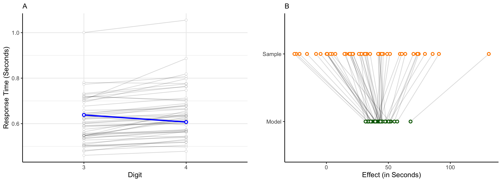
```


```{r figure1b, echo=FALSE, fig.align='left', fig.cap="RTs per condition (i.e., digit). The grey lines represent the individual RTs, and the blue line the mean aggregated response time.", fig.height=4, fig.width=6, eval = FALSE}

meanrtindat$Group.3 <- ifelse(meanrtindat$Group.1 > 5, 1, 0)
meanside <- with(meanrtindat, tapply(x, Group.3, mean))
meanside2 <- as.data.frame(t(meanside))
meanside3 <- data.frame(y = c(meanside2$`0`, meanside2$`1`), type = c("Smaller", "Larger"))

indside <- with(meanrtindat, tapply(x, list(Group.3, Group.2), mean))
indside2 <- as.data.frame(t(indside))
indside3 <- data.frame(y = c(indside2$`0`,indside2$`1`), type = rep(c("Smaller", "Larger"), each = nrow(indside2)), group = rep(1:52, 2))


# matplot(indside, type = "b", lty = 1, col = adjustcolor(1, .3), pch = 20
#         , ylim = c(300, 1200), xlim = c(0.8, 2.2), xaxt = "n")
# axis(1, 1:2, labels = c("smaller", "larger"))
# lines(meanside, lwd = 2, type = "b", col = "darkred")

level_order <- c("Smaller", "Larger")
theme_set(theme_apa(base_size = 9))
meanrtplot2 <- ggplot(indside3, aes(y = y, x = factor(type, level_order))) + 
  geom_line(aes(group = group), alpha = .15) + geom_point() + 
  geom_line(data = meanside3, aes(group = 1), color='blue', size = 1) + 
  geom_point(data = meanside3, 
             aes(group = 1), color='blue', shape = 21, size = 2, stroke = 1) + 
  labs(x = "", y = "Response Time (Ms)") + 
  theme_bw() + 
  theme(axis.line = element_line(colour = "black"), 
        panel.border = element_blank(), 
        panel.background = element_blank())

# meanrtplot2 
```

## Why Multilevel Modeling?  

Before diving into hierarchical modeling, let us consider two alternative approaches: Analyzing aggregated data and analyzing the data separately for each participant. Analyses of aggregated data such as the ANOVA from the scenario above examine a general effect that is assumed to be consistent across subjects. For instance, when investigating whether there is an effect of digit on RT, the mean RT for each participant is computed for each digit-condition, and a repeated-measures ANOVA is conducted on these aggregated scores. Analyses of aggregated data cannot investigate whether a trend is consistent across participants. Therefore, when this option is applied and individual variability is ignored, the general trend can be an inaccurate representation of the true general trend [Rouder, Morey, & Pratte, 2013; Haaf & Rouder, 2017; van Doorn, Aust, Haaf, Stefan, and Wagenmakers, -@van2021bayes]. This is shown in Panel A of Figure \@ref(fig:figure1) where some of the individual trends (i.e., slopes of the grey lines) differ from the general trend (i.e., slope of the blue line). If every participant takes part in each condition, the person variability affects all conditions, thus inducing a correlation across conditions. For example, participants in a symbolic distance effect experiment repeatedly respond to target digits inducing a correlation between the responses to the target digits, such as between target digit 3 and target digit 4. Therefore, the observations are not independent as we assume if we perform analysis on aggregated data. As a result, the type I error rate of a test of the effect increases: there is a higher probability of concluding that there is an effect if there is no effect (Rouder & Lu, 2005). 

A second alternative analysis method is to conduct an analysis on each participant's data independently. For example, in the digit classification task, we would estimate one digit effect per person (cf. the grey lines in Figure 1A), but no overall effect (cf. the blue line in Figure 1A). Therefore, when analyzing participant data independently, it is hard to draw any general conclusions.   

In hierarchical analyses, the general or overall effect is called fixed effect, and the individual-specific deviations from this effect are called random effects (Rouder & Lu, 2005). We can also estimate individual effects, not as deviations from an overarching effect, but as effects for each individual, as obtained from a per-participant analysis. In this tutorial, we will use the terms general effect, individual deviation, and individual effects instead of fixed and random effects, because we believe these terms are better suited for the interpretation of our analyses. 

If estimated for each participant independently, observed individual effects are quite variable because they are perturbed by sample noise. In hierarchical modeling, these individual effects are optimally and automatically corrected towards the general trend [@efron1977stein]. This phenomenon, also called "shrinkage", is illustrated in Panel B of Figure \@ref(fig:figure1). The rightmost observation in the figure is in sample quite large compared to the other observed effects. The estimated effect (green point) is drastically corrected towards the mean. Conversely, the general trend is only influenced slightly by individuals showing a highly divergent trend. By adding the individual variability to the model, we no longer assume independence between observations, but the overall effect in the model leaves the possibility to generalize the effect. Therefore, hierarchical analysis can be considered a middle ground between an independent analysis and an analysis of aggregated data. 
```{r figure2, echo=FALSE, eval = FALSE, fig.cap="Sample represents the observed response time in milliseconds per individual, while model represents the individual response time estimates. Individual estimates are shrunken towards the general trend. ", fig.align = "left", fig.height = 2, fig.width = 3, out.width="70%"}
knitr::include_graphics("Images/hierplotefmor.png")
```
 
The Bayesian framework offers an intuitive approach for hierarchical modeling (Rouder & Lu, 2005; Lynch, 2007). The flexibility of the Bayesian approach facilitates the implementation of complex hierarchical models (Rouder, Morey, & Pratte, 2013). It also allows for the inclusion of prior knowledge into the analysis, as well as the monitoring of evidence for specific hypotheses as the data accumulate [@wagenmakers2018bayesian]. A complete discussion of the Bayesion approach is beyond the scope of this manuscript. We refer the interested reader to Etz and Vandekerckhove [-@etz2018introduction] and Wagenmakers and colleagues [-@wagenmakers2018bayesian]. 

# Model Specification 
In the following section, we specify two models that can be used for our application example: a normal and a log-normal model.^[Online Supplement A provides the parameterization for models of aggregated and individual data, to illustrate the difference with hierarchical models. ] We are aware that many psychologists do not engage with equations on a daily basis. In this section, however, we try to accessibly summarize the key considerations of model specification. We encourage everyone to read on and not skip the section. Additionally, we provide a non-technical verbal summary.

Throughout the section, we assume that each observation $Y_{ijk}$ is the response time from participant $i$ in trial $k$ of condition $j$. The condition $j$ is the digit presented to the participant, and can take the values 2, 3, 4, 6, 7, and 8. We further assume that the digit side ($x$) is recorded using effect coding where a value of -0.5 indicates that the digit is smaller than 5, and a value of 0.5 indicates that the digit is larger than 5. Additionally, we assume that the digits presented in the trial are dummy-coded in the data using four variables ($u$, $v$, $w$, $z$). If digits 2 and 8 were presented all four variables are zero. The dummy variables represent the digits 3 ($u$), 4 ($v$), 6 ($w$), and 7 ($z$), and each take the value 1 if the respective digit was presented in the trial, and 0 if it was not.

## Normal Model 

In the normal model, the observation $Y_{ijk}$ is assumed to come from a normal distribution. The mean of this normal distribution is predicted by the person-specific intercept $\gamma$, the effect of the side (i.e., smaller or greater than 5, $\beta$) and the effect of the distance from 5 (i.e., symbolic distance effect, $\delta$’s). The variance is represented by $\sigma^2$. This is captured in the following equation:   

\begin{equation}
Y_{ijk} \sim \text{Normal}(\gamma_{i} + x_j \beta_{i} + u_j \delta_{7i} + v_j \delta_{6 i} + w_j \delta_{4i} + z_j \delta_{3i}, \sigma^2), (\#eq:datalevel)
\end{equation}

where 

<!-- \[ -->
<!-- x_j =  -->
<!-- \begin{cases} -->
<!-- \frac{1}{2} & j < 5\\ -->
<!-- - \frac{1}{2} & j > 5, \\ -->
<!-- \end{cases} -->

<!-- \; \; \; -->

<!-- \[ -->
<!-- u_j =  -->
<!-- \begin{cases} -->
<!-- 1 & j = 7\\ -->
<!-- 0 & \text{Otherwise}, -->
<!-- \end{cases} -->

<!-- \; \; \; -->

<!-- v_j =  -->
<!-- \begin{cases} -->
<!-- 1 & j = 6\\ -->
<!-- 0 & \text{Otherwise}, -->
<!-- \end{cases} -->
<!-- \] -->

\begin{align*}
&
\begin{aligned}
x_j = 
\begin{cases}
\frac{1}{2} & j < 5\\
- \frac{1}{2} & j > 5, \\
\end{cases}
\end{aligned}
&
\begin{aligned}
u_j = 
\begin{cases}
1 & j = 7\\
0 & \text{Otherwise},
\end{cases}
\end{aligned}
&
\begin{aligned}
v_j = 
\begin{cases}
1 & j = 6\\
0 & \text{Otherwise},
\end{cases}
\end{aligned}
\end{align*}

<!-- \[ -->
<!-- w_j =  -->
<!-- \begin{cases} -->
<!-- 1 & j = 4\\ -->
<!-- 0 & \text{Otherwise}, -->
<!-- \end{cases} -->

<!-- \; \; \; -->

<!-- z_j =  -->
<!-- \begin{cases} -->
<!-- 1 & j = 3\\ -->
<!-- 0 & \text{Otherwise}. -->
<!-- \end{cases} -->
<!-- \] -->

\begin{align*}
&
\begin{aligned}
w_j = 
\begin{cases}
1 & j = 4\\
0 & \text{Otherwise},
\end{cases}
\end{aligned}
&
\begin{aligned}
z_j = 
\begin{cases}
1 & j = 3\\
0 & \text{Otherwise}.
\end{cases}
\end{aligned}
\end{align*}
The model equation shows that, for instance, for participant *i* = 1 and digit *j* = 7, the mean RT is modeled by: $\gamma_{i = 1} - \frac{1}{2} \beta_{i = 1} + \delta_{7,i = 1}$. If all $\delta$s are positive, then the model equation indicates that individuals respond fastest when the digits 2 and 8 are presented, as in this situation there are no digit effects in the equation.  

The intercept $\gamma_i$, the side effect $\beta$, and the digit effects $\delta$ are person-specific. This means that for these parameters, the model will produce one estimate for each participant. The multilevel model assumes that these individual-level effects in turn follow a normal distribution: 

\begin{equation}
\begin{aligned}
\gamma_{i} &\sim \text{Normal}(\mu_{\gamma}, \sigma^2_{\gamma}), (\#eq:fixedvsrandom)\\
\beta_{i} &\sim \text{Normal}(\mu_{\beta}, \sigma^2_{\beta}), \\
\delta_{7i} &\sim \text{Normal}(\mu_{\delta_{7}}, \sigma^2_{\delta_{7}}), \\
\delta_{6i} &\sim \text{Normal}(\mu_{\delta_{6}}, \sigma^2_{\delta_{6}}), \\
\delta_{4i} &\sim \text{Normal}(\mu_{\delta_{4}}, \sigma^2_{\delta_{4}}),\\
\delta_{3i} &\sim \text{Normal}(\mu_{\delta_{3}}, \sigma^2_{\delta_{3}}).\\
\end{aligned}
\end{equation}
The means ($\mu_{\gamma}$, $\mu_{\beta}$, $\mu_{\delta}$) of these normal distributions represent the general expected effect, for example, $\mu_{\beta}$ represents the expected effect of digit side across individuals. The variances ($\sigma^2_{\gamma}$, $\sigma^2_{\beta}$, $\sigma^2_{\delta}$) represent the individual variation. Therefore, the individual level depends on another level, the overall effect level, containing $\mu_{\gamma}$, $\mu_{\beta}$, $\mu_{\delta}$, $\sigma^2_{\gamma}$, $\sigma^2_{\beta}$, and $\sigma^2_{\delta}$.

## Log-normal Model 
A normal model may not be appropriate in case of more complex theories, hypotheses, or data structures. For example, the data in the example are response times. The normal model, however, can yield negative values, which seems very problematic. In addition, RT distributions are right-skewed. A better representation of the data at hand is therefore given by a log-normal model [@schramm2019reaction]. This means that Equation \@ref(eq:datalevel) has to be adjusted:

\begin{equation}
Y_{ijk} \sim \text{LogNormal}(\gamma_{i} + x_j \beta_{i} + u_j \delta_{7i} + v_j \delta_{6i} + w_j \delta_{4i} + z_j \delta_{3i}, \sigma^2).  
\end{equation}
Note that the only change in the model formulation is the change of the likelihood function from a normal distribution to a log-normal distribution. The location parameter of the log-normal distribution is described through the same combination of parameters as the mean of the normal model. However, it has a different interpretation. For example, for a location parameter of $\mu = 0$ and a scale parameter of $\sigma^2 = 1$, the mode of the log-normal distribution is $0.368$, and the mean is $1.65$. 

## Summary

In summary, the models are placed directly on the raw RT data. The only difference between the normal and the log-normal models is the likelihood distribution. The normal model just assumes a symmetric normal distibution that can take on any value. The log-normal model assumes a log-normal distribution, which is restricted to positive values and has a right skew. 

Both the normal and the log-normal models contain the following parameters: $\gamma_i$ corresponds to the participant's overall response time, $\beta_i$ corresponds to the participant's side effect, and the four $\delta_{\cdot i}$ correspond to the effects between the digits furthest away from 5 (2 or 8) and the other digits. These person-specific effects all come from parent distributions. This results in the hierarchical structure shown in Figure \@ref(fig:hierarchyplot). The figure highlights the relationship between the parameters and the data.

In Bayesian modeling, prior distributions are needed to complete model specification. In the next section, we will take you through the process of setting these priors, followed by sections on Bayesian estimation and hypothesis testing for both the normal and log-normal model. In every section, we will first explain the normal model, followed by an illustration of the log-normal model. 

```{r hierarchyplot, echo=FALSE, fig.cap="Hierarchical structure of the normal and lognormal models for the number classification task.", fig.align = "left", fig.height = 3, fig.width = 4, out.width="70%"}
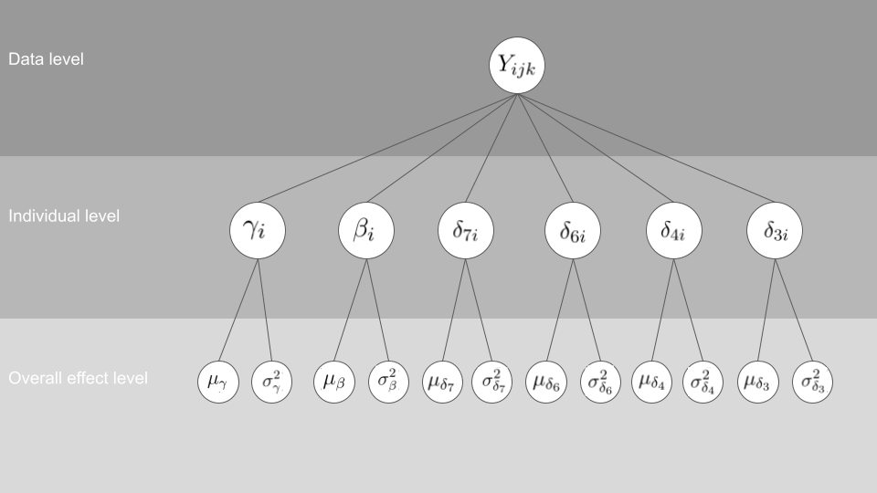
```

# Prior Settings 
Bayesian analysis requires the specification of prior distributions. Prior distributions are probability distributions on model parameters that specify beliefs about the relative plausibility of parameter values before seeing the data [@wagenmakers2018bayesian]. These prior beliefs can then be updated with the data to obtain the posterior beliefs about the model parameters, following Bayes' rule [@jeffreys1961theory].

For our models, priors are needed on the general effects ($\mu_{\gamma}$, $\mu_{\beta}$, $\mu_{\delta}$) and on the variances ($\sigma_{\gamma}^2$, $\sigma_{\beta}^2$, $\sigma_{\delta}^2$, and $\sigma^2$), as shown in Equation \@ref(eq:fixedvsrandom). For each of these parameters, we specify our beliefs as a probability distribution. For example, if we expect small side effects in the digit classification example, the prior distribution on $\mu_{\beta}$ should have its peak close to zero. Large values for the variance parameters indicate large individual differences, whereas values close to zero indicate that effects are similar across individuals [@haaf2017developing]. If we expect little variability of side effects between people, the prior assigned to $\sigma_{\beta}$ should also have its peak close to zero. The width of prior distributions expresses how certain we are about the parameters before seeing the data. For example, if we want to express that we are certain that the side effect is zero, we can formulate a prior that allocates all probability mass to a parameter value of zero. 

## Fear of Commitment  
In many cases substantive researchers fear committing to prior settings because they are unsure about their choices for the type and settings of the distribution. Therefore, they tend to choose wide priors to indicate little prior knowledge about the parameter values [@aczel2018expert]. These include default priors offered by programming packages, such as `rstan` (Stan Development Team, 2019a; illustrated in Online Supplement B) and `brms` [@R-brms_a; @R-brms_b]. Wide priors are priors that allocate (approximately) equal probability density to a great range of values, such as a uniform distribution without bounds [@gelman2006prior]. However, wide priors can be problematic. First, since the distribution is spread out across a wide range of values, the probability density on any specific parameter value is very low. Therefore, any effect is unlikely under the prior as a wide range of effects is deemed plausible. This influences model comparisons: the support for the null hypothesis becomes increasingly large. This is also referred to as the Jeffreys-Lindley paradox [@lindley1957statistical]. 

Another important issue is that wide priors are often improper, that is, the probability density does not integrate to one [@hobert1996effect]. An example of an improper prior is a uniform prior distribution ranging from minus infinity to infinity. In case of improper priors, an estimation of the general and individual effects cannot be provided. However, even proper priors can result in improper posteriors [@hobert1996effect]. Although estimation should not be possible in this situation, statistical software might still provide results without notifying the user that the posterior distribution does not exist. If users are not aware of this problem, this can result in misleading conclusions. Therefore, it is important to check if *(a)* the priors are proper and *(b)* the priors result in proper posteriors. There is no fail-safe method that guarantees proper posteriors for hierarchical models. The best approach is to choose well-reasoned informative priors for the model, for instance, by using the proposed four-step procedure below.

## Procedure 
We propose four steps to choose suitable priors for Bayesian hierarchical models. We first present the steps and then apply them to choose suitable priors for the parameters $\mu_{\gamma}$, $\mu_{\beta}$, $\mu_{\delta}$, $\sigma_{\gamma}^2$, $\sigma_{\beta}^2$, $\sigma_{\delta}^2$ and $\sigma^2$ in our example. 

```{r distributionsteps, echo=FALSE, fig.cap = "Prior specification steps.", fig.align='center', warning=FALSE, message=FALSE, fig.height=3, fig.width=4, cache = TRUE}
# https://jokergoo.github.io/circlize_book/book/graphics.html 
library(circlize)
library(unikn)   # https://cran.r-project.org/web/packages/unikn/vignettes/colors.html

# circos.initialize(letters[1:4], xlim = c(0, 1))
# col = rand_color(4)
# tail = c("point", "normal", "point", "normal")
# circos.track(ylim = c(0, 1), panel.fun = function(x, y) {
#     circos.arrow(x1 = 0, x2 = 1, y = 0.5, width = 0.4, 
#         arrow.head.width = 0.6, arrow.head.length = ux(1, "cm"), 
#         col = col[CELL_META$sector.numeric.index], 
#         tail = tail[CELL_META$sector.numeric.index])
# }, bg.border = NA, track.height = 0.4)

circos.clear()
cell_cycle = data.frame(phase = c("1. Distribution family", "2. Distribution settings", "3. Prior predictions", "4. Adjust"), levels = c("Distribution type", "Distribution settings", "Prior predictions", "Adjust"),
                        hour = c(8, 8, 8, 8))
color = c(NA)
circos.par(start.degree = 90)
circos.initialize(cell_cycle$phase, xlim = cbind(rep(0, 4), cell_cycle$hour))
circos.track(ylim = c(0, 1), panel.fun = function(x, y) {
    circos.arrow(CELL_META$xlim[1], CELL_META$xlim[2], 
        arrow.head.width = CELL_META$yrange*0.8, arrow.head.length = ux(0.5, "cm"),
        col = color[CELL_META$sector.numeric.index])
    circos.text(CELL_META$xcenter, CELL_META$ycenter, CELL_META$sector.index, 
        facing = "bending.inside", niceFacing = TRUE, cex = 0.6)
}, bg.border = NA, track.height = 0.4)
```

## Step 1: Distribution Family  
The first step in specifying a prior distribution is to find a suitable distribution family. For instance, the prior plausibility of parameter values can be expressed through a normal, an inverse gamma, or a Student's *t*-distribution. These distributional families have different shapes and a different support, as illustrated in Figure \@ref(fig:distritypeplot).  For example, the inverse gamma distribution is limited to non-negative parameter values and has a positive skew. The normal and Student's *t*-distribution both have support over the real line, however, the Student's *t*-distribution has wider tails, that is, it assigns a higher plausibility to values that are on the extremes of the distribution. 

The support of the prior distribution should cover all theoretically possible parameter values. For example, if a parameter cannot have negative values, such as a standard deviation, the inverse gamma distribution would be a suitable choice. Conversely, if a parameter can take positive and negative values, the normal and Student *t*-distribution would be suitable.

Note that although distributions within a distributional family share the same functional form, they can differ a lot in their shape and location. The exact appearance of a prior distribution is controlled by a set of hyperparameters, for example, the mean and variance for the location and scale of a normal prior. In the next section, we will give some guidance for specifying these hyperparameters.

```{r distritypeplot, echo=FALSE, fig.cap="Common probability density distributions that may be used as priors. Panel A shows normal distributions varying in mean and standard deviation. Panel B shows inverse gamma distributions that differ in the shape and scale parameter. Panel C shows Student's \\textit{t}-distributions that differ in the location and scale parameter. For all three \\textit{t}-distributions, the degrees of freedom are set to 3.", fig.align = "left", fig.height = 8, fig.width = 12, out.width="100%"}
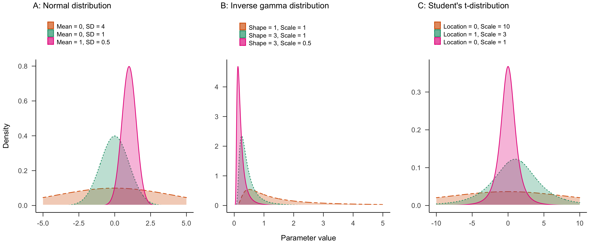
``` 

## Step 2: Set Hyperparameters  
Location, scale, and sometimes shape of the selected distribution can be adjusted by choosing adequate hyperparameters. The goal is to adjust the prior to reflect which parameter values we deem most plausible and how much uncertainty there is. For instance, panel A of Figure \@ref(fig:distritypeplot) illustrates, that increasing the mean in the normal distribution leads to a shift of location: higher parameter values are deemed more plausible according to the pink distribution compared to the green distribution. Panel B shows how uncertainty can be specified, for example, by decreasing the shape of the inverse gamma distribution while keeping the scale constant: the orange distribution assigns probability to a wider range of values than the green distribution. 

For this step, it is important to consider the scale on which variables are measured. For instance, RTs could be measured in seconds or in milliseconds. This means that if a researcher expects a response time of one second, they will formulate a prior distribution with a mean of 1 if RT is measured in seconds, or formulate a prior distribution with a mean of 1000 if RT is measured in milliseconds. Similarly, the measurement scale will also affect the width of the specified prior.

## Step 3: Prior Predictions 
A key advantage of model specification with priors is that we can obtain preditions on what the data would look like that are generated from the model. These prior predictions allow us to make the implications of our specified priors more concrete. Researchers can look at relevant statistic that summarize the simulated data and decide if they correspond to reasonable observations for their specific research context. If the simulated data are in line with the researchers' expectations, the priors can be used for the analysis. If the simulated data do not match the expectations, the priors have to be adjusted (Step 4).  

```{r priorpredfigurepanel, echo=FALSE, fig.cap="Side and digit effects from predicted data. Violins represent the distribution of predicted effects across 1000 simulation runs. The blue points are the average effects across simultions. Panel A shows the prior predictions for the normal model based on the default priors of \\textit{brms}. Panel B shows the prior predictions for the normal model based on the selected priors. Panel C shows the prior predictions for the lognormal model based on the priors chosen for the normal model. Panel D shows the prior predictions for the lognormal model based on the selected priors.", fig.align = "left", fig.height = 3, fig.width = 4, out.width="100%"}
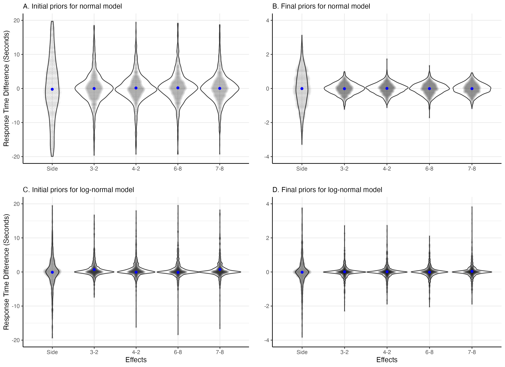
```

The simulation proceeds as follows: First, one random draw from each prior distribution is taken. This is plugged into the individual effect distributions (Equation (2)). Then, the likelihood of the model, such as specified in Equations (1) and (3), is used to simulate observations per condition. This means that for *n* participants, *n* random values for the model parameters are generated based on the priors, which will result in the *k* observations per *j* conditions. This process is repeated *m* times, where *m* is the number of simulations drawn. Note that the more simulations are conducted, the closer one gets to the full picture because enough samples from the prior distribution are needed. Finally, we can visualize the simulated data. Figure \@ref(fig:priorpredfigurepanel) shows prior predictions for the key effects from the number classification task. For this task, we mainly care about the side effect and digit effects corresponding to the $\beta$s and the $\delta$s from the model. Here, the prior predictions for the average side effect and the average digit effect across participants are depicted.

For step 3, the intention is not to compare the actual data of interest to the data predicted by the priors. Instead, the researchers' *expectations* of plausible data are compared to the prior predictions. Therefore, prior predictive checks are conducted *before* looking at the actual data. If the prior predictions match the expectations, the priors can be used for the analysis. If they do not match the expectations, the priors need to be adjusted.

## Step 4: Adjust 
Based on the results of the prior predictions, it might be necessary to adjust the priors. Typically, the focus of adjustments will be on finding adequate parameter values for the prior distribution, that is, on repeating step 2 and the following steps of the prior specification process. 

In the following two sections, we will provide a walk-through of all four steps of prior specification for our two models of the symbolic distance effect. 

## Normal Model 

In the symbolic distance model, we have to specify priors for the parameters $\mu_{\gamma}$, $\mu_{\beta}$, $\mu_{\delta}$, $\sigma^2_{\gamma}$, $\sigma^2_{\beta}$, and $\sigma^2_{\delta}$. The parameters $\mu_{\gamma}$, $\mu_{\beta}$, and $\mu_{\delta}$ can be positive or negative. All variance terms ($\sigma_{\gamma}^2$, $\sigma_{\beta}^2$, $\sigma_{\delta}^2$, and $\sigma^2$) are constrained to be positive. If there is no information from previous studies, researchers might be inclined to use the default priors in `brms` as a starting point.  

In `brms`, different default priors are set on different types of parameters [@R-brms_a]. The prior on the group-level regression weights ($\mu_{\beta}$, $\mu_{\delta}$) is a normal distribution with a mean of 0 and a standard deviation of 1. The prior on the intercept $\mu_{\gamma}$ is a scaled and shifted Student's *t*-distribution with 3 degrees of freedom, a location parameter of 1, and a scale parameter of 10. `brms` specifies priors on standard deviations ($\sqrt{\sigma^2}$) instead of variances. For the normal model, this means that priors are set on $\sigma_{\gamma}$, $\sigma_{\beta}$, $\sigma_{\delta}$ and $\sigma$, instead of on $\sigma_{\gamma}^2$, $\sigma_{\beta}^2$, $\sigma_{\delta}^2$ and $\sigma^2$. The default prior on the standard deviations is a central, scaled Student's *t*-distribution with 3 degrees of freedom and a scale parameter of 10 that is truncated at zero. To summarize, the default priors would be set the following way: 

\begin{equation}
\begin{aligned}
\mu_{\gamma} &\sim \text{Student's t}(3, 1, 10), (\#eq:chosenpriors1) \\ 
\mu_{\beta}, \mu_{\delta} &\sim \text{Normal}(0, 1), \\ 
\sigma, \sigma_{\gamma}, \sigma_{\beta}, \sigma_{\delta} &\sim \text{Truncated-Student's t}_{+}(3, 0, 10). 
\end{aligned}
\end{equation}
The prior distributions `brms` specifies on the standard deviations can be transformed to prior distributions on variances. Prior distributions on variances have a smaller scale than priors on standard deviation. Note, however, that the transformation of the prior distributions is not as simple as the transformation of the parameter itself. In our Online Supplement, we provide R-code with a numeric solution to the transformation. For the `brms` priors, we obtain the following implied prior distributions on variances:

\begin{equation}
\begin{aligned}
\sigma_{\gamma}^2, \sigma_{\beta}^2, \sigma_{\delta}^2, \sigma^2 &\sim \text{Student's t}(3, 0, 1.48). 
\end{aligned}
\end{equation}

The priors are visualized on the right side of Figure \@ref(fig:priorvisualizationbrms2). Note that these prior distributions are on the group-level parameters and represent the uncertainty about the general effect. The uncertainty about individual effects is represented by the marginal prior distribution on the left. This distribution takes the prior variability of the mean and variance as well as the implied individual variability into account.

```{r priorvisualizationbrms2, fig.cap="Visualization of \\textit{brms} default prior settings for the normal model. On the right, the prior distributions on general effects parameters are shown. On the left, the implied distribution of the individual effects for every parameter based on these priors are presented. ", fig.align = "left", message=FALSE, warning=FALSE, cache = TRUE}
# library(crch)  for truncated student's t 

# Plots 
x <- seq(-3, 3, by=.01)
# color codes: https://flaviocopes.com/rgb-color-codes/


# Instead do this, take integral  
Nplotst <- 1000000
mugammaplotbrms <- rst(Nplotst, nu = 3, mu = 1, sigma = 10)
vargammaplotbrms <- rtt(Nplotst, df = 3, location = 0, scale = 10, left = 0, right = Inf)  # should be truncated 
betaplot2brms <- rnorm(Nplotst, mugammaplotbrms, sqrt(vargammaplotbrms))

pgamma2databrms <- data.frame(betaplot2brms)
pgamma2brms <- ggplot(pgamma2databrms, aes(x = betaplot2brms)) + geom_density_line(color = "#0072B2", fill = "#0072B2", alpha = 0.1, position = "identity") + ylab("Density") + xlab("") + labs(title = expression(~gamma[i])) + theme(plot.title = element_text(size = 14)) + xlim(-20, 20)

parametersgammabrms <- c("Mean" = "#D95F02", "Variance" = "#1B9E77")

ptogethergamma2brms <- ggplot(data = data.frame(x = c(-20, 20)), aes(x)) +
  stat_function(fun = dst, n = 1001, args = list(nu = 3, mu = 1, sigma = 10), aes(color = "Mean", fill = "Mean"), geom = "area", alpha = 0.3) + ylab("") + xlab("") + 
  stat_function(fun = dtt, n = 1001, args = list(df = 3, location = 0, scale = 10, left = 0, right = Inf), geom = "area", aes(color = "Variance", fill = "Variance"), alpha = 0.3, position = "identity") + geom_hline(yintercept=0, colour="white", size=1) + scale_color_manual(name = "Prior on", values = parametersgammabrms, aesthetics = c("colour", "fill"), labels = c(expression(~mu[~gamma]), expression(~sigma[~gamma]))) + 
  theme(legend.text=element_text(size = 9), legend.title = element_text(size = 7), legend.key.width=unit(0.45,"cm"), legend.key.height=unit(0.5,"cm"))


# Beta 
mubetaplotbrms <- rnorm(Nplotst, 0, 1)
varbetaplotbrms <- rtt(Nplotst, df = 3, location = 0, scale = 10, left = 0, right = Inf)  
betaplot22brms <- rnorm(Nplotst, mubetaplotbrms, sqrt(varbetaplotbrms))

pbeta2databrms <- data.frame(betaplot22brms)
pbeta2brms <- ggplot(pbeta2databrms, aes(x = betaplot22brms)) + geom_density_line(color = "#0072B2", fill = "#0072B2", alpha = 0.1, position = "identity") + ylab("Density") + xlab("") + labs(title = expression(~beta["i"])) + theme(plot.title = element_text(size = 14)) + xlim(-10, 10)

ptogetherbeta2brms <- ggplot(data = data.frame(x = c(-20, 20)), aes(x)) +
  stat_function(fun = dnorm, n = 1001, args = list(0, 1), aes(color = "Mean", fill = "Mean"), geom = "area", alpha = 0.3) + ylab("") + xlab("") + 
  stat_function(fun = dtt, n = 1001, args = list(df = 3, location = 0, scale = 10, left = 0, right = Inf), geom = "area", aes(color = "Variance", fill = "Variance"), alpha = 0.3, position = "identity") + geom_hline(yintercept=0, colour="white", size=1) + scale_color_manual(name = "Prior on", values = parametersgammabrms, aesthetics = c("colour", "fill"), labels = c(expression(~mu[~beta]), expression(~sigma[~beta]))) + 
  theme(legend.text=element_text(size = 9), legend.title = element_text(size = 7), legend.key.width=unit(0.45,"cm"), legend.key.height=unit(0.5,"cm")) 

# Delta's 

mudeltaplotbrms <- rnorm(Nplotst, 0, 1)
vardeltaplotbrms <- rtt(Nplotst, df = 3, location = 0, scale = 10, left = 0, right = Inf)  
deltaplot2brms <- rnorm(Nplotst, mudeltaplotbrms, sqrt(vardeltaplotbrms))

pdelta2databrms <- data.frame(deltaplot2brms)
pdelta2brms <- ggplot(pdelta2databrms, aes(x = deltaplot2brms)) + geom_density_line(color = "#0072B2", fill = "#0072B2", alpha = 0.1, position = "identity") + ylab("Density") + xlab("Individual effect") + labs(title = expression(~delta[i])) + theme(plot.title = element_text(size = 14)) + xlim(-10, 10)

ptogetherdelta2brms <- ggplot(data = data.frame(x = c(-20, 20)), aes(x)) +
  stat_function(fun = dnorm, n = 1001, args = list(0, 1), aes(color = "Mean", fill = "Mean"), geom = "area", alpha = 0.3) + ylab("") + xlab("Parameter value") + 
  stat_function(fun = dtt, n = 1001, args = list(df = 3, location = 0, scale = 10, left = 0, right = Inf)  , geom = "area", aes(color = "Variance", fill = "Variance"), alpha = 0.3, position = "identity") + geom_hline(yintercept=0, colour="white", size=1) + scale_color_manual(name = "Prior on", values = parametersgammabrms, aesthetics = c("colour", "fill"), labels = c(expression(~mu[~delta]), expression(~sigma[~delta]))) + 
  theme(legend.text=element_text(size = 9), legend.title = element_text(size = 7), legend.key.width=unit(0.45,"cm"), legend.key.height=unit(0.5,"cm"))


theme_set(theme_apa(base_size = 9))
#ptogether

# Final figure 
grid.arrange(pgamma2brms, ptogethergamma2brms, pbeta2brms, ptogetherbeta2brms, pdelta2brms, ptogetherdelta2brms, nrow = 3, ncol = 2, widths = c(0.4, 0.6))
```


We will continue with step 3 of the prior specification process and check what the expected data would look like according to the selected priors. The results of the prior prediction for the symbolic distance effect with the priors from Equation \@ref(eq:chosenpriors1) with the number of participants $n = 10$, the number of trials per condition $k = 60$, and the number of simulations $m = 1000$ are shown in panel A of Figure \@ref(fig:priorpredfigurepanel). Code for the simulations can be found in our Online Supplement.

The figure shows the difference in RTs between digits for every repetition averaged across subjects (i.e., 1000 grey dots per effect). The blue dots represent the mean effect. Using the default prior from `brms`, the mean effects are expected to be around zero, with a mean effect of zero. However, the range around this mean is very wide, ranging from -10 to 10 second effects. Most of the trials are in a smaller range of -5 to 5 second effects. This means that according to our priors, we would expect the effects to fall in this range. For this task, where participants have to respond as fast as possible, such large RT effects are unlikely. Therefore, it seems reasonable to adjust the priors.  

```{r priorvisualization2, fig.cap="Visualization of the adjusted prior settings for the normal model. On the right, the prior distributions on general effects parameters are shown. On the left, the implied distribution of the individual effects for every parameter based on these priors are presented. ", fig.align = "left", fig.height = 6, fig.width = 8, warning=FALSE, message=FALSE, cache = TRUE}
### Set the priors 
a <- 0.5  # mean for mu, mu is the mean of theta  
b <- 1  # variance for mu 
c <- 3  # mean for sigma 
d <- .7  # variance for sigma, sigma is the variance of observations  
e <- 3  # mean for g, g is the variance of theta   
f <- .7  # variance for g 

#### Priors for beta 
a2 <- 0  # mean for mean of beta
b2 <- 0.09  # variance for mean of beta, used to be 1 
e2 <- 3  # mean for variance of beta, used to be .7 
f2 <- 0.5  # variance for variance of beta, used to be .2. 

#### Prior for deltas, same for every delta 
a3 <- 0  # mean for mean of delta 
b3 <- 0.09  # sd for mean of delta, 0.5, 0.3  
dd3 <- 3  # mean for variance of delta 
f3 <- 0.5   # variance for variance of delta 

# Plots 
x <- seq(-3, 3, by=.01)
# color codes: https://flaviocopes.com/rgb-color-codes/

## Gamma 
mu <- rnorm(10, a, b)
g <- rinvgamma(10, e, f)
gammaplot <- dnorm(x, mu, g)  # I think this is not possible. Get a value for mu and g for each x --> 601

# Instead do this, take integral  
Nplot <- 1000000
mugammaplot <- rtruncnorm(Nplot, a = 0, mean = 0.5, sd = 1)
vargammaplot <- rinvgamma(Nplot, e, f)
betaplot2 <- rnorm(Nplot, mugammaplot, sqrt(vargammaplot))
# plot(density(betaplot2, na.rm = TRUE))

pgamma2data <- data.frame(betaplot2)
pgamma2 <- ggplot(pgamma2data, aes(x = betaplot2)) + geom_density_line(color = "#0072B2", fill = "#0072B2", alpha = 0.1, position = "identity") + ylab("Density") + xlab("") + labs(title = expression(~gamma[i])) + theme(plot.title = element_text(size = 14)) + xlim(-10, 10)

parametersgamma <- c("Mean" = "#D95F02", "Variance" = "#1B9E77")

ptogethergamma <- ggplot(data = data.frame(x = c(-5, 5)), aes(x)) +
  stat_function(fun = dnorm, n = 1001, args = list(mean = a, sd = b), geom = "area", color = "#D95F02", fill = "#D95F02", alpha = 0.3) + ylab("") +
  stat_function(fun = dinvgamma, n = 1001, args = list(shape = e, scale = f), geom = "area", color = "#1B9E77", fill = "#1B9E77", alpha = 0.3, position = "identity") + geom_hline(yintercept=0, colour="white", size=1) + scale_color_manual(name = "Prior parameters gamma", values = parametersgamma) + 
  scale_fill_manual(name = "Bar",values = parametersgamma) 

ptogethergamma2 <- ggplot(data = data.frame(x = c(-5, 5)), aes(x)) +
  stat_function(fun = dtruncnorm, n = 1001, args = list(a = 0, mean = 0.5, sd = 1), aes(color = "Mean", fill = "Mean"), geom = "area", alpha = 0.3) + ylab("") + xlab("") + 
  stat_function(fun = dinvgamma, n = 1001, args = list(shape = e, scale = f), geom = "area", aes(color = "Variance", fill = "Variance"), alpha = 0.3, position = "identity") + geom_hline(yintercept=0, colour="white", size=1) + scale_color_manual(name = "Prior on", values = parametersgamma, aesthetics = c("colour", "fill"), labels = c(expression(~mu[~gamma]), expression(~sigma[~gamma]^2))) + 
  theme(legend.text=element_text(size = 9), legend.title = element_text(size = 7), legend.key.width=unit(0.45,"cm"), legend.key.height=unit(0.5,"cm")) + xlim(-1, 1)

# Beta 
mu2 <- dnorm(x, a2, b2)
g2 <- dinvgamma(x, e2, f2)
betaplot <- dnorm(x, mu2, g2)

mubetaplot <- rnorm(Nplot, a2, b2)
varbetaplot <- rnorm(Nplot, e2, f2)
betaplot22 <- rnorm(Nplot, mubetaplot, sqrt(varbetaplot))
# plot(density(betaplot22, na.rm = TRUE))

pbeta2data <- data.frame(betaplot22)
pbeta2 <- ggplot(pbeta2data, aes(x = betaplot22)) + geom_density_line(color = "#0072B2", fill = "#0072B2", alpha = 0.1, position = "identity") + ylab("Density") + xlab("") + labs(title = expression(~beta["i"])) + theme(plot.title = element_text(size = 14)) + xlim(-10, 10)

ptogetherbeta2 <- ggplot(data = data.frame(x = c(-5, 5)), aes(x)) +
  stat_function(fun = dnorm, n = 1001, args = list(mean = a2, sd = b2), aes(color = "Mean", fill = "Mean"), geom = "area", alpha = 0.3) + ylab("") + xlab("") + 
  stat_function(fun = dinvgamma, n = 1001, args = list(shape = e2, scale = f2), geom = "area", aes(color = "Variance", fill = "Variance"), alpha = 0.3, position = "identity") + geom_hline(yintercept=0, colour="white", size=1) + scale_color_manual(name = "Prior on", values = parametersgamma, aesthetics = c("colour", "fill"), labels = c(expression(~mu[~beta]), expression(~sigma[~beta]^2))) + 
  theme(legend.text=element_text(size = 9), legend.title = element_text(size = 7), legend.key.width=unit(0.45,"cm"), legend.key.height=unit(0.5,"cm")) + xlim(-1, 1)

# Delta's 
mu3 <- dnorm(x, a3, b3)
g3 <- dinvgamma(x, dd3, f3)
deltaplot <- dnorm(x, mu3, g3)


mudeltaplot <- rnorm(Nplot, a3, b3)
vardeltaplot <- rnorm(Nplot, dd3, f3)
deltaplot2 <- rnorm(Nplot, mudeltaplot, sqrt(vardeltaplot))

pdelta2data <- data.frame(deltaplot2)
pdelta2 <- ggplot(pdelta2data, aes(x = deltaplot2)) + geom_density_line(color = "#0072B2", fill = "#0072B2", alpha = 0.1, position = "identity") + ylab("Density") + xlab("Individual Effect") + labs(title = expression(~delta[i])) + theme(plot.title = element_text(size = 14)) + xlim(-10, 10)

ptogetherdelta2 <- ggplot(data = data.frame(x = c(-5, 5)), aes(x)) +
  stat_function(fun = dnorm, n = 1001, args = list(mean = a3, sd = b3), aes(color = "Mean", fill = "Mean"), geom = "area", alpha = 0.3) + ylab("") + xlab("Parameter Value") + 
  stat_function(fun = dinvgamma, n = 1001, args = list(shape = dd3, scale = f3), geom = "area", aes(color = "Variance", fill = "Variance"), alpha = 0.3, position = "identity") + geom_hline(yintercept=0, colour="white", size=1) + scale_color_manual(name = "Prior on", values = parametersgamma, aesthetics = c("colour", "fill"), labels = c(expression(~mu[~delta]), expression(~sigma[~delta]^2))) + 
  theme(legend.text=element_text(size = 9), legend.title = element_text(size = 7), legend.key.width=unit(0.45,"cm"), legend.key.height=unit(0.5,"cm")) + xlim(-1, 1)


theme_set(theme_apa(base_size = 9))
# ptogether

# Final figure 
grid.arrange(pgamma2, ptogethergamma2, pbeta2, ptogetherbeta2, pdelta2, ptogetherdelta2, nrow = 3, ncol = 2, widths = c(0.4, 0.6))

```

The normal distribution on $\mu_{\beta}$ and $\mu_{\delta}$ seems reasonable if we assume that a two-sided hypothesis about the symbolic distance effect is tested. However, we expect less variance around this mean. Therefore, we decrease the setting for the variation. The wide tails of the Student's *t*-distribution could be one of the reasons for the high range in variation. We change the prior for $\mu_{\gamma}$ to a normal distribution that has more narrow tails. As RTs cannot be negative, we adjust the prior to be positive only by truncating the normal distribution using a lower bound of zero. Finally, we would like to use a more common conjugate prior for the variances to ensure obtaining a proper posterior distribution. ^[Conjugate priors result in posterior distributions that belong to the same distribution family as the prior distribution [@Fink1997]. For a normal likelihood, these are the normal distribution for the mean and the inverse gamma distribution for the variance.] Therefore, we choose an inverse gamma distribution. We can also be more specific about the expected RTs. Based on our knowledge of these types of tasks [e.g., @haaf2017developing], it seems highly plausible that participants will respond within a second or two. We would expect effects in the range of 10 milliseconds to 100 milliseconds. We adjust our priors using these new distribution types and settings, evaluate the prior predictions (shown in panel B of Figure \@ref(fig:priorpredfigurepanel)) and arrive at the following priors:^[Because response times cannot be negative the prior for the overall baseline $\mu_\gamma$ is a truncated normal with a lower bound of zero.] 
      
\begin{equation}
\begin{aligned}
\mu_{\gamma} &\sim \text{Truncated-Normal}_{+}(0.5, 1), (\#eq:chosenpriors2var) \\
\mu_{\beta} &\sim \text{Normal}(0, 0.09), \\
\mu_{\delta} &\sim \text{Normal}(0, 0.09), \\
\sigma^2 &\sim \text{Inverse-Gamma}(3, 0.7),  \\
\sigma^2_{\gamma} &\sim \text{Inverse-Gamma}(3, 0.7), \\   
\sigma^2_{\beta} &\sim \text{Inverse-Gamma}(3, 0.5), \\   
\sigma^2_{\delta} &\sim \text{Inverse-Gamma}(3, 0.5).    
\end{aligned}
\end{equation}
Setting equivalent prior distributions on the standard deviations instead of on the variances results in the following priors: 

\begin{equation}
\begin{aligned}
\mu_{\gamma} &\sim \text{Truncated-Normal}_{+}(0.5, 1), (\#eq:chosenpriors2sd) \\
\mu_{\beta} &\sim \text{Normal}(0, 0.3), \\ 
\mu_{\delta} &\sim \text{Normal}(0, 0.3), \\  
\sigma &\sim \text{Inverse-Gamma}(13.8, 6.3),  \\ 
\sigma_{\gamma} &\sim \text{Inverse-Gamma}(13.8, 6.3), \\   
\sigma_{\beta} &\sim \text{Inverse-Gamma}(13.8, 5.3), \\    
\sigma_{\delta} &\sim \text{Inverse-Gamma}(13.8, 5.3).     
\end{aligned}
\end{equation}
The adjusted priors are visualized in Figure \@ref(fig:priorvisualization2). The figure shows that the adjusted priors assign their highest probability density to a smaller range of values and are, therefore, more specific than `brms`'s default priors presented in Figure \@ref(fig:priorvisualizationbrms2). In addition, the shape of the distribution is different for the individual variation, resulting in a higher probability for values closer to zero. Panel B of Figure \@ref(fig:priorpredfigurepanel) shows the predictions of the normal model with adjusted prior distributions. Most effects now range between -0.5 and 0.5 seconds. This aligns better with our expectations based on existing literature, but still allows for a considerable uncertainty about the true size of the effects. 

## Log-normal model 

We follow the same procedure for prior specification in the log-normal model. As before, we prefer to apply conjugate priors. The conjugate priors that we applied to the normal model are also conjugate priors for the log-normal model. As a starting point, we can therefore use the adjusted priors of the normal model and perform a prior prediction, shown in panel C of Figure \@ref(fig:priorpredfigurepanel). These priors result in a slightly higher variance in RTs than we would expect, and, importantly, the mean response time differences are not centered around zero in all conditions. This pattern is inconsistent with our expectations, which means that prior distributions for the log-normal model need to be adjusted. 

```{r priorpredfigurepanellog, echo=FALSE, fig.cap="Predicted mean RT difference between digits per repetition. The blue line represents the aggregated trend. Panel A represents the prior prediction based on the priors of the normal model. Panel B shows the prior prediction based on the selected prior for the log-normal model.", fig.align = "left", fig.height = 3, fig.width = 4, out.width="100%", eval = FALSE}
knitr::include_graphics("Images/priorpredfigure_lognormal_v2.png")
```
The transformation of the prior distributions is not as simple as the transformation of the parameter itself. Panel C shows that with the same priors as for the normal model, we obtain different data for the log-normal model compared to the normal model (panel B). Therefore, we adjusted the priors until the simulated data matched our expectations and looked like panel B. This yields the following priors that result in the prior prediction shown in panel D of Figure \@ref(fig:priorpredfigurepanel):^[For the overall baseline $\mu_\gamma$ we adjusted the prior based on our expectation of the expected overall response times. A mean parameter of -0.5 for the log-normal likelihood corresponds to a mean response time of 1.] 

\begin{equation}
\begin{aligned}
\mu_{\gamma} &\sim \text{Normal}(-0.5, 1), (\#eq:chosenpriorslogvar) \\
\mu_{\beta} &\sim \text{Normal}(0, 0.005), \\
\mu_{\delta} &\sim \text{Normal}(0, 0.005), \\
\sigma^2 &\sim \text{Inverse-Gamma}(3, 0.3),  \\
\sigma^2_{\gamma} &\sim \text{Inverse-Gamma}(3, 0.3), \\   
\sigma^2_{\beta} &\sim \text{Inverse-Gamma}(3, 0.01), \\   
\sigma^2_{\delta} &\sim \text{Inverse-Gamma}(3, 0.01).    
\end{aligned}
\end{equation}
Setting the same prior distribution on the standard deviations instead of on the variances yields the following priors:

\begin{equation}
\begin{aligned}
\mu_{\gamma} &\sim \text{Normal}(-0.5, 1), (\#eq:chosenpriorslogsd) \\
\mu_{\beta} &\sim \text{Normal}(0, 0.07), \\
\mu_{\delta} &\sim \text{Normal}(0, 0.07), \\
\sigma &\sim \text{Inverse-Gamma}(13.8, 4.1),  \\
\sigma_{\gamma} &\sim \text{Inverse-Gamma}(13.8, 4.1), \\   
\sigma_{\beta} &\sim \text{Inverse-Gamma}(13.8, 0.7), \\   
\sigma_{\delta} &\sim \text{Inverse-Gamma}(13.8, 0.7).    
\end{aligned}
\end{equation}

## Prior sensitivity 
In the previous sections, we decided on one set of prior distributions for each of the proposed models. However, researchers may find it difficult to settle on a single set of prior distributions in practice. This raises the question: What happens if you cannot decide on one prior? If several possibilities seem plausible, it is possible to use them all separately for the analysis and investigate their influence on the analysis results. This is called a prior sensitivity analysis [@roos2015sensitivity]. Generally, when it comes to prior specification, it is important to be *transparent* and to provide a justification for the selected prior distributions [@Stefan_etal2021]. Prior distributions are rarely inadmissible. However, as we demonstrated earlier, their usefulness in constraining model predictions can vary. Therefore, providing a justification of prior distributions in a paper can help readers gauge the generative quality of a presented model. When multiple justifiable prior distributions are applied to the same analysis, it is important to be transparent about this to avoid the impression of cherry-picking priors. If priors are chosen for their best fit to the data, this can lead to overfitting and spurious results. Prior sensitivity analyses and transparency about the prior specification process more generally, can therefore help to increase trust in the research results. 

# Bayesian Parameter Estimation

In Bayesian statistics, parameter estimates are obtained from the posterior distribution. The posterior distribution captures the uncertainty about the parameter after seeing the data, $\bf{Y}$. The mean of this distribution can be used as a point estimate for the parameter. The posterior distribution is calculated by updating the prior distribution using Bayes rule. For the symbolic distance effect, we have a model with many parameters, so the posterior distribution is also multidimensional. Instead of writing out all the parameters, we replace all the model parameters with the vector $\bm{\theta}$, resulting in the joint posterior:  

\begin{equation}
\underbrace{P(\bm{\theta}|\bf{Y})}_{\text{Posterior}} = \underbrace{P(\bm{\theta})}_{\text{Prior}}\times\underbrace{\frac{P(\bf{Y}|\bm{\theta})}{P(\bf{Y})}}_{\text{Updating factor}}.
(\#eq:Bayesrule)
\end{equation}

Typically, we are not interested in the distribution of all parameters together, but in the posterior of one parameter independent of all the others. This posterior distribution is called the marginal posterior, and it is computed by integrating out all other parameters of the joint posterior. The marginal posterior distribution for the side effect $\mu_{\beta}$, for instance, is:

\begin{equation}
P(\mu_{\beta}| \bf{Y}) = \int P(\bf{Y} | \mu_{\beta}, \bm{\theta})P(\mu_{\beta})P(\bm{\theta})) d\bm{\theta}  
\end{equation}
where $\bm{\theta}$ now represents all parameters except for $\mu_{\beta}$. With an increasing number of parameters and an increasingly complex model structure, it is no longer possible to find analytical solutions for the multidimensional integrals involved in the posterior distributions. A solution to this issue is to sample from the joint posterior distribution. Using algorithms such as Markov chain Monte Carlo sampling [MCMC; for an introduction see  @van2018simple], Gibbs sampling [@chib1995marginal] or Hamiltonian Monte Carlo sampling [@betancourt2015hamiltonian]. It is out of the scope of this paper to go into detail on the algorithms, but we refer the interested reader to a tutorial paper on MCMC by van Ravenzwaaij et al. [-@van2018simple], a conceptual introduction to Hamiltonian Monte Carlo by Betancourt [-@betancourt2018conceptual], and a summary of samplers by Green et al. [-@green2015bayesian]. 

An approximation for the marginal posterior distribution can be obtained by assessing the empirical distribution of MCMC samples for the parameter of interest disregarding the other parameters. Since the frequency of combinations of samples in the joint posterior is determined by their posterior plausibility, this procedure is equivalent to a multidimensional integration across all other parameters. 

Every sampling algorithm requires the specification of the number of samples (also called iterations) that are drawn from the posterior distribution. Furthermore, all MCMC sampling methods have in common that results depend (somewhat) on chosen starting values, that is, initial parameter values for which the unnormalized posterior (i.e., likelihood times prior) is evaluated. This dependency can be assessed if the sampling algorithm is repeated several times (i.e., chains) with different starting values. Since the first few iterations of a chain---often called warm-up or burn-in---are somewhat dependent on the starting value, these samples are typically discarded. 

Before interpreting the estimation results, it has to be checked whether the posterior distribution of the parameters has converged, meaning that a stationary posterior distribution has been reached [@Vehtari_2021]. We will explain these convergence checks in more detail in the section Model Diagnostics. 

## Software 
There are many different programs available to fit Bayesian hierarchical models, that is, to obtain samples from the joint posterior distribution of parameters. In this tutorial, we focus on two of the most commonly used `R` packages, `rstan` [@R-rstan] and `brms` [@R-brms_a; @R-brms_b]. We assume that readers are somewhat familiar with `R`. The package `rstan` provides the most modern algorithms and flexibility in model set-up. The package `brms` was created as an overlay to `rstan` and is based on the well-known `lme4` syntax [@R-lme4]. The goal of `brms` is to ease the transition to Bayesian hierarchical modeling for novice users of Bayesian statistics. The packages work similarly for the normal and log-normal model. In this section, we explain how a model can be fitted in each package using code snippets. In addition, we offer a separate Rmarkdown file for each package in our Online Supplement that explains in more depth how to analyze the full symbolic distance effect model with the specific package. 

### Rstan 

`Rstan` allows the application of `Stan` [@carpenter2017stan], a probabilistic programming language, in `R`. The package uses a version of the Hamiltonian Monte Carlo (HMC) algorithm, No-U-turn sampler [NUTS; Hoffman & Gelman, -@hoffman2014no], for sampling. `Rstan` requires two files: a `.stan` file containing the model specification and an R script containing the code for the model fitting. In the `.stan` file, the parameters, priors, and the likelihood are specified. An example `.stan` file of a simple, non-hierarchical normal model, where the variance is already known and the mean has to be estimated, is shown below [adapted example from @nicenboim2021introduction, Chapter 10]. The `.stan` file for the symbolic distance effect, including explanations, can be found in the Online Supplement. The file is divided into three sections: `data`, `parameters`, and `model`.

\scriptsize
```{r stanfileexample, eval = FALSE, echo = TRUE}
data {
  int<lower = 1> N;             // Total number of trials 
  vector[N] y;                  // Score in each trial 
  real<lower = 0> sigma;        // The variance of the normal distribution 
}

parameters {
  real mu; 
}

model {
  // Priors: 
  target += normal_lpdf(mu | 0, 20);
  // Likelihood: 
  for(i in 1:N)
    target += normal_lpdf(y[i] | mu, sigma);
}
```
\normalsize

The `data` section specifies the variables in the dataset, as well as constant values in the model. For the symbolic distance effect model, the `data` section contains the total number of observations, the participant index variable, the response time variable in the dataset, the condition for every response time (side of the digit and the digit indicator, i.e., variables $x_j$, $u_j$, $v_j$, $w_j$ and $z_j$ from \@ref(eq:datalevel)) and the prior specification according to Equations \@ref(eq:chosenpriors2var) and \@ref(eq:chosenpriorslogvar). The `parameters` section specifies all parameters that are estimated. These are the general and individual effects. The last section, `model`, contains the likelihood function and priors, as specified earlier in this article. 

In the corresponding `R` file, the model is fitted to the data using the `stan` function, as shown below. In this function, it is possible to specify the number of iterations, chains and warm-up samples in the Monte Carlo sampling procedure. Next to these specifications, the function requires a directory path to the `.stan` file and an `R` object of type list containing the data (here called `myData_list`). Every element of the `data` section in the `.stan` file needs to be specified with the same name in the data object. 
&nbsp; 

\scriptsize
```{r stanfitexample, eval = FALSE, echo = TRUE}
model_fit <- stan(file = "./myModel.stan",  # Stan file with model  
                  data = myData_list,       # List with observed data and constants
                  iter = 4000,              # Number (Nr.) of iterations per chain
                  chains = 4,               # Nr. of chains 
                  warmup = 1000)            # Nr. iterations for warmup per chain
```
\normalsize

The package `rstan` offers a lot of flexibility. It is possible to specify the likelihood and priors in the exact way as is wished. However, this comes with the price of some technical knowledge. The commented code for fitting the full symbolic distance effect model using `rstan`, can be found in [Online Supplement C: *Bayesian Hierarchical Modeling in Rstan*](https://www.dropbox.com/s/06f6vubmnhnm326/Appendix-C--Fit-BHM-in-rstan.pdf?dl=0). 

### Brms

The `R` package `brms` also allows fitting Bayesian models using `Stan`. However, model specification and model fitting can be achieved using a much simplified `R`-script. Model specification is based on a formula syntax that is similar to the notation in the popular `lme4` package for frequentist hierarchical modeling [@R-lme4]. The formula is an object that specifies the dependent variable as a function of the independent variables. The `~` (tilde) separates the dependent variable (`rt`) on the left side from the independent variables on the right side. The formula distinguishes between general effects and individual deviations. The first part of the equation on the predictor side of the formula shown below (i.e., `1 + side + dif1 + dif2 + dif3 + dif4`) represents the general effects. The `1` represents the intercept, in the case of the symbolic distance effect $\mu_{\gamma}$, `side`, and `dif1` to `dif4` represent the general effects of side and distance ($\mu_{\beta}$ and $\mu_{\delta}$). Within the round brackets individual deviations and grouping variables are specified. In this case the grouping variable (`ind`) indicates that each participant has an individual effect. In other cases effects might vary per item, block, or even the combination of participant and item. The double bar (`||`) indicates that the correlation between the parameters should not be modeled. When using a single ba (`|`) then correlations across all individual effects (intercept, side and distance) are modeled. This approach, however, is a bit more difficult to interpret and would also not correspond to the implemented `Stan` model. 

\scriptsize
```{r brmsfitexample, eval = FALSE, echo = TRUE}
formula <- rt ~ 1 + side + dif1 + dif2 + dif3 + dif4 +   # General effects 
          (1 + side + dif1 + dif2 + dif3 + dif4 || ind)  # Individual effects 

model_fit <- brm(formula = formula,                      # Model formula 
                 data = myData_dataframe,                # Dataset (parameters, observations) 
                 family = gaussian(),                    # Family, distribution dependent variable 
                 prior = priorsmodel,                    # Specification of the priors 
                 warmup = 1000,                          # Nr. iterations for warmup (per chain)
                 iter = 4000,                            # Nr. iterations (per chain)
                 chains = 4,                             # Nr. chains 
                 core = 4)                               # Nr. of cores for parallel estimation
```

```{r formulafit, eval = FALSE, echo = FALSE}
formula <- rt ~ 1 + side + dif1 + dif2 + dif3 + dif4 +    # General effects 
          (1 + side + dif1 + dif2 + dif3 + dif4 || ind)   # Individual effects 

```

\normalsize The `brm` function requires a data frame (here called `myData_dataframe`) that contains all variables mentioned in the formula. The argument `family` in the `brm` function specifies the exponential family of distributions according to which the dependent variable is assumed to be distributed. For the normal model, this argument takes the value `gaussian`; for the log-normal model, it needs to be specified as `lognormal`. 

Finally, we specify the priors. In `brms`, priors can be set on the general effects represented by `class = b` and on the individual variation represented by `class = sd`. It is important to note that priors can only be set on the specific parameters that are part of the brms model specification. For example, `brms` only allows setting priors on standard deviations and not on variances.
Therefore, for the normal model of the symbolic distance effect, we will use the priors for standard deviations specified in Equation \@ref(eq:chosenpriors2sd). To set the priors, we use the `set_prior` function, as shown below. In this function, first, the distribution is specified, using the `Stan` programming language. Then, the type of parameter to which the prior applies is defined by `class`. The parameter to which this prior applies is specified by `coef`. For the priors on the individual effects, an additional element has to be specified, namely, the grouping variable (i.e., `group`). For example, the prior distributions on the general side effect, $\mu_{\beta}$, and on its variability between individuals, $\sigma_{\beta}$, can be specified as follows: 
&nbsp; 

\scriptsize 
```{r priorsillusbrms2, eval = FALSE, echo = TRUE}
set_prior("normal(0,0.3)", class = "b", coef="side")  # general effect 
set_prior("inv_gamma(13.8, 5.3)", class = "sd",       # individual variation 
          coef="side", group = "ind") 
```
\normalsize 

\scriptsize 
```{r priorsillusbrms, eval = FALSE, echo = FALSE}
priorsmodel <- c(set_prior("normal(0,1)", class = "Intercept"),  
                 set_prior("inv_gamma(13.75136, 4.102063)", class = "sd", coef="Intercept", group = "sub1"), 
                 set_prior("normal(0,0.3)", class = "b", coef="xj"),  
                 set_prior("inv_gamma(13.75134,5.295736)", class = "sd", coef="xj", group = "sub1"), 
                 set_prior("normal(0,0.3)", class = "b", coef="dif1"), 
                 set_prior("inv_gamma(13.75134,5.295736)", class = "sd", coef="dif1", group = "sub1"),
                 set_prior("normal(0,0.3)", class = "b", coef="dif2"),  
                 set_prior("inv_gamma(13.75134,5.295736)", class = "sd", coef="dif2", group = "sub1"),
                 set_prior("normal(0,0.3)", class = "b", coef="dif3"), 
                 set_prior("inv_gamma(13.75134,5.295736)", class = "sd", coef="dif3", group = "sub1"),
                 set_prior("normal(0,0.3)", class = "b", coef="dif4"),  
                 set_prior("inv_gamma(13.75134,5.295736)", class = "sd", coef="dif4", group = "sub1"),
                 set_prior("inv_gamma(13.75136, 4.102063)", class = "sigma"))

```

\normalsize If you do not specify a prior for a certain parameter, the default prior as explained in the prior section will be applied. It is possible to save all priors in an R `data.frame` and provide these in the `brm` function, this and the full code with explanation for fitting the full symbolic distance effect model using `brms` is shown in our [Online Supplement D: *Bayesian Hierarchical Modeling in brms*](https://www.dropbox.com/s/mthphl3ce2kk0xx/Appendix-D--Fit-BHM-in-brms.pdf?dl=0).^[In our example of the Number Classification Task we are applying a truncated normal prior distribution for only one parameter. This requires a slightly different `brms` formula and prior specification, explained in the Online Supplement.]

# Estimation of the Number Classification Task
## Data 
For our example, we will use the data set by Rouder et al. (2005). The data are available under a free license on GitHub [https://github.com/PerceptionCognitionLab/data0/tree/master/lexDec-dist5](https://github.com/PerceptionCognitionLab/data0/tree/master/lexDec-dist5). The data set contains observations from 54 participants who took part in a number classification task. Each participant performed 360 trials in six blocks. For the analysis, only the correct responses are included. To account for practice effects, the first 25 trials of the first block are removed from the analysis. The trials after the breaks between the blocks are also removed from the analysis to correct for lack of concentration. In addition, trials with very fast RTs (< 250 MS) and very slow RTs (> 2000 MS) are excluded. Two participants were excluded because they did not respond properly to the task. Similar criteria were applied by @haaf2019capturing. This results in 52 participants and a total of 17031 observations. In the following two sections we will describe the model fitting and parameter estimation procedure for the normal and log-normal model, respectively. 

## Normal Model 

```{r traceplots3p, echo=FALSE, fig.align = "left", fig.height = 11, fig.width = 4, out.width="100%", fig.cap="Panel A and B show the trace plot of the digit parameter $\\mu_{\\delta_{6}}$ for both packages. Panel C shows the estimated $\\hat{R}$ for all individual effects per parameter group. The stars represent the $\\hat{R}$ of the general effects. Panel D illustrates the variation in the estimated number of effective samples per parameter group. The dashed lines represent the total number of iterations for each package. The stars represent the number of effective samples of the general effects."}
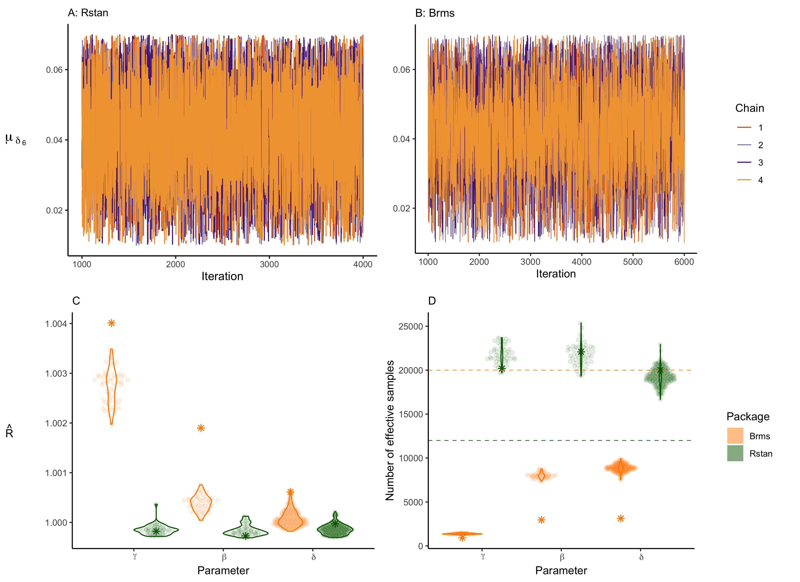
```

### Model Fitting 
The model is fitted using the packages `rstan` and `brms`. For `rstan`, four chains are run with 4000 iterations per chain, of which 1000 serve as warm-up. This results in a total of 12000 samples from the joint posterior distribution. For `brms`, four chains are run with 6000 iterations per chain, of which 1000 serve as warm-up. This results in a total of 20000 draws from the joint posterior distribution. 

### Model Diagnostics   
Before we can interpret the results, we have to evaluate whether they are reliable. Specifically, it has to be checked whether the sampling chains of the parameters have converged, meaning that a stationary posterior distribution has been reached [@Vehtari_2021]. If convergence is not achieved, the posterior estimates may change substantially if the sampling algorithm was run with more iterations or different starting values. The most common convergence measures are trace plots and the $\hat{R}$ statistic. We will also discuss an additional check provided by `rstan` and `brms`, namely, the number of effective samples. For a critical evaluation of currently used convergence statistics, we recommend the interested reader to consult Vehtari et al. (2019). 

#### Trace plot 

Trace plots show the sampled parameter value at each iteration. If the distributions have converged, the plot should look like a hairy caterpillar [Lee & Wagenmakers, -@lee2013bayesian, p. 99]: the iterations move up and down, but have much overlap in the middle. If multiple chains are used, iterations are shown per chain. In this case, the chains should overlap. If the posterior distribution did not converge, one chain could, for instance, be found on top of the figure, while all other chains are on the bottom [for an illustration see @vehtari2019rank]. Or, perhaps the first half of the chain is on the top of the graph and the second half on the bottom. The trace plot does not include burn-in samples, since these will not be used for parameter estimation. 

When inspecting the trace plots of the symbolic distance effect parameters in the normal model, the posterior distributions of the parameters appear to have converged as the iterations come together and look similar to a caterpillar. The trace plot of one of the parameters, $\delta_{6, i}$, is shown in panel A for `rstan` and panel B for `brms` of Figure \@ref(fig:traceplots3p). The trace plot in panel B shows less overlap in the middle, indicating that `brms` had a bit more dependency within chains. This might be a sign of slight issues. However, not that much to be too concerned. Trace plots for other parameters can be found in the Online Supplement. 

#### $\hat{\bm{R}}$
Next to a visual inspection of convergence, a numerical inspection is usually performed as well. A common approach is to check $\hat{R}$, also called the Gelman-Rubin Diagnostic [@gelman1992inference]. $\hat{R}$ is the ratio of between-chain variance and within-chain variance [@sorensen2015bayesian]. If the chains diverge, the between-chain variance will be higher than the within-chain variance, resulting in a $\hat{R}$ greater than 1. This indicates that the chains have not converged. There are different types of $\hat{R}$, such as the split- and rank-based $\hat{R}$ [@gelman2013bayesian; @vehtari2019rank]. Even though researchers tend to trust convergence statistics more than visual inspection, these statistics are also not fool-proof. Therefore, the development of better convergence statistics is a current topic in Bayesian analysis methods.

The $\hat{R}$ values for all individual and general symbolic distance effect parameters computed by `rstan` and `brms` are shown in panel C of Figure \@ref(fig:traceplots3p). The figure shows that $\hat{R}$'s are not substantially greater than 1. Therefore, it seems that the distributions have converged. 

#### Number of Effective Samples 
Another popular convergence statistic is the number of effective samples. This statistic is concerned with the dependence of posterior samples. In MCMC algorithms, the samples are to some degree dependent on one another: the parameter values at iteration *i* are similar to the parameter values at iteration *i-1*. The number of effective samples represents the estimated total number of *independent* draws from the posterior for every model parameter [@stan2018b, section 15.4]. If the number of effective samples is low, this indicates a high dependency of iterations in the sampling procedure. Therefore, the number of effective samples can be seen as a measure of the amount of new information about the posterior distribution that is provided by the total number of samples drawn from the posterior. A common rule for interpretation is that the number should be close to or even greater than the number of total iterations [@vehtari2019rank; @neff2018].  

For the symbolic distance effect, the estimated number of effective samples is provided in panel D of Figure \@ref(fig:traceplots3p). For the package `rstan` the number is generally high, much higher than the actual number of samples depicted by the green dashed line. The `brms` package shows much more variation. The lowest effective sample sizes can be found for the intercept parameters. Table 1 also displays the number of effective samples for the general effects parameters in the `rstan` model. If the number of effective samples is too low, `brms` and `rstan` will return a warning. Here, this was not case, and all other diagnostics were good, so we continue with the interpretation of the estimates. 

### Estimation Results
Considering good/acceptable convergence diagnostics, we can now interpret the estimation results. First, we present the general effects, then we visualize the individual variability of these effects.

```{r modelposteriorsmufigure3, echo=FALSE, fig.cap="The posterior distributions for the general effects estimated by the two packages. The middle line within the distributions represents the posterior mean. The shaded area within the distributions represent 95\\% credible intervals.", fig.align = "left", fig.height = 11, fig.width = 1, out.width="100%"}
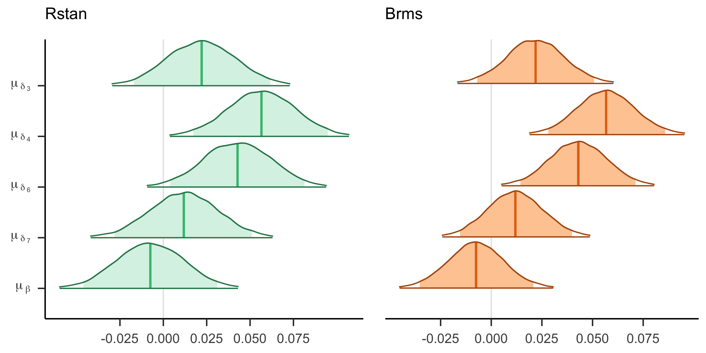
```

#### General Effects 
For the symbolic distance effect, there are two main questions we want to answer. First, we want to know whether there is a digit effect and, second, we want to know whether there is a side effect. Therefore, the key model parameters for general effects are $\mu_{\beta}$, $\mu_{\delta_{3}}$, $\mu_{\delta_4}$, $\mu_{\delta_6}$, and $\mu_{\delta_{7}}$. In the following section, we will focus our reporting on these parameters. 

The posterior distributions for the focal parameters in the normal model are presented in Figure \@ref(fig:modelposteriorsmufigure3). The posterior means estimated by `rstan` and `brms` can be found in the Online Supplement. The credible interval displayed in the figure is the Bayesian version of a confidence interval and provides a measure of uncertainty about the parameter value [@wagenmakers2018bayesian]. 

```{r geneftable, results = "hide", cache = TRUE, warning = FALSE}
# example - version 1 with SE 
rstanfithier8 <- readRDS(file = "R objects/rstan/normal model/hier_modelc_adj_07012022.rds")
fitrstanhiertable <- summary(rstanfithier8, pars = c("mu", "mu2", "mu3", "mu4", "mu5", "mu6"))$summary[,c("mean", "se_mean", "2.5%", "97.5%", "n_eff", "Rhat")]
# as.data.frame(fitrstanhiertable)
fitrstanhiertable2 <- as.data.frame(fitrstanhiertable)
rownamesfitrstanhiertable <-  c("$\\mu_{\\gamma}$","$\\mu_{\\beta}$", "$\\mu_{\\delta_{7}}$", "$\\mu_{\\delta_{6}}$", "$\\mu_{\\delta_{4}}$", "$\\mu_{\\delta_{3}}$")
colnames(fitrstanhiertable2) <- c("Mean", "SE", "Lower Bound", "Upper Bound", "$n_{eff}$","$\\hat{R}$")

fitrstanhiertable3 <- add_column(fitrstanhiertable2, Parameters = rownamesfitrstanhiertable, .before = "Mean")
#apa_table(fitrstanhiertable3, row.names = FALSE, caption = "Posterior Mean, Standar Error (SE) of the Mean, Lower and Upper Bound of the 95\\% Credible Interval, the Number of Effective Samples, and the $\\hat{R}$ of the General Effect Parameters as estimated by Rstan.", align = c("l", "c", "c", "c", "c", "c", "c"), digits = 3, escape = FALSE)

# example - version 2 without SE 
rstanfithier8 <- readRDS(file = "R objects/rstan/normal model/hier_modelc_adj_07012022.rds")
fitrstanhiertable <- summary(rstanfithier8, pars = c("mu", "mu2", "mu3", "mu4", "mu5", "mu6"))$summary[,c("mean", "2.5%", "97.5%", "n_eff", "Rhat")]
# as.data.frame(fitrstanhiertable)
fitrstanhiertable2 <- as.data.frame(fitrstanhiertable)
rownamesfitrstanhiertable <-  c("$\\mu_{\\gamma}$","$\\mu_{\\beta}$", "$\\mu_{\\delta_{7}}$", "$\\mu_{\\delta_{6}}$", "$\\mu_{\\delta_{4}}$", "$\\mu_{\\delta_{3}}$")
colnames(fitrstanhiertable2) <- c("Mean", "Lower Bound", "Upper Bound", "$n_{eff}$","$\\hat{R}$")

fitrstanhiertable3 <- add_column(fitrstanhiertable2, Parameters = rownamesfitrstanhiertable, .before = "Mean")
apa_table(fitrstanhiertable3, row.names = FALSE, caption = "Posterior Mean, Lower and Upper Bound of the 95\\% Credible Interval, Number of Effective Samples, and $\\hat{R}$ of the General Effect Parameters as estimated by rstan.", align = c("l", "c", "c", "c", "c", "c"), digits = 3, placement = "h", escape = FALSE)
```
The parameter estimates produced by the two packages look very similar. The `brms` estimates seem to be slightly higher with slightly more narrow posterior distributions compared to `rstan`. All parameters are presented on a scale of seconds. As expected, the effects are small. For instance, $\mu_{\delta_{7}}$ has a posterior mean of `r printnum(fitrstanhiertable3["mu3", "Mean"], digits = 3)`, corresponding to a 11 millisecond effect. 

For the digit effects, positive parameter estimates indicate that the response is slower for the non-baseline digits, that is, digits that are closer to 5. The parameters $\mu_{\delta_{6}}$ and $\mu_{\delta_{4}}$ are distributed around higher values and their credible intervals do not contain zero. Note that this result is consistent with the symbolic distance hypothesis that the digits 4 and 6 have the highest response times because they are closest to the 5, the comparison value. The 95% credible intervals of $\mu_{\delta_{7}}$ and $\mu_{\delta_{3}}$ contain zero. Therefore, it is plausible that the response times do not differ substantially from the baseline condition. The posterior distribution of the side effect $\mu_{\beta}$ is centered around zero with a posterior mean of `r printnum(fitrstanhiertable3["mu2", "Mean"], digits = 3)` and a 95% credible interval ranging from `r printnum(fitrstanhiertable3["mu2", "Lower Bound"], digits = 3)` to `r printnum(fitrstanhiertable3["mu2", "Upper Bound"], digits = 3)`. This indicates a small to non-existent side effect.

#### Individual effects 

```{r inddevtable, results = "asis", cache = TRUE}
# example - With SE 
# rstanfithier8 <- readRDS(file = "R objects/rstanmodelfit_final_kopie.rds")
fitrstanhiertable2 <- summary(rstanfithier8, pars = c("g", "g2", "g3", "g4", "g5", "g6"))$summary[,c("mean", "se_mean", "2.5%", "97.5%", "n_eff", "Rhat")]
# as.data.frame(fitrstanhiertable)
fitrstanhiertable22 <- as.data.frame(fitrstanhiertable2)
rownamesfitrstanhiertable2 <-  c("$\\sigma_{\\gamma}^2$","$\\sigma_{\\beta}^2$", "$\\sigma_{\\delta_{7}}^2$", "$\\sigma_{\\delta_{6}}^2$", "$\\sigma_{\\delta_{4}}^2$", "$\\sigma_{\\delta_{3}}^2$")
colnames(fitrstanhiertable22) <- c("Mean", "SE", "Lower Bound", "Upper Bound", "$n_{eff}$","$\\hat{R}$")

fitrstanhiertable32 <- add_column(fitrstanhiertable22, Parameters = rownamesfitrstanhiertable2, .before = "Mean")
# apa_table(fitrstanhiertable32, row.names = FALSE, caption = "Posterior Variance, Standar Error (SE) of the Variance, Lower and Upper Bound of the 95\\% Credible Interval, the Number of Effective Samples, and the $\\hat{R}$ of the General Effect Parameters as estimated by Rstan.", align = c("l", "c", "c", "c", "c", "c", "c"), digits = 3, escape = FALSE)

# example - without SE 
# rstanfithier8 <- readRDS(file = "R objects/rstanmodelfit_final_kopie.rds")
fitrstanhiertable2 <- summary(rstanfithier8, pars = c("g", "g2", "g3", "g4", "g5", "g6"))$summary[,c("mean", "2.5%", "97.5%", "n_eff", "Rhat")]
# as.data.frame(fitrstanhiertable)
fitrstanhiertable22 <- as.data.frame(fitrstanhiertable2)
rownamesfitrstanhiertable2 <-  c("$\\sigma_{\\gamma}^2$","$\\sigma_{\\beta}^2$", "$\\sigma_{\\delta_{7}}^2$", "$\\sigma_{\\delta_{6}}^2$", "$\\sigma_{\\delta_{4}}^2$", "$\\sigma_{\\delta_{3}}^2$")
colnames(fitrstanhiertable22) <- c("Mean", "Lower Bound", "Upper Bound", "$n_{eff}$","$\\hat{R}$")

fitrstanhiertable32 <- add_column(fitrstanhiertable22, Parameters = rownamesfitrstanhiertable2, .before = "Mean")
apa_table(fitrstanhiertable32, row.names = FALSE, caption = "Posterior Variance, Lower and Upper Bound of the 95\\% Credible Interval, Number of Effective Samples, and $\\hat{R}$ of the Variance Parameters as estimated by Rstan.", align = c("l", "c", "c", "c", "c", "c"), digits = 3, placement = "h", escape = FALSE)
```
Thanks to the hierarchical structure of the model, we can investigate whether the general effects hold for all the individuals by inspecting the individual variation and the individual parameter estimates. The individual variation is represented by the variance or standard deviation parameters in the model. The summaries of the posterior distributions of the variance parameters as estimated by `rstan` are shown in Table \@ref(tab:inddevtable). The estimates for the standard deviations by `brms` are smaller compared to `rstan` and can be found in Online Supplement D.

Posterior means of the variances for the digit and side effects are all very close to `r printnum(fitrstanhiertable32["g3", "Mean"], digits = 3)` which corresponds to a standard deviation of `r printnum(sqrt(fitrstanhiertable32["g3", "Mean"]), digits = 3)` seconds, that is, 141 milliseconds. Additionally, the 95% credible intervals do not contain zero. If we consider the effect of digit 7 wit an 11 millisecond general effect this is a substantial amount of individual variation. Therefore, we conclude that there are individual differences in the symbolic distance effect.  

```{r randomparfigure, echo=FALSE, fig.cap="The posterior means for individual effect parameters with 95\\% credible intervals as estimated by \\textit{rstan}, shown in increasing order. The dashed line represents the general posterior mean. Pink intervals contain zero, blue interval do not contain zero.", fig.align = "left", fig.height = 1, fig.width = 0.5, out.width="100%"}
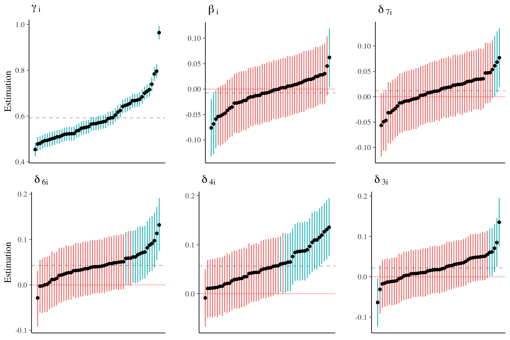

```

Figure \@ref(fig:randomparfigure) shows the posterior means and 95% credible intervals for the individual effects of all 52 participants. Estimates are printed in increasing order, from lowest to highest. Pink intervals indicate that the 95% credible interval contains zero, while blue intervals are either entirely above or below zero. A corresponding figure with individual effect estimates for `brms` can be found in Online Supplement D. 

The largest variation across participants can be seen for the intercept parameter. This means that participants vary considerably in their baseline response times. There is also considerable individual variation in the digit effects ($\delta$'s). However, most of the intervals contain zero which implies that the effects might be small or non-existent. The variability is most pronounced for the effect parameters of the digits close to 5. For these digits, there are also more intervals that do not contain zero, indicating that an effect might be present on the subject level. The posterior mean of the individual side effect ($\beta_{i}$) varies between -0.05 and 0.05. Again, all but four 95% credible intervals include zero indicating uncertainty about the existence of an effect for anyone. The credible intervals of the side effect and digit effects $\delta_{7}$ and $\delta_{3}$ indicate that different subjects may show opposite effects [@haaf2019some]. 

Finally, Figure \@ref(fig:modelestimatesfigure3) shows how the relationship between individuals' digit effects.^[The design and code for this figure are by @j_van_langen_2020_3715576.] The posterior means of individual effects are represented by the dots. The right side of each plot represents the distribution of the individual estimates. Note that this distribution is not the posterior distribution of the general effect. It rather corresponds to the left side of Figure 6. The two panels of Figure \@ref(fig:modelestimatesfigure3) show that the estimates are almost identical between `Stan` and `brms`. This means that differences in the parametrization between the packages did not influence the results of the parameter estimation.

```{r modelestimatesfigure3, echo=FALSE, fig.cap="Model estimates for digit effect parameters in \\textit{rstan}. The points represent the mean parameter estimates for each individual. The violin plots on the right side show the variance of the individual parameter estimates. The size of effects is not very constistent within a person.", fig.align = "left", fig.height = 11, fig.width = 1, out.width="75%"}
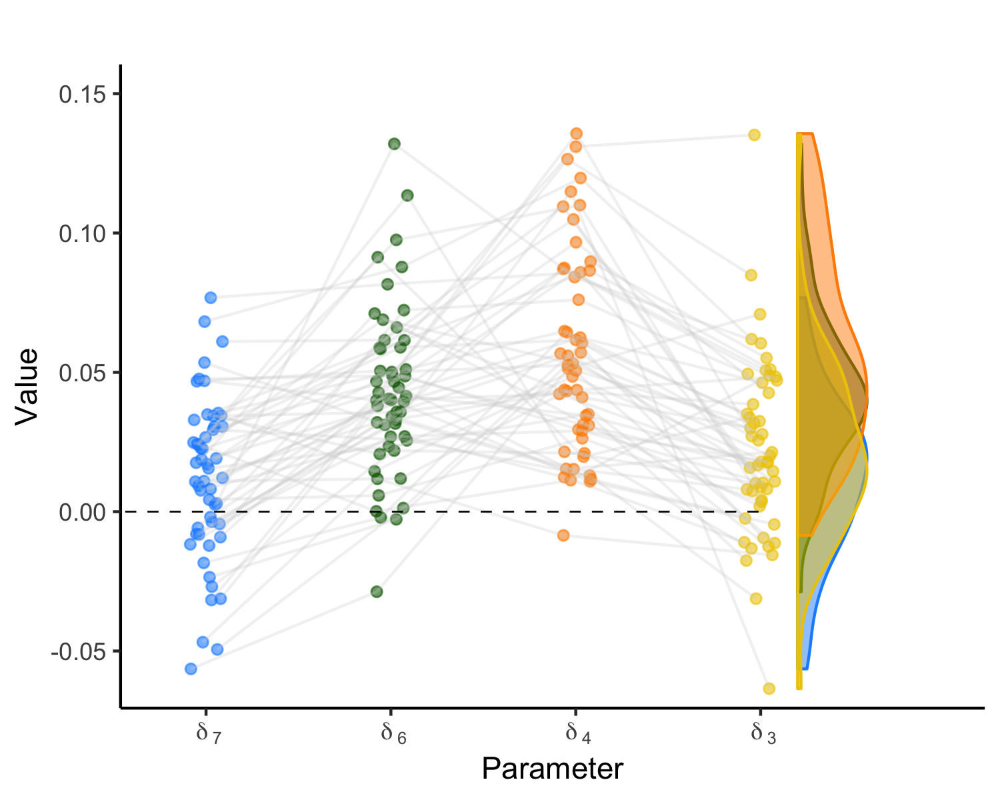
```

## Log-normal Model 
### Model Estimation 
The model is fitted using the packages `rstan` and `brms`. For `rstan`, we use the priors as specified in Equation \@ref(eq:chosenpriorslogvar). For `brms`, we use the priors in Equation \@ref(eq:chosenpriorslogsd). The rest of the settings are equivalent for both packages. We ran four chains with 4000 iterations per chain, including 1000 warm-up iterations. This results in a total of 12000 samples from the posterior distribution.  

### Model Diagnostics 
Before interpreting the results, we have to check if the posterior distributions of the parameters have converged. The trace plot of $\mu_{\delta_{6}}$ is shown panel A for `rstan` and B for `brms` of Figure \@ref(fig:traceplotlog). Trace plots for all other parameters can be found in the Online Supplement. All plots look like a hairy caterpillar. Therefore, they indicate that the posterior distributions of the parameters have converged. $\hat{R}$ values shown in Figure \@ref(fig:traceplotlog)C for all parameters are all close to 1 and most of the number of effective samples shown in Figure \@ref(fig:traceplotlog)D exceed the total number of iterations. The number of effective samples for the general effects are comparatively low but still sufficient. In combination with the other diagnostics, we conclude that the posterior distributions of the parameters have converged and we proceed with the interpretation of the results. 

(ref:captiontraceplotlog) Panel A and B show the trace plot of the digit parameter $\\mu_{\\delta_{6}}$ in the log-normal model for both packages. Panel C shows the estimated $\\hat{R}$ for all individual effects per parameter group. The stars represent the $\\hat{R}$ of the general effects. Panel D illustrates the variation in the estimated number of effective samples per parameter group. The dashed lines represent the total number of iterations for each package. The stars represent the number of effective samples of the general effects.

```{r traceplotlog, echo=FALSE, fig.cap="(ref:captiontraceplotlog)", fig.align = "left", fig.height = 11, fig.width = 4, out.width="100%"}
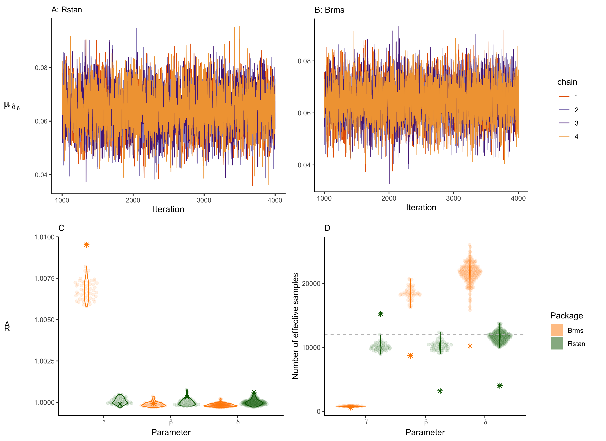
```

### Results
#### General effects  
We inspect the posterior distributions for the general effect parameters presented in Figure \@ref(fig:postplotlog). 
```{r postplotlog, echo=FALSE, fig.cap="The posterior distributions for the general effects in the log-normal model estimated by the two packages. The middle line within the distributions represents the posterior mean. The shaded area within the distributions represent 95\\% credible intervals.", fig.align = "left", fig.height = 11, fig.width = 1, out.width="100%"}
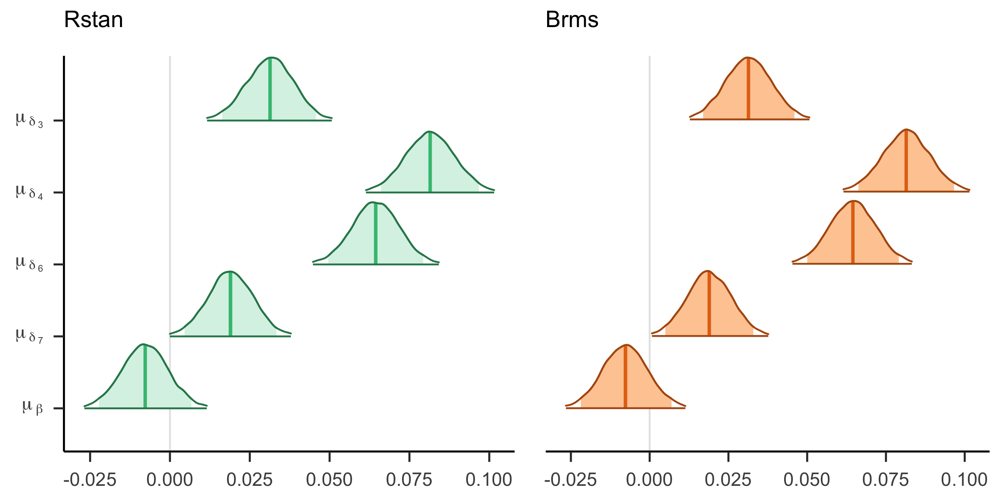
```

```{r geneftablelog, results = "hide", cache = TRUE, warning = F}
# example - with SE 
rstanfithier8log <- readRDS(file = "R objects/rstan/log-normal model/hier_logmodelc_adj13012022.rds")
fitrstanhiertablelog <- summary(rstanfithier8log, pars = c("mu", "mu2", "mu3", "mu4", "mu5", "mu6"))$summary[,c("mean", "se_mean", "2.5%", "97.5%", "n_eff", "Rhat")]
# as.data.frame(fitrstanhiertable)
fitrstanhiertable2log <- as.data.frame(fitrstanhiertablelog)
rownamesfitrstanhiertablelog <-  c("$\\mu_{\\gamma}$","$\\mu_{\\beta}$", "$\\mu_{\\delta_{7}}$", "$\\mu_{\\delta_{6}}$", "$\\mu_{\\delta_{4}}$", "$\\mu_{\\delta_{3}}$")
colnames(fitrstanhiertable2log) <- c("Mean", "SE", "Lower Bound", "Upper Bound", "$n_{eff}$","$\\hat{R}$")

fitrstanhiertable3log <- add_column(fitrstanhiertable2log, Parameters = rownamesfitrstanhiertablelog, .before = "Mean")
# apa_table(fitrstanhiertable3log, row.names = FALSE, caption = "Posterior Mean, Standar Error (SE) of the Mean, Lower and Upper Bound of the 95\\% Credible Interval, the Number of Effective Samples, and the $\\hat{R}$ of the General Effect Parameters as estimated by Rstan.", align = c("l", "c", "c", "c", "c", "c", "c"), digits = 3, escape = FALSE)

# example - without SE 
rstanfithier8log <- readRDS(file = "R objects/rstan/log-normal model/hier_logmodelc_adj13012022.rds")
fitrstanhiertablelog <- summary(rstanfithier8log, pars = c("mu", "mu2", "mu3", "mu4", "mu5", "mu6"))$summary[,c("mean", "2.5%", "97.5%", "n_eff", "Rhat")]
# as.data.frame(fitrstanhiertable)
fitrstanhiertable2log <- as.data.frame(fitrstanhiertablelog)
rownamesfitrstanhiertablelog <-  c("$\\mu_{\\gamma}$","$\\mu_{\\beta}$", "$\\mu_{\\delta_{7}}$", "$\\mu_{\\delta_{6}}$", "$\\mu_{\\delta_{4}}$", "$\\mu_{\\delta_{3}}$")
colnames(fitrstanhiertable2log) <- c("Mean", "Lower Bound", "Upper Bound", "$n_{eff}$","$\\hat{R}$")

fitrstanhiertable3log <- add_column(fitrstanhiertable2log, Parameters = rownamesfitrstanhiertablelog, .before = "Mean")
apa_table(fitrstanhiertable3log, row.names = FALSE, caption = "Posterior Mean, Lower and Upper Bound of the 95\\% Credible Interval, Number of Effective Samples, and $\\hat{R}$ of the General Effect Parameters as estimated by Rstan.", align = c("l", "c", "c", "c", "c", "c"), digits = 3, placement = "h", escape = FALSE)
```


```{r modelfitlog, eval = FALSE}
# Based on model estimates 
> exp(-0.56 - (1/2)*0.01 + 0.08)
[1] 0.6156972
> exp(-0.56 - (1/2)*0.01 + 0.03)
[1] 0.5856693
> 0.6156972 - 0.5856693
[1] 0.0300279
> exp(-.56 + .5  (-.01) + .03) - exp(-.56 + .5  (-.01))
Error: attempt to apply non-function
> exp(-.56 + .5 * (-.01) + .03) - exp(-.56 + .5  * (-.01))  # difference 3 and 2 
[1] 0.01730914
> exp(-.56 + .5 * (-.01) + .08) - exp(-.56 + .5  * (-.01))  # difference 4 and 2? 
[1] 0.04733705
```
We note that the values of the parameter estimates for the log-normal model cannot be interpreted in the same way as in normal model. The reason is that the mean parameter of the log-normal distribution does not correspond to its expected value. To better understand the size of an effect that corresponds to the parameter values, some calculations are required. For instance, if we would like to know the median difference in response times for digit 3 and 2, we calculate the difference between the exponential of the RT estimate for the condition digit = 3 and the exponential of the RT estimate for the condition digit = 2: 

\begin{equation}
\begin{aligned}
&e^{(\mu_{\gamma} + x_j \mu_{\beta} + w_j \mu_{\delta_{3}})} - e^{(\mu_{\gamma} +  x_j \mu_{\beta})} \\
&= e^{(-.56 + .5 \times (-.01) + 1 \times 0.03)} - e^{(-.56 + .5 \times (-.01))} \\ 
&= 0.017 
\end{aligned}
\end{equation}
This value corresponds to the median estimate of $\mu_{\delta_{3}}$ from the normal model. Calculating the mean estimate of $\mu_{\delta_{3}}$ would be similar, but more complicated as the mean of a log-normal distribution also depends on its variance.

One property of these parameter estimates we can immediately interpret is their sign (i.e., positive, negative or zero). A positive estimate indicates that the RT increases, whereas a negative effect indicates a decrease. When inspecting the general digit effect parameters, they all appear to positively influence the RT. This is in line with our expectations since the baseline RT in the model is set equal to the RT for the digits furthest away from 5 and the symbolic distance effect postulates that RT should increase as the digits become closer to five. The side effect is close to zero, with a posterior mean of `r printnum(fitrstanhiertable3log["mu2", "Mean"], digits = 3)` and a 95% credible interval from `r printnum(fitrstanhiertable3log["mu2", "Lower Bound"], digits = 3)` to `r printnum(fitrstanhiertable3log["mu2", "Upper Bound"], digits = 3)`. Thus, the general effect of side seems small or negligible. 

#### Individual effects 
Next, we inspect the individual deviations from the general effects. Table \@ref(tab:inddevtablelog) presents the estimates of the variance parameters by `rstan`. Results for brms can be found in the Online Supplement. 
```{r inddevtablelog, results = "asis", cache = TRUE}
# example - with SE 
# rstanfithier8log <- readRDS(file = "R objects/hier_logmodelc_adj.rds")
fitrstanhiertable2log <- summary(rstanfithier8log, pars = c("g", "g2", "g3", "g4", "g5", "g6"))$summary[,c("mean", "se_mean", "2.5%", "97.5%", "n_eff", "Rhat")]
# as.data.frame(fitrstanhiertable)
fitrstanhiertable2log2 <- as.data.frame(fitrstanhiertable2log)
rownamesfitrstanhiertable2log2 <-  c("$\\sigma_{\\gamma}^2$","$\\sigma_{\\beta}^2$", "$\\sigma_{\\delta_{7}}^2$", "$\\sigma_{\\delta_{6}}^2$", "$\\sigma_{\\delta_{4}}^2$", "$\\sigma_{\\delta_{3}}^2$")
colnames(fitrstanhiertable2log2) <- c("Mean", "SE", "Lower Bound", "Upper Bound", "$n_{eff}$","$\\hat{R}$")

fitrstanhiertable32log <- add_column(fitrstanhiertable2log2, Parameters = rownamesfitrstanhiertable2log2, .before = "Mean")
# apa_table(fitrstanhiertable32log, row.names = FALSE, caption = "Posterior Variance, Lower and Upper Bound of the 95\\% Credible Interval, Number of Effective Samples, and $\\hat{R}$ of the General Effect Parameters as estimated by Rstan", align = c("l", "c", "c", "c", "c", "c", "c"), digits = 3, escape = FALSE)

# example - without SE 
# rstanfithier8log <- readRDS(file = "R objects/hier_logmodelc_adj.rds")
fitrstanhiertable2log <- summary(rstanfithier8log, pars = c("g", "g2", "g3", "g4", "g5", "g6"))$summary[,c("mean", "2.5%", "97.5%", "n_eff", "Rhat")]
# as.data.frame(fitrstanhiertable)
fitrstanhiertable2log2 <- as.data.frame(fitrstanhiertable2log)
rownamesfitrstanhiertable2log2 <-  c("$\\sigma_{\\gamma}^2$","$\\sigma_{\\beta}^2$", "$\\sigma_{\\delta_{7}}^2$", "$\\sigma_{\\delta_{6}}^2$", "$\\sigma_{\\delta_{4}}^2$", "$\\sigma_{\\delta_{3}}^2$")
colnames(fitrstanhiertable2log2) <- c("Mean", "Lower Bound", "Upper Bound", "$n_{eff}$","$\\hat{R}$")

fitrstanhiertable32log <- add_column(fitrstanhiertable2log2, Parameters = rownamesfitrstanhiertable2log2, .before = "Mean")
apa_table(fitrstanhiertable32log, row.names = FALSE, caption = "Posterior Variance, Lower and Upper Bound of the 95\\% Credible Interval, the Number of Effective Samples, and the $\\hat{R}$ of the Variance Parameters as estimated by Rstan.", align = c("l", "c", "c", "c", "c", "c"), digits = 3, placement = "h", escape = FALSE)
```
The estimated parameter values for the variance terms are very small, but different from zero. This indicates that individuals may vary slightly with respect to the general effect parameters. The estimates for the standard deviations by `brms` are similar compared to the estimates by `rstan`, but slightly smaller. The exact estimates by `brms` can be found in Online Supplement F.
Figure \@ref(fig:randomparplotlog) shows the individual estimates for the digit and side effects. The pink lines indicate that the 95% credible interval of the individual effect contains zero. The estimated general effect is represented by the dashed line. For $\beta$, $\delta_{7}$, and $\delta_{3}$, most 95% credible intervals contain zero. For $\delta_{6}$ and $\delta_{4}$, most credible intervals are entirely larger than zero, indicating an increase in RT for most participants.

```{r randomparplotlog, echo=FALSE, fig.cap="The posterior means for individual effect parameters in the log-normal model with 95\\% credible intervals as estimated by \\textit{rstan}, shown in increasing order. The dashed line represents the general posterior mean. Pink intervals contain zero, blue interval do not contain zero.", fig.align = "left", fig.height = 1, fig.width = 0.5, out.width="100%"}
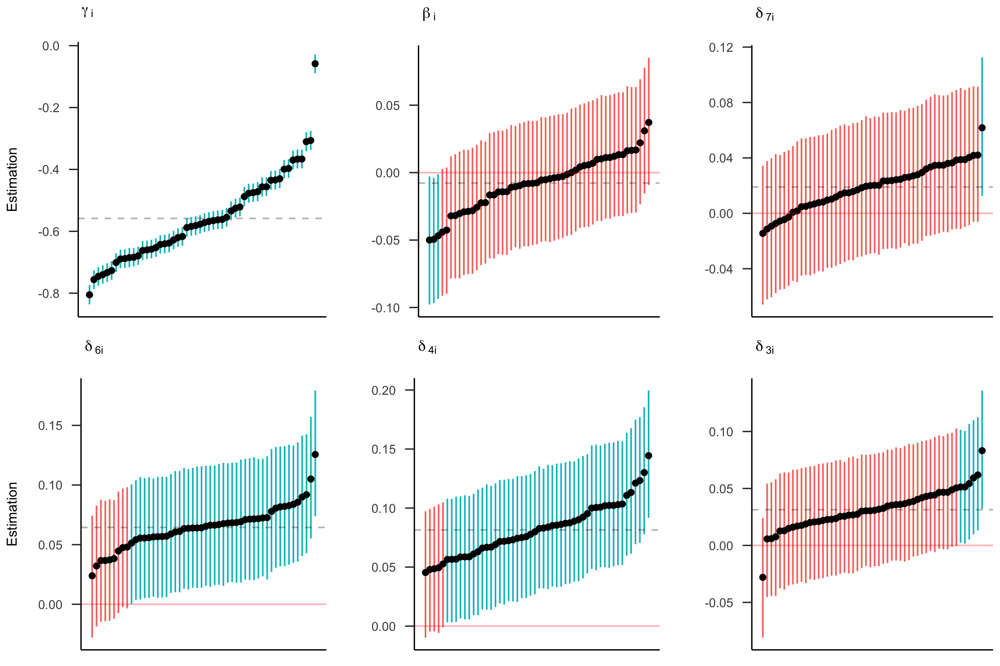
```
We can further inspect the individual estimates for the digit effects in Figure \@ref(fig:modeldigitestplotlog). The figure shows the individual estimates for the digit effects with the distribution of the variability of the individual estimates (not the posterior distribution of the general effect). The figure illustrates that there is considerable variance in the point estimates of the individual digit effects. However, compared to the normal model there is considerably more hierarchical shrinkage.


# Model Comparison 
The symbolic distance effect postulates that response times (RTs) are slower when digits are closer to 5 (digit effects), and that RTs may be influenced by whether the target digit is smaller or greater than 5 (side effect). Using Bayesian estimation, we are not able to directly test these hypotheses. Credible intervals often contain zero, but they always also contain lots of other values that have a chance of being the "true" parameter value, making them unsuitable to test hypotheses. Therefore, our goal for the following section is to set up a Bayesian hypothesis test for the parameters of interest in our model. Specifically, we will achieve this by comparing the predictive accuracy of a null model where we set one or some parameters to zero, and and effects models where these parameters are unconstrained. 

```{r modeldigitestplotlog, echo=FALSE, fig.cap="Model estimates for digit effect parameters in the log-normal model in \\textit{rstan}. The points represent the mean parameter estimates for each individual. The violin plots on the right side show the variance of the individual parameter estimates.", fig.align = "left", fig.height = 11, fig.width = 1, out.width="75%"}
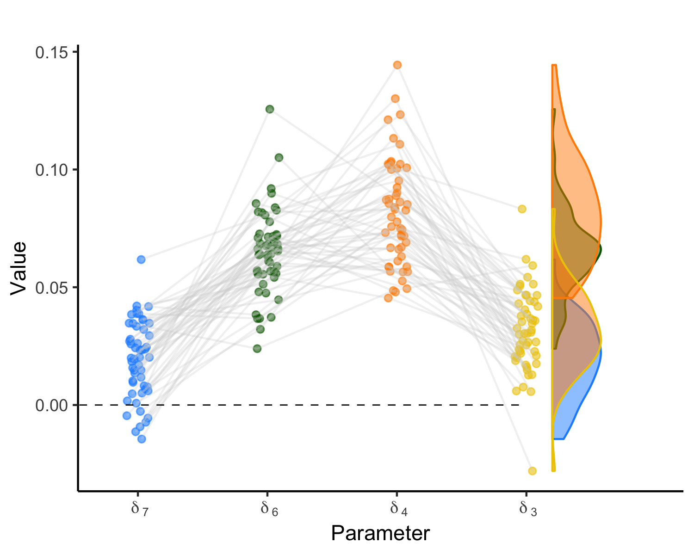
```

## Bayes factor
The Bayes factor (BF) is a measure of how well one model predicts the data compared to another [@jeffreys1961theory; @kass1995bayes; @rouder2018teaching]. The Bayes factor is defined as the probability of the data under one model compared to the probability of the data under another model. For instance, the Bayes factor comparing a null model ($\mathcal{M}_0$) and a full model ($\mathcal{M}_{\text{F}}$) can be obtained by: 

\begin{equation}
\text{BF}_{0\text{F}} = \frac{P(\bm{Y} | \mathcal{M}_0)}{P(\bm{Y} | \mathcal{M}_{\text{F}})}. 
\end{equation}

The Bayes factor can also be interpreted as the relative evidence of two competing models. Bayes factors have a few very convenient characteristics. One of them is that Bayes factors are transitive, that is, evidence for the full model over the null model can be obtained by flipping numerator and denominatior in equation 13. For a full overview of the advantages of Bayesian inference with Bayes factor, see Wagenmakers et al. [-@wagenmakers2018bayesian].

Our models consist of several parameters. Therefore, computing the Bayes factor of, for example, the normal model versus the log-normal model becomes somewhat difficult. Let the vector of all parameters of the normal model be $\bm{\theta_\text{n}}$ and the vector of all parameters for the log-normal model be $\bm{\theta_{\text{l}}}$. With the prior distributions for the two models, $f(\bm{\theta_\text{n}})$ and $f(\bm{\theta_\text{l}})$, the Bayes factor can be calculated by the following ratio of marginal likelihoods:  

\begin{equation}
\text{BF}_{\text{nl}} = \frac{\int_{-\infty}^{\infty}P(\bm{Y} | \mathcal{M}_\text{n}, \bm{\theta_{\text{n}}})f(\bm{\theta_{\text{n}}})d\bm{\theta_{\text{n}}}}{\int_{-\infty}^{\infty}P(\bm{Y} | \mathcal{M}_\text{l}, \bm{\theta_{\text{l}}})f(\bm{\theta_{\text{l}}})d\bm{\theta_{\text{l}}}}. 
\end{equation}

Imagine this results in $\text{BF}_{\text{nl}} = 100$. This means that the data are 100 times more likely under the normal model than under the log-normal model, clear evidence in favor of the normal model. But how do we know whether a Bayes factor of 100-to-1, or 10-to-1 or 3-to-1. As a reminder, Bayes factors are the relative predictive accuracy of two models for the observed data. Therefore, Bayes factors are odds or ratios. Odds themselves are directly interpretable without the need for decisions or cutoffs. For example, if a presidential candidate is favored 10-to-1 over another one, then these are just the odds, and it is beside the point whether these are large or not. According to this line of thought, Rouder et al. [-@rouder2018theories] argue that researchers should take a similar approach when interpreting and reporting Bayes factors. While there exist rules of thumb to categorize Bayes factors verbally, we suggest researchers use their research context to form substantive conclusions based on Bayes factors, not arbitrary rules of thumb.

Same as the posterior distribution, Bayes factors can rarely be computed analytically due to the multidimensional integrals involved. The difficulty to compute Bayes factors is one of the major drawbacks of Bayesian inference. However, several algorithms are available to estimate Bayes factor from posterior samples. In the following section we will present two methods to obtain Bayes factors for the symbolic distance effect. 

### Savage-Dickey Density Ratio  
One method to compute Bayes factors is the Savage-Dickey density ratio [SDD-ratio; Dickey & Lientz, -@dickey1970weighted; Morey, Rouder, Pratte, & Speckman, -@morey2011using; Wagenmakers, Lodewyckx, Kuriyal, & Grasman, -@wagenmakers2010bayesian]. This approach can be readily used to estimate the Bayes factor between two nested models that differ in only one parameter. A prime example for such a case is comparing an effect model with a null model. For example, we may compare a model with an overall side effect (effect model) to a model with no overall side effect (null model). In this case, the Bayes factor in favor of the side effect can be approximated by the ratio of the posterior density of the side effect and the prior density of the side effect at the point zero. More generally, the Savage Dickey approach works whenever one model fixes a parameter to a constant and another model assigns a prior distribution to the same parameter.

Figure \@ref(fig:sdratioplotall) shows a visualization of the SDD-ratio for the side parameter in the normal model of the symbolic distance effect. The posterior distribution is depicted in orange, the prior in green. The Bayes factor can be computed as a ratio of the posterior and prior density at the parameter value of zero, as depicted by the dashed line connecting the two points on the density functions.

```{r sdratioplotall, echo=FALSE, fig.cap="The prior and posterior distribution of the side parameter estimated by the \\textit{brms} package. The dots represent the height of the distributions at zero. The ratio of these dots indicates the Savage-Dickey density ratio. The Bayes factor represents the evidence for the hypothesis that the effect equals zero. A Bayes factor above one indicates that the evidence is in favor of the null hypothesis.", fig.align = "left", fig.height = 6, fig.width = 4, out.width="60%"}
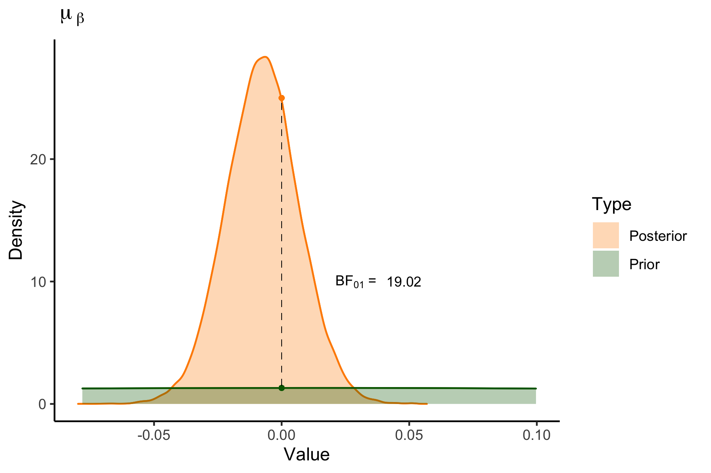
```
With `rstan`, the SDD-ratio can be computed by fitting a density function to the posterior distribution obtained from the MCMC samples, and comparing the value of this density function at $\mu_{\beta} = 0$ to the value of the prior distribution at $\mu_{\beta} = 0$. This is illustrated in the code block below. First, we extract the posterior samples for the parameter $\mu_{\beta}$, the general effect of side. We apply the `logspline` function [@logspline] to the samples to obtain an estimate of the log-density of the posterior distribution. The density at the zero is calculated with the `dlogspline` function. Finally, we compare the estimated density of the posterior to the density of the prior.  

\scriptsize
```{r codesnippetbfrstansdratio, eval=FALSE, echo=TRUE}
library(logspline)
# Get posterior samples for the side parameter mu2
samples_side <- rstan::extract(model_fit)$mu2   
log.posterior <- logspline(samples_side)                 # estimate of log-density post. distr. 
posterior_at_zero <- dlogspline(0, log.posterior)        # compute posterior density 
prior_at_zero <- dnorm(0, 0, 0.3)                        # computer prior density 
BF01 <- posterior_at_zero/prior_at_zero                  # compare estimated density posterior to prior at point 0 
```
\normalsize
In `brms`, the SDD-ratio can be computed using the built-in `hypothesis` function, as shown in the code snippet below. The resulting Bayes factor, also depicted in Figure \@ref(fig:sdratioplotall), is $BF_{01} = 18.28$, indicating evidence for the null model and against a side effect.
&nbsp; 

\scriptsize
```{r codesnippetbfbrms, eval=FALSE, echo=TRUE}
# We will use the model fit from before, specified as model_fit
hypothesis_fit <- hypothesis(model_fit,    # Object containing model fit 
                             "mu2 = 0")   # The parameter we want to test with the null hypothesis 
```
\normalsize

The Savage-Dickey approach has a number of drawbacks [see, for example, Heck, -@heck2019caveat]. First, one issue is the quality of approximation for the SSD-ratio. If either the prior or, even more problematically, the posterior have a really low density at the test value (in this case zero), it becomes difficult to estimate the SSD-ratio from the samples. This issue often occurs when the effect is large, moving the posterior distribution away from zero. In many cases there might be no samples around zero, which means that the density estimate will be very inaccurate. Therefore, we would recommend only to use the SSD-ratio if you are confident that enough posterior samples are available from the tails of the distribution. One way of ensuring that is to drastically increase the number of drawn samples.  

Second, the Savage-Dickey approach only applies for a limited set of to-be-compared models. In the example used here, we compared a model where the overall side effect is allowed to vary with a model where it is zero. Both models, however, still allow for individual variability of the side effect. For the null model, individual variability implies that some individuals are expected to have an effect favoring larger numbers and other individuals are expected to have an effect favoring smaller numbers, but, on average, both groups perfectly balance out at zero. To us, this model seems nonsensical, and, more importantly, it is not what researchers have in mind if they want to test a model without side effect. We would prefer to use a null model where none of the participants have a side effect. Yet, the Savage-Dickey density ratio is not available for such a model compared to the effects model.

### Bridge Sampling  
Bridge sampling offers a more flexible way to obtain Bayes factors [@kass1995bayes]. It allows the computation of Bayes factors for comparing models that differ in more than one parameter. Specifically, bridge sampling is a sampling-based algorithmic method to obtain the marginal likelihood of the data under a given model from the posterior samples [@meng1996simulating; @gronau2017tutorial]. 

Using bridge sampling we are able to estimate Bayes factors between any models of interest for the classification task data. We identify four models of interest:

1. Full model: This is the model we have been using throughout this paper. It states that there is an effect of side and an effect of digits for all participants. 
2. Side model: This model specifies that participants show a side effect but no digit effect. All digit parameters $\delta_{3}$ to $\delta_{7}$ are set to zero. 
3. Digit model: This model states that there are no side effects but that participants exhibit digits effects. All side parameters $\beta$ are set to zero. 
4. Null model: In this model, there is no side or digit effect on the RT. The digit parameters $\delta_{3}$ to $\delta_{7}$ and side parameters $\beta$ are set to zero. 

Note that models models 2-4 are nested in the most complex full model, and the null model is nested in models 3 and 4, but models 3 and 4 are not nested. Additionally, the models differ by several parameters. For example, compared to the full model the Digit model restricts the side parameter for all participants to zero. Using bridge sampling, we can estimate the marginal likelihood for each model separately, and then compute Bayes factors as their ratios (Equation 14).

To obtain the marginal likelihood for a specific model in `rstan` with bridge sampling [@gronau2017tutorial], the `bridgesampling` package can be used [@R-bridgesampling]. To obtain the Bayes factor comparing the side model and the full model, we first have to fit both models. Then, we use the `bridge_sampler` function from the `bridgesampling` package to obtain the marginal likelihood of the data under each of the models. Finally, the models are compared using the `bf` function from the `bridgesampling` package. 
&nbsp; 

\scriptsize
```{r codesnippetrstanestBF, eval = FALSE, echo = TRUE}

# We will use the model fit of both models (called sidemodel and fullmodel)
# (how to perform this is illustrated in the model estimation section)

# Bridge sampling 
library(bridgesampling)
ML_Hside <- bridge_sampler(sidemodel)  # compute the marginal likelihood under the side model 
ML_Hfull <- bridge_sampler(fullmodel)  # compute the marginal likelihood under the full model 

# Obtain Bayes factor (in this way evidence in favor of the side hypothesis)
bridgesampling::bf(ML_Hside, ML_Hfull)

```
\normalsize
In the `brms` package, Bayes factors based on bridge sampling can be obtained with the function `bayes_factor` as shown in the code snippet below. The function takes two fitted models as input. Therefore, both models first have to be fitted as explained in Model Estimation section of this manuscript. 

\scriptsize
```{r codesnippetbrmsestBF, eval = FALSE, echo = TRUE}
bayes_factor(fitsidemodel, fitfullmodel)$bf
```
\normalsize

Even though bridge sampling is a flexible method for obtaining Bayes factors, it is still an estimation method based on posterior samples. Therefore, as with any Bayes factor estimation method, we advice to take two precautions with bridge sampling. First, it is always wise to increase the number of iterations when performing model comparison. The reason is that convergence of estimation of posterior distributions and convergence of estimation of the marginal likelihood can differ. Therefore, a rule of thumb is to use ten times the number of iterations than we would usually use for estimation. The second precaution is to conduct a stability analysis. Both the posterior samples from the model estimation procedure and the estimate of the marginal likelihood from the bridge sampling can be variable. Therefore, stability may best be assessed by repeating the entire process of fitting each model and applying the bridge sampling function several times.

We assess the stability of the obtained Bayes factor by repeating the estimating process ten times with `rstan` and `brms`, respectively. The results are shown in Figure \@ref(fig:bsbfestimatesbrmsrstan). The figure shows the evidence in favor of the null, digit and side model against the full model. All Bayes factors are larger than one. Therefore, it can be concluded that the data are more likely under less complex models. There is almost no variation in the computed Bayes factors per model, indicating that the Bayes factor estimate is stable. However, the Bayes factor estimates in `rstan` generally show stronger evidence than Bayes factor estimates based on `brms`. It is important to note that this difference is not due to the bridge sampling function, but a result of a difference in parametrization. However, for both packages, the conclusion is the same: the data are least likely to have occurred under the full model. In case the estimates are unstable, it is recommended to further increase the number of posterior samples. 

```{r bsbfestimatesbrmsrstan, echo=FALSE, fig.cap="The BF estimates of the other models (0; null, side and digit model) against the full model (1). The green triangles represent the estimates using \\textit{rstan}. The orange dots represent the \\textit{brms} estimates. The dashed line represents a $\\text{BF}_{01}$ of 1. ", fig.align = "left", fig.height = 11, fig.width = 4, out.width="70%"}
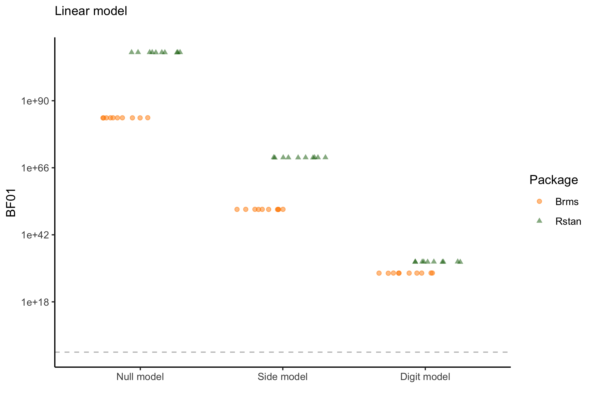
```
Finally, it is time to answer our research question: Is there a symbolic distance effect? When considering all Bayes factor estimates from Figure \@ref(fig:sdratioplotall) and \@ref(fig:bsbfestimatesbrmsrstan), the null model ($\text{BF}_{max} = 232 * 10^{105}$ for `rstan`) performs best compared to the side model ($\text{BF}_{max} = 458 * 10^{68}$ for `rstan`), the digit model ($\text{BF}_{max} = 269 * 10^{31}$ for `rstan`). Therefore, the data from Rouder et al. (2005) show evidence against the symbolic distance effect. 


## Sensitivity Analysis 
The full model including the side and digit effects performs worst compared to all other models in the Bayes factor model comparison. However, we did find non-zero digit effects in the model estimation. How is this possible? 

A possible explanation is a lack of individual variability in the digit and side effects. The full model assumes that participants vary in the digit and side effect, and we specified our expectations about this size of the variability in the prior. However, if there is a lack of individual variability in the effects, the full model is punished for the complexity added by the individual variation (illustrated by Rouder et al., 2021). To investigate this idea, we can reformulate the prior distributions on the variance parameters to indicate a smaller individual variation or, even more extreme, remove these individual effects from the model entirely. Then, we can calculate the posterior model probabilities for all specified models. 

Specifically, we will compare models from three scenarios: scenario 1 specifies large individual differences equivalent to Equation \@ref(eq:chosenpriors2var). For the models in scenario 2, we adjust the priors on $\sigma^2_{\beta}$ and $\sigma^2_{\delta}$ in the following way:  

\begin{equation}
\begin{aligned}
\sigma^2_{\beta} &\sim \text{Inverse-Gamma}(3, 0.05), \\   
\sigma^2_{\delta} &\sim \text{Inverse-Gamma}(3, 0.05). 
\end{aligned}
\end{equation}
The smaller value for the scale parameter of the inverse gamma distribution (i.e., 0.05 instead of 0.5) results in a shift of the peak of the prior towards smaller values for the individual variance. This means that the variation of the individual effects is expected to be much smaller than before.

In scenario 3, we remove individual variability from the side, digit, and full model. This results in the following full model, from which the side and digit model follow logically: 

\begin{equation}
Y_{ijk} \sim \text{Normal}(\gamma_{i} + x_j \mu_\beta + u_j \mu_{\delta{7}} + v_j \mu_{\delta{6}} + w_j \mu_{\delta{4}} + z_j \mu_{\delta{3}}, \sigma^2). (\#eq:datalevel2)
\end{equation}
Note that the null model is the same in all three scenarios. 

To obtain the posterior model probability for each model in every scenario, we first compute the Bayes factor of every model against the null model. This includes the trivial Bayes factor of the null model against the null model, resulting in ten Bayes factors in total. Next, we calculate the sum of all these Bayes factors and divide each Bayes factor by this sum. This results in the posterior model probabilities shown in Table 5.^[Note that it would be possible to calculate the posterior model probabilities directly from the marginal likelihoods. However, marginal likelihoods are often not computed explicitly in the model fitting process (e.g., when using the bayes_factor function in the `brms` package), so we believe that readers might find it easier to compute posterior model probabilities from Bayes factors.] All posterior model probabilities from the table and the posterior probability of the null model (see table note) sum to one.

\begin{table}[H]
\caption{Posterior Model Probabilities}
\begin{tabularx}{\textwidth}{XXXX}
\toprule
 & \multicolumn{1}{c}{Scenario 1} & \multicolumn{1}{c}{Scenario 2} & \multicolumn{1}{c}{Scenario 3}\\
\midrule
Digit model & $0.87*10^{-126}$ & $0.29*10^{-46}$ & $0.95$\\
Side model & $0.20*10^{-88}$ & $0.18*10^{-66}$ & $0.77*10^{-53}$ \\
Full model & $0.43*10^{-158}$ & $0.47*10^{-61}$ & $0.05$\\
\bottomrule
\end{tabularx}
\begin{tablenotes}[para]
\textit{Note.} Scenario 1: large individual differences. Scenario 2: small individual differences. Scenario 3: no individual differences. The posterior model probability of the null model is the same in every scenario and equals $0.50*10^{107}$. 
\end{tablenotes}
\end{table}

The table shows that the digit model without individual digit effects from scenario 3 has the highest posterior model probability, followed by the full model without individual digit and side effects (scenario 3). This means that the data are most likely under these models than the other eight models included in the comparison. In addition, the models with smaller prior expectations for individual differences (scenario 2), have higher posterior model probabilities than the models in scenario 1. Thus, decreasing our expectations of the size of the individual digit and side effects, or completely removing them, results in higher posterior model probabilities. Together with Figure \@ref(fig:randomparfigure), showing the small differences in individual effects (also illustrated by Haaf et al., 2019), this result supports the notion that side and digit effects are small and there is a lack in individual variability. 

This example illustrates the benefits of comparing hierarchical models of varying complexity. While individual differences are a common phenomenon in psychology, there are instances where general effects are sufficient to describe the data adequately, or where only a random intercept, but no random slopes are necessary. As shown in Table 5, Bayesian model comparisons can help researchers to identify the model that best describes the data. 

# Discussion 

<!-- To conclude this tutorial on Bayesian hierarchical modeling in psychology, we will highlight the most important recommendations to keep in mind when applying a Bayesian hierarchical model.   -->

In this tutorial, we described model and prior specification, estimation, and model comparison for hierarchical models in the Bayesian framework. In the following, we want to present several key recommendations.

As prior distributions influence model estimation and model comparison, it is important to choose suitable priors. We believe that simulating data based on the chosen priors is an intuitive tool to find reasonable prior settings that take the existing knowledge in the specific model application context into account. We showed that it can be problematic to use default priors without checking their suitability. Therefore, we recommend performing prior predictive checks with the priors that will be applied before running the analysis. 

We illustrated different methods to obtain Bayes factors. We want to emphasize the importance of checking the variability of the Bayes factor estimate, the Bayes factor sensitivity to prior distributions, and to ensure that the Bayes factor estimate is based on a sufficient number of posterior samples. 

This tutorial showed the application of two R packages: `rstan` and `brms`. Which package to use depends mostly on the complexity of the model and your technical background. For the non-technical user, we recommend using `brms` because of its intuitive model specification. However, the default prior setup can be unsuitable for a specific research context and might need to be adapted. Additionally, users are limited to predefined parametrizations. `rstan` offers the most flexibility in model and prior specification. This flexibility comes with a cost: if the prior or the model is not well defined, results can be misleading. 

## Further Recommendations

With this tutorial, we attempted to cover the most relevant topics that researchers encounter when starting with Bayesian hierarchical modeling. However, there are still many remaining issues and recommendations that we could not discuss. Here, we would like to point to further references in the literature if researchers want to continue mastering Bayesian hierarchical modeling.

First, we kept the discussion of the software packages and code fairly brief. We provide further code examples for the digit classification task in the Online Supplement. For different models, it may be useful to study additional tutorials and books. For `rstan`, we recommend the `Stan` manual [@stan2018a; @stan2018b]. For `brms` there are several useful tutorials [@R-brms_a; @R-brms_b; @burkner2019ordinal]. There are also several resources for Bayesian estimation with other samplers [@lee2013bayesian; @rouder2013hierarchical]. Two other useful tutorials for Bayesian modeling are Schad, Betancourt, and
Vasishth [-@schad2019toward] and Schad, Nicenboim, Bürkner, Betancourt, and Vasishth [-@schad2021workflow].

Second, we did not discuss study planning. When planning an experiment, researchers may want to determine the number of participants required to gain conclusive results. Bayesian analysis has the advantage that an optional stopping paradigm may be employed [@rouder2014optional; @schonbrodt2017sequential]. Schönbrodt and Wagenmakers [-@schonbrodt2018bayes] and Stefan and colleagues [-@stefan2019tutorial] introduced Bayes factor design analysis for fixed and sequential designs. However, these approaches to study planning have not yet been fully extended to a hierarchical setup [but see recent efforts by Vasishth et al., -@vasishth2021sample]. The extension to nested designs is not entirely trivial because, in addition to planning the number of participants, we also need to consider the number of trials [@rouder2018power]. While we think there remains some open questions on the topic, the tutorial by Stefan and colleagues [-@stefan2019tutorial] is a good place to start for applied researchers.

## Potential Technical Issues

One key advantage of Bayesian over frequentist hierarchical modeling is that complex modeling leads to fewer convergence issues in the Bayesian framework. This advantage, however, does not imply that there are no technical issues in the Bayesian framework. One possible technical issue is with the choice of priors when using `Stan` for estimation. The `Stan` algorithm is most efficient with specific prior distributions. For example, it may be beneficial to use a truncated $t$-distribution on standard deviation parameters instead of an inverse gamma distribution on variances [@gelman2006prior]. Using priors not recommended by the `Stan` team may lead to more issues with convergence. In this tutorial, we highlight that choosing priors based on their predictions on data is beneficial. We still think this is the best path for substantive researchers. If one wants more flexibility in choices of priors or has continuous issues with convergence with their chosen prior distributions, then it might be worth considering using `JAGS` instead of `Stan`. `JAGS` [@Plummer03jagsa] has a similar functionality and syntax as `Stan`. While `Stan` tends to be more efficient in the sampling phase, especially in case of correlated parameters [@hecht2021comparing], the `JAGS` algorithm could be more flexible and less affected by the choice of priors. 

Another technical issue may arise with the estimation of Bayes factors. Here, we highlighted two approaches, the Savage-Dickey density ratio [@wagenmakers2010bayesian] and bridge sampling [@gronau2017tutorial]. We already highlighted the drawbacks of the SD density ratio. Yet, bridge sampling may also fail in some cases. Failures of the bridge sampling algorithm are identified by unstable Bayes factors across repeated sampling runs. There are improvements to the algorithm that are specifically developed for hierarchical models [@gronau2019simple]. Yet, it remains crucial to assess the stability of Bayes factor estimates.

## Living with Uncertainty

Let us reconsider our scenario from the introduction. The graduate student may have read our tutorial and went back to their supervisor to propose a Bayesian hierarchical analysis of their data. Compared to the initially considered ANOVA analysis, there are many small decisions to be made for this more extensive analysis. These small decisions tend to make researchers uncomfortable. What prior is the right one? Are there enough posterior samples? 

In Bayesian modeling, we have to learn living with these uncertainties. In fact, we recommend embracing them as these small decisions. First, we at the very least are making these decisions deliberately. Second, we can check their impact on the results. Throughout the tutorial we highlighted several potential robustness checks, from prior predictions over convergence assessment, to sensitivity analysis for Bayes factors. These checks may help researchers to understand how robust their results are and when they break. Therefore, we hope the checks will support switching from simple procedures to Bayesian hierarchical modeling. Because ultimately, the results from such an analysis are much richer.

In summary, by offering a comparison of software packages, guidance on prior selection and default priors, and assessment of the Bayes factor as model comparison method, we hope that Bayesian hierarchical models will become available to a wider psychology public.

\newpage 

# Acknowledgement 

We would like to express our gratitude to the R developers [Version 3.6.1; @R-base] and the following R package developers:  

- Document layout: *rmarkdown* [Version 1.16; @R-rmarkdown], *papaja* [Version 0.1.0.9842; @R-papaja], *knitr* [Version 1.25; @R-knitr], *kableExtra* [Version 1.1.0; @R-kableExtra]
- Data analysis and cleaning: *LaplacesDemon* [Version 16.1.4; @R-LaplacesDemon], *plyr* [Version 1.8.4; @R-dplyr; @R-plyr], *dplyr* [Version 0.8.3; @R-dplyr], *readr* [Version 1.3.1; @R-readr], *crch* [Version 1.0.4; @R-crch_a; @R-crch_b; @R-crch_c; @R-crch_d], *foreign* [Version 0.8.71; @R-foreign], *Matrix* [Version 1.2.17; @R-Matrix], *tidyr* [Version 1.0.0; @R-tidyr]
- Model fit and comparison: *rstan* [Version 2.19.2; @R-rstan], *brms* [Version 2.13.0; @R-brms_a; @R-brms_b], *BayesFactor* [Version 0.9.12.4.2; @R-BayesFactor], *bridgesampling* [Version 1.0.0; @R-bridgesampling]
- Visualization: *coda* [Version 0.19.3; @R-coda], *lattice* [Version 0.20.38; @R-lattice], *ggplot2* [Version 3.3.2; @R-ggplot2], *Rmisc* [Version 1.5; @R-Rmisc], *devtools* [Version 2.2.1; @R-devtools], *gghalves* [Version 0.1.0; @R-gghalves], *bayesplot* [Version 1.7.1; @R-bayesplot], *gridExtra* [Version 2.3; @R-gridExtra], *tibble* [Version 3.0.2; @R-tibble], *ggmcmc* [Version 1.4.1; @R-ggmcmc], *cowplot* [Version 1.0.0; @R-cowplot], *ggridges* [Version 0.5.1; @R-ggridges], *circlize* [Version 0.4.9; @R-circlize], *StanHeaders* [Version 2.19.0; @R-StanHeaders], *unikn* [Version 0.2.0; @R-unikn]
- Other: *Rcpp* [Version 1.0.3; @R-Rcpp_a; @R-Rcpp_b], *usethis* [Version 1.5.1; @R-usethis]

\newpage

# References
```{r create_r-references}
r_refs(file = "r-references.bib")
# cite_r("r-references.bib")  # to obtain package versions 
```

\begingroup
\setlength{\parindent}{-0.5in}
\setlength{\leftskip}{0.5in}

<div id = "refs">


</div>
\endgroup

\newpage 

